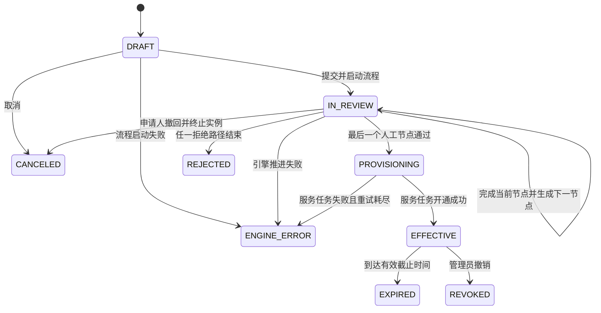
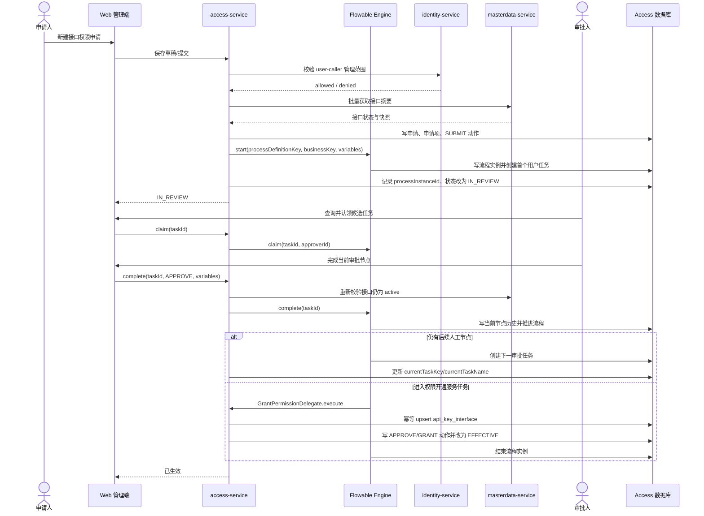
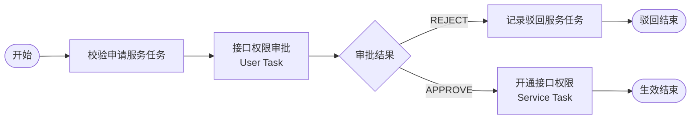
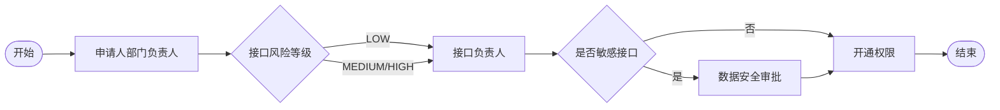

# 接口调用权限审批功能设计方案

> 版本：V1.1
> 日期：2026-07-23
> 适用项目：data-manager-hub
> 设计范围：内部系统申请 API 接口调用权限，审批通过后自动开通
> 推荐落地方式：业务审批归属 `access` 域，通过 BPMN 2.0 流程引擎驱动审批节点

## 1. 方案摘要

当前平台以 `API Key + 接口` 作为实际调用授权粒度：

- 管理员在“调用方管理”页面选择 API Key。
- 管理员通过 `POST /caller/apikey/{id}/interfaces` 全量覆盖接口授权。
- 授权结果写入 `api_key_interface`。
- OpenAPI 单条调用、批量调用和调用方接口文档均通过
  `ApiKeyInterfaceService.hasInterfacePermission(apiKeyId, interfaceId)` 判断权限。

本方案在现有授权模型前增加一层“申请—流程引擎—审批任务—生效”控制面，最终授权落点仍为
`api_key_interface`，不改变调用方使用 API Key 的方式，也不引入新的运行时鉴权协议。
审批节点由 BPMN 2.0 流程定义驱动，业务代码通过 `ApprovalEnginePort` 适配流程引擎，
避免把单级审批、审批人和节点顺序硬编码在 Controller 或 Service 中。

核心闭环：

1. 申请人选择自己有权管理的内部系统（Caller）。
2. 选择该系统下的有效 API Key 和需要调用的接口。
3. 填写业务用途、预计调用量、申请有效期后提交。
4. access 启动指定版本的 BPMN 流程实例。
5. 流程引擎根据节点配置生成审批任务并分配给候选人/候选组。
6. 最后一个人工节点通过后进入“开通接口权限”服务任务。
7. 服务任务幂等写入 `api_key_interface`。
8. 流程结束后，OpenAPI 调用链立即识别新权限。
9. 权限到期、撤销或接口停用后，运行时拒绝调用。

默认流程采用“整单、单级、人工审批”，但底层引擎与业务模型支持后续增加节点：

- 一份申请可以包含多个接口。
- 整单批准或整单驳回，不支持部分批准。
- 申请人不能审批自己的申请。
- 默认 BPMN 只有一个“接口权限审批”用户任务和一个“权限开通”服务任务。
- 后续可通过发布新 BPMN 版本增加部门负责人、接口负责人、安全审核、会签、条件网关、
  SLA 定时提醒等节点，无需修改申请主表和 OpenAPI 鉴权协议。

## 2. 现状与问题

### 2.1 现有模型

| 对象 | 所属域 | 当前职责 |
|---|---|---|
| `caller_info` | access | 内部调用系统/调用方 |
| `api_key` | access | 调用身份、状态、限流、配额 |
| `api_key_interface` | access | API Key 与接口的有效授权关系 |
| `api_interface` | masterdata | 接口定义、编码、契约、启停状态 |
| `user_caller` | identity | 用户可管理的 Caller 范围 |
| `operation_log` | governance | 通用管理操作日志 |

当前授权链路：


### 2.2 现有问题

1. 没有申请入口，业务系统只能线下联系管理员。
2. 授权人、申请人、业务理由、审批意见没有结构化记录。
3. 当前接口采用“先删后增”的全量覆盖方式，误操作可能撤销已有权限。
4. 现有授权写接口未校验接口 ID 是否真实、是否启用。
5. 现有管理接口没有完整的后端细粒度权限检查，主要依赖前端菜单权限。
6. 不能设置接口权限有效期，也不能自动到期。
7. 无法区分历史管理员授权、审批授权和紧急授权。
8. 通用 `operation_log` 可记录操作，但不能替代不可变的审批轨迹。
9. 申请人对 Caller 的管理范围属于 identity 域，access 域不能直接读取
   `user_caller` 表。
10. 接口定义属于 masterdata 域，access 域不能通过本地表关联判断接口是否可申请。

### 2.3 影响范围

GitNexus 影响分析结论：

- `assignInterfaces` 上游仅有管理端 Controller，静态风险为 **LOW**。
- `hasInterfacePermission` 上游影响 OpenAPI 单条调用、批量调用、调用方接口详情和
  OpenAPI 文档下载，静态风险为 **CRITICAL**。

因此实施时必须把“申请审批控制面”和“运行时权限判定”拆成两个可独立验证的切片；
运行时判定变更必须覆盖 OpenAPI 与文档链路的完整回归。

## 3. 目标与非目标

### 3.1 功能目标

- 内部用户可以为其有权管理的 Caller 申请接口权限。
- 审批人可以查看待办、批准、驳回。
- 审批通过后立即产生可用授权。
- 申请、审批、授权、撤销、到期全程可追溯。
- 支持按申请人、Caller、API Key、接口、状态、时间查询。
- 支持有效期控制和到期失效。
- 防止重复申请、重复审批、越权申请和自我审批。
- 保留受控的紧急管理员授权通道。
- 不破坏当前 API Key 调用方式和 OpenAPI 契约。

### 3.2 非目标

V1 不包含：

- API Key 申请与密钥发放审批。
- 产品权限、场景权限、配额和计费方案审批。
- 面向业务人员的在线 BPMN 流程设计器；V1 的 BPMN 文件由研发评审、版本化并随发布部署。
- 默认流程不启用多级审批、会签、转办、加签和委托，但引擎适配层和数据模型必须支持后续扩展。
- 邮件、短信、企业 IM 通知。
- 跨租户统一审批。
- 接口权限自动推荐。

说明：接口审批通过仅代表 `API Key` 获得接口权限。实际调用仍需同时满足：

- Caller 已启用；
- API Key 已启用且未过期；
- API Key 拥有产品权限；
- Caller 已配置对应产品；
- 调用场景有效；
- 接口与厂商路由有效；
- 限流、配额和计费校验通过。

前端应在申请详情中显示这些“调用前置条件”，避免把“审批通过”误解为所有调用条件均已满足。

## 4. 角色与权限

新增权限编码：

| 权限编码 | 作用 |
|---|---|
| `api-permission:view` | 查看“我的申请”和本人可见申请详情 |
| `api-permission:apply` | 创建、编辑、提交、取消本人申请 |
| `api-permission:approve` | 查看本租户待审批申请并批准/驳回 |
| `api-permission:grant-view` | 查询本租户当前有效授权 |
| `api-permission:revoke` | 撤销已生效授权 |
| `api-permission:emergency-grant` | 紧急管理员直接授权 |
| `api-permission:process-view` | 查看流程定义版本、实例和节点诊断信息 |
| `api-permission:process-manage` | 启停流程路由配置；不包含在线任意脚本部署 |

权限与数据范围必须同时满足：

- 有按钮权限不等于可以操作所有 Caller。
- 申请人只能选择 `user_caller` 已关联且与当前租户一致的 Caller。
- 审批人默认只能处理当前租户申请。
- 平台管理员的跨租户能力必须使用独立权限，不通过 `admin` 角色名称硬编码放行。
- 申请人和审批人为同一用户时禁止批准。
- 完成流程任务需要同时拥有 `api-permission:approve` 和当前任务 candidate group/assignee 身份。

流程 candidate group 使用 identity 域角色编码，例如：

- `api_interface_approver`：默认接口权限审批；
- `api_interface_owner`：接口负责人审批；
- `data_security_approver`：敏感数据安全审批。

这些角色必须包含通用 `api-permission:approve` 权限。流程引擎只保存角色编码，
实际用户与角色关系始终由 identity 域解析。

推荐初始角色配置：

| 角色 | 权限 |
|---|---|
| 普通业务用户 | `view`、`apply` |
| 接口权限审批员 | `view`、`approve`、`grant-view` |
| 租户管理员 | 上述全部，不默认包含 `emergency-grant` |
| 数据安全审批员 | `view`、`approve`、`grant-view`，并关联 `data_security_approver` |
| 流程管理员 | `process-view`、`process-manage`，不默认拥有业务审批权 |
| 平台安全管理员 | `grant-view`、`revoke`、`emergency-grant`、`process-view` |

## 5. 业务流程

### 5.1 新增权限申请

1. 申请人进入“接口权限 > 我的申请”。
2. 新建申请。
3. 系统加载申请人可管理的 Caller。
4. 申请人选择 Caller 后，系统仅展示该 Caller 下状态为 `active` 的 API Key。
5. 申请人选择 API Key 后，系统展示：
   - 当前已授权接口；
   - 已提交、待审批的接口；
   - 可申请的启用接口。
6. 申请人选择一个或多个接口。
7. 填写：
   - 业务用途；
   - 使用场景；
   - 预计日调用量；
   - 期望有效截止时间；
   - 可选的工单号/项目编号。
8. 保存草稿或提交。
9. 提交时服务端重新执行全部资格校验。
10. 提交成功后启动 BPMN 流程，申请进入 `IN_REVIEW`，首个用户任务出现在候选人待办中。

### 5.2 审批

审批人从流程引擎任务列表进入申请详情，页面展示：

- 申请人及租户；
- Caller 和 API Key 名称；
- 接口编码、名称、描述、当前启停状态；
- 业务用途、预计调用量、申请有效期；
- 当前产品权限、Key 状态等就绪检查；
- 是否存在相同接口的有效授权或待审批申请；
- 当前节点、任务创建时间、候选组和 SLA；
- 完整操作轨迹。

完成当前审批任务时：

1. 服务端确认任务仍为活动任务，当前用户是 assignee 或合法 candidate。
2. 服务端禁止申请人完成任何批准节点。
3. 当前节点根据 BPMN 表单配置收集 `APPROVE`/`REJECT`、意见和节点扩展字段。
4. 只有被流程定义标记为“最终期限确认”的节点可以缩短有效期，不能超过申请有效期。
5. 服务端写入业务动作后调用 `ApprovalEnginePort.complete` 推进流程。
6. 若仍有后续节点，引擎创建下一用户任务，申请保持 `IN_REVIEW`。
7. 若最后一个人工节点通过，引擎进入 `GrantPermissionDelegate` 服务任务：
   - 重新校验 API Key、Caller 和接口状态；
   - 锁定申请及授权记录；
   - 幂等新增或更新 `api_key_interface`；
   - 写入授权动作；
   - 更新申请及申请项为 `EFFECTIVE`。
8. 服务任务成功后流程结束，权限立即生效。

驳回时：

- 驳回原因必填；
- 当前任务完成并沿 BPMN 拒绝分支结束流程；
- 申请进入 `REJECTED`，引擎状态进入 `COMPLETED`；
- 不产生授权；
- 原申请不可再次编辑，申请人可复制后重新提交。

### 5.3 取消

- 申请人只能取消自己的 `DRAFT` 或仍允许撤回的 `IN_REVIEW` 申请。
- `DRAFT` 取消后进入 `CANCELED`。
- `IN_REVIEW` 撤回需要先校验当前节点允许撤回，再终止流程实例并原子更新状态；
  若流程已进入权限开通或已结束，返回 409。
- 已生效授权不能通过“取消申请”撤回，应走“撤销授权”。

### 5.4 到期与撤销

- 运行时每次鉴权都检查 `effective_at <= now < expire_at`。
- `expire_at` 为空表示长期有效，但是否允许长期有效由配置控制。
- 到期任务只负责把展示状态更新为 `EXPIRED` 和记录审计动作；
  即使调度任务延迟，运行时也必须立即按时间拒绝调用。
- 撤销需要 `api-permission:revoke`，撤销原因必填。
- 撤销只修改授权状态，不物理删除申请、审批动作或授权记录。

### 5.5 紧急授权

紧急授权只用于故障处置或业务连续性：

- 必须拥有 `api-permission:emergency-grant`。
- 必须填写原因、关联工单号和截止时间。
- 最长有效期建议限制为 24 小时。
- 授权来源记录为 `EMERGENCY_ADMIN`。
- 操作写入审批动作表和通用操作日志。
- 紧急授权不能调用现有“全量覆盖”逻辑，只能增量新增或缩短/撤销指定授权。

## 6. 状态模型

### 6.1 申请状态

| 状态 | 含义 | 可执行动作 |
|---|---|---|
| `DRAFT` | 草稿 | 编辑、提交、取消 |
| `IN_REVIEW` | 流程运行中，存在一个或多个待办节点 | 查询任务、认领、完成当前节点、申请人撤回 |
| `PROVISIONING` | 人工节点已完成，正在执行权限开通服务任务 | 系统重试、管理员查看 |
| `EFFECTIVE` | 已批准且授权已生效 | 撤销、等待到期 |
| `REJECTED` | 已驳回 | 查看、复制申请 |
| `CANCELED` | 已取消 | 查看 |
| `ENGINE_ERROR` | 流程启动或推进失败 | 管理员诊断、幂等重试或终止 |
| `EXPIRED` | 授权已到期 | 查看、发起续期 |
| `REVOKED` | 授权被人工撤销 | 查看、重新申请 |



业务状态与引擎状态分离。申请表另存：

- `engine_status`：`NOT_STARTED`、`RUNNING`、`COMPLETED`、`TERMINATED`、`ERROR`；
- `process_instance_id`：引擎流程实例 ID；
- `current_task_key/current_task_name`：页面展示用的当前节点投影。

Flowable 嵌入模式下，“完成最后审批任务—执行开通服务任务—写入授权—结束流程”使用同一
Spring 事务。开通失败时任务完成和业务状态整体回滚，申请保持 `IN_REVIEW`，由引擎重试。
`PROVISIONING` 主要用于未来接入外部引擎或异步 Worker 时展示中间状态。

### 6.2 整单规则

- 一份申请的所有接口使用同一个 API Key、业务理由和有效期。
- V1 整单批准或整单驳回。
- 如果审批人不接受其中某个接口，应驳回并说明调整建议。
- 申请人复制原申请、删除不需要的接口后重新提交。

## 7. 架构与领域边界

### 7.1 工作流引擎选型

当前项目使用 JDK 21、Spring Boot 3.4.13。流程引擎选型需要同时考虑 BPMN 能力、
Spring 兼容性、运维复杂度、开源许可和未来升级路径。

| 方案 | 集成方式 | 优点 | 当前约束 | 结论 |
|---|---|---|---|---|
| Flowable 7.1.0 | 嵌入 `access-service` | Apache 2.0、BPMN/DMN/CMMN、用户任务成熟、可共享本地事务、基础设施最少 | 已完成 JDK 21、Boot 3.4.13 兼容性 POC | **V1 默认实现** |
| Flowable 8.x | 嵌入应用 | 最新 Flowable 主线 | 官方明确基于 Spring Boot 4，不再支持 Boot 3 | 当前不采用 |
| Camunda 8.9.x | 独立编排集群 + Java Client | 云原生、水平扩展、运维和流程可观测性强 | 官方 Spring Boot 3 Starter 面向 Boot 3.5.x；需要额外集群和最终一致性设计 | 战略备选适配器 |
| Camunda 7 | 嵌入/共享引擎 | 生态成熟 | 已进入最后 LTS/维护阶段，不适合新建长期能力 | 不采用 |

选型依据：

- Flowable 支持嵌入 Java/Spring 应用，并提供 `RuntimeService`、`TaskService`、
  候选用户/候选组、用户任务、多实例和监听器等能力。
- Flowable 的 IdentityService 不会在运行时替平台验证真实用户，因此用户、角色和数据范围
  仍以本项目 identity 域为准，不能把流程引擎内部身份库当作权限事实源。
- Camunda 8 适合未来把流程编排独立部署，但引入后审批完成与 access 授权写入不再天然共享事务，
  必须使用 outbox/inbox、幂等 Worker 和补偿机制。

官方参考：

- [Flowable Spring Boot 集成](https://www.flowable.com/open-source/docs/bpmn/ch05a-Spring-Boot)
- [Flowable 用户任务与候选组](https://www.flowable.com/open-source/docs/bpmn/ch07b-BPMN-Constructs/)
- [Flowable 8.0.0 发布说明](https://github.com/flowable/flowable-engine/releases)
- [Camunda 8 Spring Boot Starter 兼容矩阵](https://docs.camunda.io/docs/apis-tools/camunda-spring-boot-starter/getting-started/)
- [Camunda 7 支持公告](https://docs.camunda.org/enterprise/announcement/)

V1 必须先完成一个独立兼容性 POC：

1. 引入 `flowable-spring-boot-starter-process` 7.1.0，不引入全套 IDM/CMMN/DMN Starter。
2. 执行 Maven dependency convergence，确认 Spring、MyBatis、Liquibase、Jackson、Sa-Token
   没有版本覆盖或自动配置冲突。
3. 在 PostgreSQL 上部署一个最小 BPMN，完成启动、候选任务查询、认领、批准、驳回和历史查询。
4. 验证同一事务中完成 `TaskService.complete`、服务任务授权写入和业务状态更新。
5. 验证多实例部署、重启恢复、定时器、并发任务锁和引擎表升级。

POC 不通过时不通过强制覆盖 Spring 依赖解决，改用以下路径之一：

- 先将项目升级到已验证的 Spring Boot 版本；或
- 采用 Camunda 8 独立集群适配器；或
- 将 Flowable 适配器隔离为独立 workflow runtime，但申请和授权事实仍归属 access。

### 7.2 引擎适配层

业务代码不得直接散落调用 Flowable/Camunda API。`access-service` 内定义稳定端口：

```java
public interface ApprovalEnginePort {
    ProcessStartResult start(ProcessStartCommand command);
    PageResult<ApprovalTask> queryCandidateTasks(TaskQuery query);
    ApprovalTask getTask(String taskId);
    void claim(String taskId, String userId);
    TaskCompleteResult complete(TaskCompleteCommand command);
    void cancelProcess(String processInstanceId, String reason);
    ProcessHistory getHistory(String processInstanceId);
}
```

建议包结构：

```text
data-platform-access-service
└── com.dataplatform.access.approval
    ├── application       # 申请、任务、审批用例
    ├── domain            # 状态、规则、命令
    ├── engine
    │   ├── ApprovalEnginePort
    │   └── flowable      # V1 默认适配器
    ├── process           # BPMN、Delegate、Listener
    ├── persistence       # 业务表 Mapper/Entity
    └── controller
```

适配边界：

- Controller 只调用审批应用服务，不直接调用 `RuntimeService` 或 `TaskService`。
- BPMN 只传递业务 ID、角色编码、租户 ID、风险等级、期限等轻量变量。
- Caller、API Key、接口详情不作为大 JSON 长期存入引擎变量，详情从业务表读取。
- 业务申请表是申请内容事实源；引擎是流程实例、活动节点和任务状态事实源。
- 一个环境只能启用一个 `ApprovalEnginePort` 实现，不支持同一新申请同时启动两个引擎。
- 每个申请必须记录 `engine_type`，以便切换引擎期间继续查询旧实例。
- 已启动实例固定使用启动时的流程定义版本；发布新 BPMN 只影响新申请。

### 7.3 领域归属

| 能力/数据 | 所属域 | 设计原因 |
|---|---|---|
| 申请单、申请项、审批动作 | access | 它们决定 API Key 的调用授权 |
| 最终有效授权 | access | 现有 `api_key_interface` 已由 access 管理 |
| BPMN 流程定义、流程实例、审批任务 | access 内的流程引擎适配层 | 只服务 access 授权业务，不形成跨域共享业务表 |
| Caller、API Key | access | 调用身份和权限资源 |
| 用户、角色、用户-Caller 关系 | identity | 用户数据和管理范围属于身份域 |
| 接口定义、接口状态、契约 | masterdata | 接口主数据属于主数据域 |
| 通用操作日志 | governance | 沿用现有治理域日志能力 |

V1 不新增“approval-service”，而是在 access 域内嵌入 Flowable Process Engine。当前需求只有接口权限
审批一个稳定场景，过早拆出业务审批服务会增加：

- 跨服务事务；
- 审批结果投递和幂等；
- 授权补偿；
- 服务间鉴权与故障恢复复杂度。

当未来至少出现三类跨域审批场景，或者流程实例需要独立扩缩容时，再将
`ApprovalEnginePort` 的实现迁移为独立流程运行时；各域业务事实和最终授权仍由所属域管理。

### 7.4 跨域调用

申请提交时：

1. access 通过 identity-api 内部 Feign 契约校验当前用户是否关联 Caller。
2. access 通过 masterdata-api 内部 Feign 契约批量读取接口摘要并校验接口有效。
3. access 只写自己的申请表和授权表。

建议新增轻量契约：

```text
identity-api
└── CallerAccessInternalFeignClient
    └── GET /internal/v1/identity/users/{userId}/callers/{callerId}/access

masterdata-api
└── ApiInterfaceFeignClient
    └── POST /internal/v1/masterdata/interfaces/batch-get
```

内部调用要求：

- 路径只能使用 `/internal/v1/**`。
- 使用短期 Service JWT。
- identity 接口校验 audience 和 `identity:caller-access:read` scope。
- masterdata 接口校验 audience 和 `masterdata:interface:read` scope。
- Gateway 不暴露 `/internal/**`。
- 不透传用户 Bearer Token 或 API Key 充当服务身份。
- 用户 ID、租户 ID、traceId 作为 actor/trace 上下文单独传递。
- 下游超时、401、403 或空响应时提交失败关闭，不能默认认为有权限或接口有效。

### 7.5 申请、引擎任务与授权时序



### 7.6 默认 BPMN 与后续节点扩展

默认流程定义：



建议固定标识：

```text
processDefinitionKey: apiPermissionApproval
businessKey: applicationNo
tenantId: 当前业务租户 ID
```

后续增强流程可以发布新版本：



可扩展 BPMN 元素：

- 顺序审批：连续 User Task。
- 或签：同一候选组内任一人认领并完成。
- 会签：并行多实例 User Task，通过 completion condition 控制通过比例。
- 条件审批：Exclusive Gateway 根据 `riskLevel`、`expectedDailyCalls`、`requestedDays`
  等流程变量路由。
- 超时提醒：User Task Boundary Timer。
- 超时升级：定时边界事件后转交更高审批组。
- 子流程：Call Activity 复用“数据安全审批”等公共流程定义。
- 自动规则：后续可接 DMN，但 V1 不把授权业务规则写入脚本任务。

流程变量白名单：

| 变量 | 类型 | 用途 |
|---|---|---|
| `applicationId` | Long/String | 回查业务申请 |
| `applicationNo` | String | businessKey 和审计 |
| `tenantId` | Long/String | 任务数据范围 |
| `applicantUserId` | String | 禁止自我审批 |
| `callerId` | Long/String | 路由和展示 |
| `apiKeyId` | Long/String | 授权目标 |
| `riskLevel` | String | 条件网关 |
| `expectedDailyCalls` | Long | 条件网关 |
| `requestedExpireAt` | ISO-8601 String | 最终期限确认 |
| `approverGroup` | String | 默认候选组 |
| `decision` | String | 当前节点 `APPROVE`/`REJECT` |
| `approvedExpireAt` | ISO-8601 String | 最终授权期限 |
| `requestedCacheEnabled` | Boolean | 是否申请结果缓存 |
| `requestedCacheDays` | Integer | 申请缓存时效，1～365 天 |
| `approvedCacheEnabled` | Boolean | 审批人是否批准缓存 |
| `approvedCacheDays` | Integer | 批准缓存时效，不得超过申请值 |

禁止放入流程变量：

- API Key 明文、API Secret、用户 Token；
- 完整接口契约或大体积申请 JSON；
- 需要实时一致性的 Caller/API Key 状态；
- 无版本约束的 Java 序列化对象。

流程版本规则：

1. BPMN 文件纳入 Git，建议路径：
   `data-platform-access-service/src/main/resources/processes/api-permission-approval-v1.bpmn20.xml`。
2. 流程发布前执行 BPMN XML 校验和自动化路径测试。
3. 已运行实例继续使用启动时的定义版本。
4. 新版本默认只用于新申请，不自动迁移存量实例。
5. 必须迁移存量实例时，需要维护“旧节点 ID → 新节点 ID”映射、备份、演练和回滚方案。
6. 禁止直接覆盖已部署流程定义或复用节点 ID 表达不同业务含义。

## 8. 数据模型

### 8.1 `api_permission_application`

申请主表，归属 access 域。

| 字段 | 类型 | 约束/说明 |
|---|---|---|
| `id` | BIGSERIAL | 主键 |
| `application_no` | VARCHAR(40) | 唯一业务编号 |
| `request_type` | VARCHAR(20) | `OPEN`、`RENEW`；V1 只开放这两类 |
| `tenant_id` | BIGINT | 必填，数据范围 |
| `caller_id` | BIGINT | 必填，access 域内校验 |
| `caller_code_snapshot` | VARCHAR(50) | 审计快照 |
| `caller_name_snapshot` | VARCHAR(100) | 审计快照 |
| `api_key_id` | BIGINT | 必填，必须属于 Caller |
| `api_key_name_snapshot` | VARCHAR(100) | 不保存完整 Key 和 Secret |
| `applicant_user_id` | BIGINT | 必填 |
| `applicant_name_snapshot` | VARCHAR(100) | 审计快照 |
| `business_purpose` | TEXT | 必填，建议 10～1000 字 |
| `business_scene` | VARCHAR(200) | 必填 |
| `expected_daily_calls` | BIGINT | 必填，大于 0 |
| `ticket_no` | VARCHAR(100) | 可选 |
| `requested_expire_at` | TIMESTAMP | 期望截止时间 |
| `approved_expire_at` | TIMESTAMP | 审批后的最终截止时间 |
| `status` | VARCHAR(20) | 申请状态 |
| `engine_type` | VARCHAR(20) | `FLOWABLE`、`CAMUNDA8` |
| `engine_status` | VARCHAR(20) | `NOT_STARTED`、`RUNNING`、`COMPLETED`、`TERMINATED`、`ERROR` |
| `process_definition_key` | VARCHAR(100) | 启动时流程定义 Key |
| `process_definition_version` | INTEGER | 启动时流程定义版本 |
| `process_instance_id` | VARCHAR(100) | 流程实例 ID，唯一 |
| `current_task_id` | VARCHAR(100) | 当前任务投影；并行会签时为空并从引擎查询 |
| `current_task_key` | VARCHAR(100) | 当前 BPMN Activity ID |
| `current_task_name` | VARCHAR(200) | 当前节点名称 |
| `current_task_created_at` | TIMESTAMP | 当前任务到达时间 |
| `submitted_at` | TIMESTAMP | 提交时间 |
| `decided_by` | BIGINT | 最终审批人 |
| `decided_by_name_snapshot` | VARCHAR(100) | 审批人快照 |
| `decided_at` | TIMESTAMP | 审批时间 |
| `decision_comment` | TEXT | 审批意见 |
| `idempotency_key` | VARCHAR(64) | 防止客户端重复提交 |
| `version` | INTEGER | 乐观锁，默认 0 |
| `created_at` | TIMESTAMP | 创建时间 |
| `updated_at` | TIMESTAMP | 更新时间 |

关键索引：

- 唯一索引：`application_no`。
- 唯一索引：`(applicant_user_id, idempotency_key)`，仅在 key 非空时生效。
- 查询索引：`(tenant_id, status, submitted_at DESC)`。
- 查询索引：`(applicant_user_id, created_at DESC)`。
- 查询索引：`(caller_id, api_key_id, status)`。
- 唯一索引：`(engine_type, process_instance_id)`，仅在实例 ID 非空时生效。
- 查询索引：`(engine_status, current_task_key, current_task_created_at)`。

### 8.2 `api_permission_application_item`

| 字段 | 类型 | 约束/说明 |
|---|---|---|
| `id` | BIGSERIAL | 主键 |
| `application_id` | BIGINT | 关联申请主表 |
| `api_key_id` | BIGINT | 冗余用于并发和重复校验 |
| `interface_id` | BIGINT | 接口 ID，不建立跨域数据库外键 |
| `interface_code_snapshot` | VARCHAR(100) | 必填 |
| `interface_name_snapshot` | VARCHAR(200) | 必填 |
| `interface_status_snapshot` | VARCHAR(20) | 提交时状态 |
| `item_status` | VARCHAR(20) | 与申请状态同步 |
| `requested_cache_enabled` | BOOLEAN | 是否申请结果缓存 |
| `requested_cache_days` | INTEGER | 申请缓存时效，启用时为 1～365 |
| `approved_cache_enabled` | BOOLEAN | 审批是否批准结果缓存 |
| `approved_cache_days` | INTEGER | 批准时效，不得超过申请时效 |
| `grant_id` | BIGINT | 生效后关联 `api_key_interface.id` |
| `created_at` | TIMESTAMP | 创建时间 |
| `updated_at` | TIMESTAMP | 更新时间 |

约束与索引：

- 唯一约束：`(application_id, interface_id)`。
- 查询索引：`(api_key_id, interface_id, item_status)`。
- 提交事务中对 `api_key_id + interface_id` 使用数据库锁或串行化检查，
  防止并发生成两条待审批申请。

接口快照用于历史展示，不能代替审批时对 masterdata 当前状态的重新校验。

### 8.3 `api_permission_action`

不可变审批轨迹表。禁止更新和删除。

| 字段 | 类型 | 说明 |
|---|---|---|
| `id` | BIGSERIAL | 主键 |
| `application_id` | BIGINT | 申请 ID |
| `action` | VARCHAR(30) | `CREATE`、`SUBMIT`、`APPROVE`、`REJECT`、`CANCEL`、`EXPIRE`、`REVOKE`、`EMERGENCY_GRANT` |
| `actor_type` | VARCHAR(20) | `USER`、`SYSTEM` |
| `actor_user_id` | BIGINT | 系统动作可为空 |
| `actor_name_snapshot` | VARCHAR(100) | 操作人快照 |
| `from_status` | VARCHAR(20) | 原状态 |
| `to_status` | VARCHAR(20) | 新状态 |
| `comment` | TEXT | 意见/原因 |
| `engine_type` | VARCHAR(20) | 动作所属引擎 |
| `process_instance_id` | VARCHAR(100) | 流程实例 ID |
| `task_id` | VARCHAR(100) | 用户任务 ID |
| `task_definition_key` | VARCHAR(100) | BPMN Activity ID |
| `task_name` | VARCHAR(200) | 节点名称快照 |
| `task_assignee` | VARCHAR(100) | 实际处理人 |
| `process_definition_version` | INTEGER | 流程定义版本 |
| `trace_id` | VARCHAR(128) | 链路追踪 |
| `created_at` | TIMESTAMP | 动作时间 |

### 8.4 演进 `api_key_interface`

保留现有表作为当前授权事实表，新增字段：

| 字段 | 类型 | 说明 |
|---|---|---|
| `grant_source` | VARCHAR(30) | `LEGACY_ADMIN`、`APPROVAL`、`EMERGENCY_ADMIN` |
| `application_item_id` | BIGINT | 审批来源申请项，可为空 |
| `cache_enabled` | BOOLEAN | 当前授权是否允许使用结果缓存 |
| `approved_cache_days` | INTEGER | 获批缓存上限，启用时为 1～365 |
| `status` | VARCHAR(20) | `ACTIVE`、`REVOKED`、`EXPIRED` |
| `effective_at` | TIMESTAMP | 生效时间 |
| `expire_at` | TIMESTAMP | 失效时间，可为空 |
| `revoked_at` | TIMESTAMP | 撤销时间 |
| `revoked_by` | BIGINT | 撤销人 |
| `revoke_reason` | TEXT | 撤销原因 |
| `updated_at` | TIMESTAMP | 更新时间 |
| `version` | INTEGER | 乐观锁 |

保留唯一约束 `(api_key_id, interface_id)`。重新申请或续期时更新同一当前授权记录，
历史通过申请和动作表保留。

运行时有效条件：

```text
api_key_id = ?
AND interface_id = ?
AND status = 'ACTIVE'
AND effective_at <= CURRENT_TIMESTAMP
AND (expire_at IS NULL OR expire_at > CURRENT_TIMESTAMP)
```

运行时在上述授权谓词成立后继续执行缓存策略谓词：

```text
use_cache = false
OR (
  cache_enabled = true
  AND request.cache_days BETWEEN 1 AND approved_cache_days
)
```

缓存有效期从原始厂商响应的 `call_record.created_at` 绝对计算，缓存命中生成的审计记录必须带
`cache_hit = true` 且永远不能再次成为缓存来源。复用键至少包含租户、接口代码、接口版本和规范化请求参数；
默认 `CALLER` 作用域还必须包含 Caller，显式 `GLOBAL` 也不得跨租户。授权撤销或到期后先于缓存查询失败关闭。

不在 `api_key_interface.interface_id` 上建立指向 masterdata 表的数据库外键，
避免跨域数据所有权耦合；接口存在性通过 masterdata 内部契约校验。

### 8.5 `api_approval_process_config`

业务类型到流程定义的路由配置。流程定义本身由引擎管理，本表只保存选择策略。

| 字段 | 类型 | 说明 |
|---|---|---|
| `id` | BIGSERIAL | 主键 |
| `tenant_id` | BIGINT | 租户级覆盖；0 表示平台默认 |
| `business_type` | VARCHAR(50) | `API_PERMISSION_OPEN`、`API_PERMISSION_RENEW` |
| `risk_level` | VARCHAR(20) | 可选：`LOW`、`MEDIUM`、`HIGH`、`*` |
| `engine_type` | VARCHAR(20) | `FLOWABLE`、`CAMUNDA8` |
| `process_definition_key` | VARCHAR(100) | BPMN Process ID |
| `approver_group` | VARCHAR(100) | 默认候选角色/组 |
| `enabled` | BOOLEAN | 是否启用 |
| `priority` | INTEGER | 多条匹配时的优先级 |
| `created_by` | BIGINT | 创建人 |
| `created_at` | TIMESTAMP | 创建时间 |
| `updated_by` | BIGINT | 更新人 |
| `updated_at` | TIMESTAMP | 更新时间 |
| `version` | INTEGER | 乐观锁 |

匹配顺序：

1. 当前租户 + 精确业务类型 + 精确风险等级；
2. 当前租户 + 精确业务类型 + `*`；
3. 平台默认租户 + 精确业务类型 + 精确风险等级；
4. 平台默认租户 + 精确业务类型 + `*`。

没有匹配配置时提交失败关闭，不能绕过引擎回退到管理员直接授权。

## 9. API 设计

管理端统一前缀仍为 `/api/v1`，以下为业务路径。

### 9.1 申请人 API

| 方法 | 路径 | 说明 |
|---|---|---|
| GET | `/api-permission/applications` | 查询我的申请；审批人可按授权范围查询 |
| GET | `/api-permission/applications/{id}` | 申请详情与动作轨迹 |
| POST | `/api-permission/applications` | 创建草稿 |
| PUT | `/api-permission/applications/{id}` | 编辑本人草稿 |
| POST | `/api-permission/applications/{id}/submit` | 提交申请 |
| POST | `/api-permission/applications/{id}/cancel` | 取消草稿或待审批申请 |
| POST | `/api-permission/applications/{id}/copy` | 复制为新草稿 |
| GET | `/api-permission/eligible-callers` | 当前用户可申请的 Caller |
| GET | `/api-permission/callers/{callerId}/api-keys` | 可申请的有效 API Key |
| GET | `/api-permission/interface-options` | 可申请接口、当前授权和待审批标记 |

创建草稿请求示例：

```json
{
  "requestType": "OPEN",
  "callerId": 12,
  "apiKeyId": 31,
  "interfaceIds": [101, 102],
  "businessPurpose": "贷前风控系统需要查询客户基础数据",
  "businessScene": "贷前审批",
  "expectedDailyCalls": 5000,
  "cacheEnabled": true,
  "requestedCacheDays": 2,
  "requestedExpireAt": "2027-07-23T23:59:59",
  "ticketNo": "RISK-2026-0188"
}
```

提交请求应携带：

```http
Idempotency-Key: <UUID>
```

### 9.2 流程任务 API

| 方法 | 路径 | 说明 |
|---|---|---|
| GET | `/api-permission/tasks` | 查询当前用户候选/已认领任务 |
| GET | `/api-permission/tasks/{taskId}` | 任务、节点表单和关联申请详情 |
| POST | `/api-permission/tasks/{taskId}/claim` | 认领候选任务 |
| POST | `/api-permission/tasks/{taskId}/unclaim` | 释放尚未完成的任务 |
| POST | `/api-permission/tasks/{taskId}/complete` | 完成当前审批节点 |
| GET | `/api-permission/applications/{id}/process-history` | 查询 BPMN 节点与审批轨迹 |

完成任务请求：

```json
{
  "applicationVersion": 2,
  "decision": "APPROVE",
  "approvedExpireAt": "2027-01-31T23:59:59",
  "approvedCacheEnabled": true,
  "approvedCacheDays": 2,
  "comment": "同意，先授权六个月",
  "formData": {
    "riskConfirmed": true
  }
}
```

驳回当前任务：

```json
{
  "applicationVersion": 2,
  "decision": "REJECT",
  "comment": "请补充数据使用范围和日调用量测算"
}
```

API 只暴露平台业务 DTO，不直接暴露 Flowable/Camunda 原生 REST API。这样可以统一执行：

- Sa-Token 登录校验；
- tenant 和 user-caller 数据范围；
- 任务候选人/assignee 校验；
- 禁止自我审批；
- 表单字段白名单；
- 审批动作审计；
- 引擎异常到平台错误码的转换。

### 9.3 授权管理 API

| 方法 | 路径 | 说明 |
|---|---|---|
| GET | `/api-permission/grants` | 查询当前/历史授权 |
| POST | `/api-permission/grants/{id}/revoke` | 撤销指定授权 |
| GET | `/api-permission/emergency-options/callers` | 查询本租户可用于紧急授权的 Caller |
| GET | `/api-permission/emergency-options/callers/{callerId}/api-keys` | 查询可用 API Key |
| GET | `/api-permission/emergency-options/interfaces` | 查询启用接口及当前授权标记 |
| POST | `/api-permission/emergency-grants` | 紧急增量授权 |

现有接口处理建议：

- 保留 `GET /caller/apikey/{id}/interfaces`，用于兼容查询。
- 废弃普通用户对 `POST /caller/apikey/{id}/interfaces` 的访问。
- 开启审批功能后，该 POST 不再执行全量覆盖。
- 有紧急权限的管理员也必须调用新的增量授权 API，不能继续使用全量覆盖。
- 过渡期旧 POST 返回 409，并提示使用接口权限申请或紧急授权。

### 9.4 错误语义

| HTTP 状态 | 场景 |
|---|---|
| 400 | 字段缺失、有效期非法、接口列表为空 |
| 401 | 未登录或内部服务身份无效 |
| 403 | 无权限、无 Caller 管理权、自我审批、跨租户 |
| 404 | 申请、Caller、API Key 或接口不存在 |
| 409 | 重复待审批、已有有效授权、状态版本冲突、重复审批 |

建议稳定业务错误码：

- `CALLER_ACCESS_DENIED`
- `API_KEY_CALLER_MISMATCH`
- `INTERFACE_NOT_ACTIVE`
- `GRANT_ALREADY_ACTIVE`
- `DUPLICATE_PENDING_APPLICATION`
- `SELF_APPROVAL_FORBIDDEN`
- `APPLICATION_STATE_CONFLICT`
- `APPROVED_EXPIRY_EXCEEDS_REQUEST`

## 10. 核心业务校验

### 10.1 保存草稿

- 当前用户必须有 `api-permission:apply`。
- Caller 必须存在且属于当前租户。
- API Key 必须属于 Caller。
- 不要求草稿中的接口在后续始终保持启用，但保存时至少需要存在。

### 10.2 提交

- 申请必须属于当前用户且状态为 `DRAFT`。
- 通过 identity 内部接口验证 user-caller 关系。
- Caller、API Key 均必须为启用状态。
- API Key 不得已过期或删除。
- 接口必须存在且为 `active`。
- 接口不能已经拥有长期或覆盖本次期限的有效授权。
- 相同 `API Key + interfaceId` 不能存在待审批申请。
- 有效截止时间必须晚于当前时间。
- 不限制最长申请期限，按申请人选择的有效截止时间提交。
- 业务用途、场景、调用量必须符合格式限制。

### 10.3 完成审批节点

- 当前用户必须有 `api-permission:approve`。
- `taskId` 必须属于当前申请的活动流程实例。
- 当前用户必须是任务 assignee，或属于任务候选用户/候选组并先成功认领。
- 审批人与申请人不能相同。
- 申请与审批人必须在相同租户范围内。
- 申请状态必须为 `IN_REVIEW`，业务 version 必须匹配。
- `decision` 只能取当前 BPMN 节点表单允许的动作。
- 提交的 `formData` 只接受节点定义的字段白名单。
- 最终期限确认节点设置的有效期不得超过申请有效期。
- 到达权限开通服务任务时重新校验 Caller、API Key、接口状态和重复授权。
- Flowable 嵌入模式下，任务推进、授权写入和申请状态更新必须使用同一事务管理器。

### 10.4 运行时鉴权

`hasInterfacePermission` 必须成为唯一的接口授权判定入口，并同时被以下链路使用：

- `/openapi/v1/query`
- `/openapi/v1/batch-query`
- 调用方接口详情
- 调用方 OpenAPI 文档下载

所有链路使用完全一致的状态和有效期语义。禁止 Controller 自行拼装不同的授权条件。

## 11. 并发、幂等与事务

### 11.1 提交幂等

- 客户端提交使用 `Idempotency-Key`。
- 服务端使用 `(applicant_user_id, idempotency_key)` 唯一索引。
- 相同 key 重试返回第一次提交结果，不重复创建申请。

### 11.2 重复申请

提交时对每个 `api_key_id + interface_id` 做重复检查。

建议在事务中使用以下一种方式：

1. PostgreSQL advisory transaction lock，锁键由 `apiKeyId + interfaceId` 稳定计算；或
2. 专门的申请资源锁表。

V1 推荐 advisory lock，避免新增只用于锁的业务表。

### 11.3 任务并发

业务申请采用条件更新：

```sql
UPDATE api_permission_application
SET status = ?, version = version + 1
WHERE id = ?
  AND status = 'IN_REVIEW'
  AND version = ?;
```

同时依赖流程引擎任务 revision/optimistic locking。两个审批人并发认领或完成同一任务时，
只有第一个请求成功，后续请求统一转换为 409 `TASK_STATE_CONFLICT`。

权限开通事务内应按固定顺序锁定：

1. 申请主表；
2. 申请项；
3. `api_key_interface` 当前授权。

防止任务完成、流程撤回、引擎重试和紧急授权相互覆盖。

### 11.4 事务边界

- identity/masterdata 校验在本地事务开启前完成，避免长事务持锁。
- 进入事务后再次校验申请状态和本地域数据。
- Flowable 适配器与 access 使用同一个 DataSource 和 Spring TransactionManager。
- `TaskService.complete`、节点动作、授权 upsert、申请状态更新在同一个事务中。
- `GrantPermissionDelegate` 必须以 `applicationItemId` 作为幂等键；引擎重试不得重复授权。
- 引擎启动与申请提交也使用同一事务；启动失败时申请保持 `DRAFT`，并记录失败原因。
- 通用治理日志失败不能回滚已完成的授权；关键审批轨迹必须先写本地
  `api_permission_action`。

未来使用 Camunda 8 等外部引擎时事务模型改为：

1. access 在本地事务写申请和 outbox；
2. 发布器幂等启动流程；
3. Worker 使用 `jobKey + applicationId` inbox 去重；
4. 权限开通成功后完成 Job；
5. 完成 Job 失败可安全重试，授权 upsert 不重复；
6. 超过重试次数进入 Incident/人工恢复，申请状态为 `ENGINE_ERROR`。

## 12. 安全、租户与审计

### 12.1 安全原则

- 所有管理 API 必须在后端校验权限，不能依赖前端隐藏按钮。
- 申请详情查询必须做行级数据范围检查。
- 不在申请表、日志或前端保存 `api_secret`。
- API Key 列表只返回脱敏 Key 和 Key 名称。
- 申请参数、审批意见按文本处理，不允许富文本脚本。
- 所有状态变更采用服务端当前用户，忽略客户端传入的 applicant/approver ID。
- 不对 Gateway 暴露 Flowable REST、Actuator 流程管理端点或引擎数据库。
- 候选组来自 identity 域角色/权限映射；不能仅因为 Flowable 接受某个 userId 就认为该用户合法。
- BPMN 表达式只能调用显式白名单 Spring Bean，不允许任意脚本、任意类名 Delegate 或不受控 EL。
- 流程定义部署权限与审批权限分离，发布 BPMN 必须走代码评审和发布审计。
- 接口停用时，即使授权仍为 `ACTIVE`，OpenAPI 路由和接口状态校验仍应失败关闭。

### 12.2 审计

需要同时保留三类记录：

1. `api_permission_action`：业务事实，记录完整状态流转，永久保留。
2. 流程引擎 History：流程实例、Activity、Task、变量变更和耗时。
3. `operation_log`：平台操作日志，记录 URL、模块、结果、IP、耗时。

业务页面以 `api_permission_action` 为稳定审计口径，引擎 History 用于流程诊断和节点耗时分析。
不能只依赖引擎历史表，因为切换引擎或清理引擎历史后仍需保留业务审计事实。

审批动作日志至少包含：

- 申请编号；
- Caller、API Key ID；
- 接口 ID 列表；
- 操作人；
- 原状态和新状态；
- 有效期；
- 原因/意见；
- traceId；
- 操作时间。

敏感值处理：

- 不记录完整 API Key。
- 不记录 API Secret。
- 请求参数日志对 Key、Secret、Token 字段统一脱敏。

## 13. 前端设计

### 13.1 菜单

新增一级菜单“接口权限”，下设：

- 我的申请；
- 当前授权；
- 审批中心（仅审批人可见，显示待办数量）。

### 13.2 我的申请

列表字段：

- 申请编号；
- Caller；
- API Key 名称；
- 接口数量；
- 申请类型；
- 状态；
- 申请人；
- 提交时间；
- 有效截止时间；
- 操作。

筛选项：

- 状态；
- Caller；
- API Key；
- 接口编码/名称；
- 提交时间。

### 13.3 新建申请

推荐三步表单：

1. 选择内部系统与 API Key；
2. 选择接口；
3. 填写用途并确认。

接口选择器需要标记：

- 已授权；
- 待审批；
- 可申请；
- 已停用；
- 授权到期时间。

“已授权”和“待审批”项不可重复选择。

### 13.4 审批中心

列表优先展示：

- 当前节点名称；
- 任务状态（候选/已认领）；
- 等待时长；
- 申请人；
- Caller；
- 接口数量；
- 预计日调用量；
- 申请期限。

详情页采用左右布局：

- 左侧：申请内容、接口清单、就绪检查；
- 右侧：BPMN 节点时间线、业务审批轨迹和当前任务表单。

- 候选任务先认领后处理，也支持“认领并提交”的原子体验。
- 按当前节点元数据动态显示允许动作和表单字段。
- 批准和驳回均使用二次确认。
- 只有最终期限确认节点显示授权期限调整字段。
- 并行会签时页面展示已完成数量、总人数和当前 completion condition。

### 13.5 改造现有调用方页面

- 移除“API Key 接口授权”全量穿梭框的普通授权能力。
- 改为展示当前授权和“发起权限申请”入口。
- 有紧急权限的管理员显示单独的“紧急授权”按钮。
- 不允许前端继续调用旧的全量覆盖 API。

## 14. 数据库迁移方案

项目当前由 Liquibase 根变更日志统一管理，历史基线和已发布迁移不可修改。

建议新增：

```text
sql/migrations/V026__create_api_permission_approval.sql
sql/rollbacks/U026__remove_api_permission_approval.sql
sql/changelog/workflow/flowable-7.1.0.xml
sql/changelog/db.changelog-master.xml
```

迁移顺序：

1. 先通过兼容性 POC 固定 Flowable 补丁版本和数据库脚本版本。
2. 在同一 PostgreSQL 数据库创建独立 `workflow` schema。
3. 使用该 Flowable 版本官方数据库变更集创建引擎表，不手写或精简引擎表。
4. 创建申请主表、申请项表、动作表和流程路由配置表。
5. 为 `api_key_interface` 增加可空字段。
6. 回填历史数据：
   - `grant_source = 'LEGACY_ADMIN'`
   - `status = 'ACTIVE'`
   - `effective_at = COALESCE(created_at, CURRENT_TIMESTAMP)`
7. 校验不存在无法识别的重复 `(api_key_id, interface_id)`。
8. 将必须字段改为非空并增加 CHECK 约束。
9. 创建索引。
10. 幂等写入新增权限编码和默认流程路由配置。

生产配置要求：

```yaml
flowable:
  database-schema: workflow
  database-schema-update: false
  history-level: audit
  check-process-definitions: true
```

- 生产环境禁止引擎启动时自动创建/升级表。
- 引擎表升级必须先备份，并使用与目标 Flowable 版本匹配的官方升级脚本。
- 业务 Liquibase changeset 和 Flowable vendor changeset 分开记录，便于校验和升级审计。
- BPMN 自动部署只用于经过 Git 评审的 classpath 资源；生产在线上传默认关闭。

不得修改：

- `sql/migrations/V007__add_permission_tables.sql`
- 已登记的 `baseline-2026-07-22`
- 已执行 changeset 的内容或校验和

回滚策略：

- 尚未产生审批数据时，可删除新增表和新增列。
- 一旦存在审批申请、活动流程实例或 `APPROVAL`/`EMERGENCY_ADMIN` 授权，回滚脚本必须中止，
  防止删除审计、引擎状态与授权事实。
- 生产环境优先采用前向恢复：关闭审批入口、保留表和数据、修复代码后重新发布。
- 执行迁移前备份，验证 fresh install、从 V025 升级、Flowable 官方表升级、
  重复执行、失败原子性和恢复。

## 15. 兼容与发布策略

### 15.1 分阶段发布

#### 阶段 A：引擎 POC、数据库与兼容读取

- 完成 Flowable 7.1.0 与 Spring Boot 3.4.13 的兼容性 POC，固定依赖版本。
- 部署默认 BPMN 并验证候选任务、认领、完成、历史和事务回滚。
- 通过 Liquibase 创建 Flowable `workflow` schema 和业务 V026。
- 执行 V026。
- 历史授权全部回填为 `LEGACY_ADMIN + ACTIVE`。
- 运行时按新字段判断权限。
- 此时旧管理端授权仍可工作，但需写入新字段默认值。

#### 阶段 B：申请审批后端

- 上线申请、审批、授权查询和撤销 API。
- 上线 `ApprovalEnginePort` 与 Flowable 适配器。
- 上线流程任务 API 和默认 `apiPermissionApproval` BPMN。
- 上线 identity/masterdata 内部契约。
- 增加后端权限与租户校验。
- 保持前端旧入口暂时可用，进行灰度验证。

#### 阶段 C：前端切换

- 上线“我的申请”和“审批中心”。
- 调用方页面改为申请入口。
- 开启 `api-permission.approval-required=true`。
- 旧全量授权 POST 返回 409。

#### 阶段 D：收口

- 清理旧前端调用。
- 保留旧 GET 查询兼容。
- 紧急授权全部迁入新 API。
- 监控审批积压、审批耗时、授权失败和 403 变化。

### 15.2 功能开关

建议配置：

```yaml
api-permission:
  approval-required: true
  engine: flowable
  process-definition-key: apiPermissionApproval
  allow-permanent-grant: false
  max-valid-days: 365
  emergency-max-hours: 24
  expiry-scan-cron: "0 */10 * * * ?"
```

业务规则属于 access 域，不应放入 common 模块。

## 16. 测试方案

### 16.1 单元测试

- 草稿创建、编辑、提交状态转换。
- Caller 与 API Key 归属校验。
- user-caller 校验失败关闭。
- 接口不存在或停用时拒绝提交。
- 重复有效授权、重复待审批申请。
- 自我审批。
- 非候选用户认领/完成任务。
- 同一任务并发认领和并发完成。
- 单节点通过、单节点驳回。
- 多节点顺序推进、条件网关、并行会签。
- 审批有效期缩短与越界。
- 乐观锁冲突。
- 批准事务回滚。
- `GrantPermissionDelegate` 重试幂等。
- 流程启动失败、任务推进失败和引擎重启恢复。
- 到期与撤销判定。
- 紧急授权期限限制。

### 16.2 Controller 权限测试

每个端点至少覆盖：

- 未登录：401；
- 无功能权限：403；
- 有权限但跨租户：403；
- 有权限但无 Caller 管理范围：403；
- 合法请求：200；
- 状态冲突：409。

### 16.3 跨域契约测试

- access 只依赖 identity-api 和 masterdata-api。
- internal endpoint 对错误 audience/scope 返回 401/403。
- Gateway 无法访问 `/internal/**`。
- identity/masterdata 超时、空响应、5xx 时申请提交失败关闭。

### 16.4 流程引擎集成测试

- BPMN 自动部署和版本递增。
- 新实例使用新流程版本，存量实例继续原版本。
- `businessKey=applicationNo` 唯一关联。
- 通过 identity 角色映射查询 candidate group 任务。
- 认领、释放、批准、驳回和流程撤回。
- User Task Boundary Timer 到期和升级路径。
- 多实例会签 completion condition。
- 服务任务异常时任务完成、授权和业务状态整体回滚。
- access-service 重启后活动流程和定时器恢复。
- Flowable History 与 `api_permission_action` 对账。
- 流程定义中出现未授权 Bean/脚本时部署失败。

### 16.5 运行时回归

由于 `hasInterfacePermission` 影响范围为 CRITICAL，必须覆盖：

1. 未授权的单条 OpenAPI 调用返回 403。
2. 批准后单条调用立即成功。
3. 批准后批量调用立即成功。
4. 未授权接口的调用方文档不可见。
5. 批准后接口详情和 OpenAPI 文档可见。
6. 到期后调用和文档访问同时返回 403。
7. 撤销后调用和文档访问同时返回 403。
8. 历史 `LEGACY_ADMIN` 授权升级后行为不变。
9. 接口停用后即使授权有效仍不可调用。
10. 产品权限、场景、限流、配额校验不受影响。

### 16.6 数据库迁移回归

- Liquibase dry-run。
- 全新数据库 update。
- 从 V025 状态升级。
- Flowable workflow schema 首次创建和官方升级脚本验证。
- 重复 update 不产生重复权限或索引。
- 历史授权回填准确。
- 存在重复授权时迁移失败并回滚。
- 无业务数据时 U026 可回滚并重放。
- 有审批数据时 U026 安全拒绝。
- 备份恢复后应用可启动。

### 16.7 前端验收

- 普通用户只能看到自己的申请。
- 申请人只能选择已关联 Caller。
- 已授权和待审批接口不可重复选择。
- 审批人看到本租户待办数量。
- 候选任务可以认领、释放并完成。
- 页面展示当前 BPMN 节点和完整节点轨迹。
- 多级流程按节点表单展示不同操作项。
- 自己的申请不显示批准按钮。
- 并发审批冲突有明确提示并刷新详情。
- 审批后当前授权和调用方页面状态同步。

## 17. 监控指标

建议新增指标：

| 指标 | 用途 |
|---|---|
| `api_permission_application_total{status}` | 申请数量与结果 |
| `api_permission_pending_total{tenant}` | 当前审批积压 |
| `api_permission_approval_duration_seconds` | 从提交到决策耗时 |
| `api_permission_grant_total{source}` | 授权来源分布 |
| `api_permission_expired_total` | 到期数量 |
| `api_permission_revoke_total` | 撤销数量 |
| `api_permission_runtime_denied_total{reason}` | 运行时拒绝原因 |
| `api_permission_internal_dependency_error_total{service}` | identity/masterdata 校验失败 |
| `approval_engine_process_instance_total{status,version}` | 流程实例状态与版本分布 |
| `approval_engine_task_total{taskKey,status}` | 节点任务数量 |
| `approval_engine_task_duration_seconds{taskKey}` | 节点处理耗时 |
| `approval_engine_job_retry_total{activityKey}` | 服务任务/定时器重试 |
| `approval_engine_error_total{operation}` | 部署、启动、认领、完成、查询错误 |

告警建议：

- 待审批超过 24 小时；
- 待审批积压持续增长；
- 批准事务失败；
- 流程启动或任务完成错误率升高；
- 服务任务重试耗尽或出现无法恢复的 Job；
- 业务 `IN_REVIEW` 但无活动流程/任务；
- 流程已结束但业务状态仍为 `IN_REVIEW/PROVISIONING`；
- internal 契约错误率升高；
- 上线后接口权限 403 突增；
- 到期扫描任务连续失败。

## 18. 实施切片

按可审查、可回滚的垂直切片实施：

### 切片 1：流程引擎兼容性 POC

- 固定并锁定经兼容性验证的 Flowable 7.1.0。
- Maven 依赖收敛和 Spring Boot 3.4.13 启动验证。
- PostgreSQL workflow schema。
- 最小 BPMN 部署、任务认领/完成、历史、定时器和事务回滚。
- POC 结论作为是否进入正式实现的门禁。

### 切片 2：迁移与授权模型

- V026/U026。
- Flowable 官方 schema changeset。
- `api_key_interface` 实体和查询条件。
- 历史授权兼容。
- 迁移回归与运行时授权回归。

### 切片 3：跨域资格校验

- identity-api user-caller 校验契约。
- masterdata-api 接口批量摘要契约。
- Service JWT audience/scope。
- Gateway 边界和失败关闭测试。

### 切片 4：申请与流程启动闭环

- 申请表实体、Mapper、Service、Controller。
- `ApprovalEnginePort` 和 Flowable Adapter。
- 默认 BPMN、流程路由配置和版本记录。
- 草稿、提交、启动流程、撤回、查询。
- 重复申请和幂等。
- 我的申请前端。

### 切片 5：流程任务与自动授权

- 候选任务、认领、释放、完成和流程历史。
- `GrantPermissionDelegate` 幂等授权。
- 最终任务推进、授权和业务状态同事务。
- 审批中心前端。
- 并发任务与引擎恢复测试。

### 切片 6：到期、撤销和紧急授权

- 有效期运行时校验。
- 到期任务。
- 撤销和紧急授权。
- 监控与审计。

### 切片 7：旧入口收口

- 调用方页面替换。
- 旧全量授权 POST 禁用。
- API 文档、CODE_WIKI、PENDING_TASKS 更新。
- 完整 `mvn verify`、前端 lint/build、迁移回归和 `arch-scan.sh`。

## 19. 验收标准

功能完成必须同时满足：

1. 普通用户能为自己有权管理的 Caller 创建并提交申请。
2. 用户不能为未关联或跨租户 Caller 申请。
3. 审批人不能批准自己的申请。
4. 两个审批人并发操作只有一个成功，另一个收到 409。
5. 批准成功时申请和授权原子生效，不存在“已批准未授权”。
6. 批准后单条、批量调用和调用方文档均立即识别权限。
7. 到期、撤销后上述三类入口均立即拒绝。
8. 历史管理员授权升级后不受影响。
9. 所有申请和动作均可审计，且不泄露 API Key/Secret。
10. 旧全量授权入口不再对普通管理用户开放。
11. 数据库 fresh install、V025 升级、重复执行和恢复验证通过。
12. 跨域依赖仅通过目标域 `*-api` Feign 契约，并使用内部服务身份。
13. 默认 `apiPermissionApproval` BPMN 可以完成提交、认领、批准、驳回、撤回和自动授权。
14. 发布流程 V2 后，新申请进入 V2，运行中的 V1 实例不受影响。
15. 顺序多级审批、条件网关和并行会签至少各有一条自动化流程测试。
16. access-service 重启后活动任务、定时器和流程历史可恢复。
17. 非候选用户、跨租户用户和申请人本人无法认领或批准任务。
18. Flowable 原生 REST、Actuator 流程管理端点和 workflow schema 不经 Gateway 暴露。
19. Flowable History 与 `api_permission_action` 可按申请编号完整对账。
20. Flowable 依赖未覆盖项目受控的 Spring、MyBatis、Liquibase、Jackson 和安全组件版本。

## 20. 建议确认的产品参数

以下参数不阻塞总体架构，但在开发前应由产品/安全负责人确认：

1. 默认授权期限和最长授权期限。
2. 是否允许长期权限。
3. 哪个角色承担审批职责。
4. 审批人是否只能审批本租户申请。
5. 紧急授权最长时长。
6. 业务用途和工单号是否都必填。
7. 待审批超时提醒阈值。
8. V1 是否需要“续期申请”；本方案已预留并建议实现。
9. 默认 BPMN 是单节点审批，还是首版即采用“部门负责人 + 接口负责人”两级审批。
10. 高风险/敏感接口是否必须追加“数据安全审批”节点。

默认建议：

- 默认 90 天；
- 不设置最长授权期限，使用申请人选择并经审批确认的截止时间；
- 不允许永久授权；
- 默认 BPMN 使用单个“接口权限审批”节点，流程引擎支持后续加节点；
- 高风险接口预留“接口负责人 + 数据安全审批”流程版本；
- 同租户审批；
- 禁止自我审批；
- 紧急授权最长 24 小时；
- 业务用途必填，工单号可选；
- 待审批 24 小时提醒。
