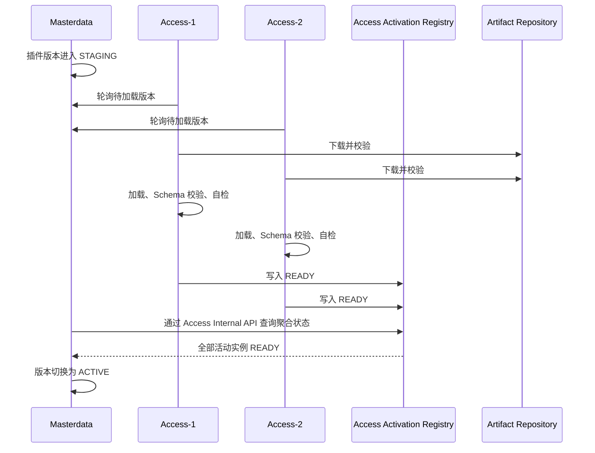
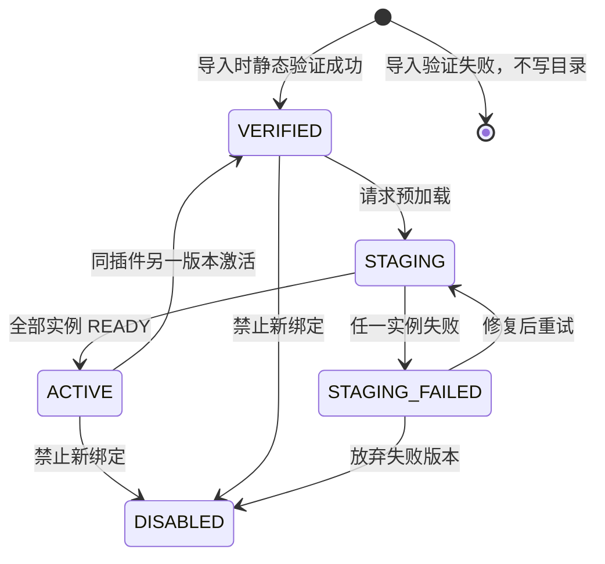
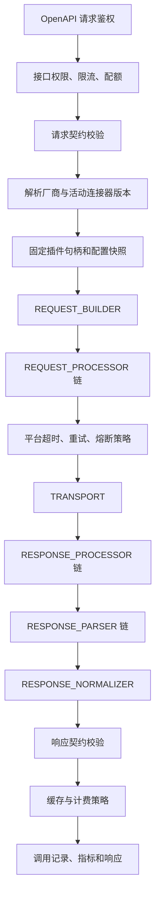

# 外部请求连接器插件化升级设计

> 版本：V2.0（阶段 0—5 落地与隔离验收收口稿）
>
> 最后核对：2026-08-11
>
> 适用项目：data-manager-hub
>
> 参考项目：bumblebee-merge2.0
>
> 参考入口：`/datainner/integrated/encryptExecuteByID`
>
> 状态：**阶段 0—5 已实现；组件测试、V048 迁移验证、隔离运行时和浏览器验收均已通过；未声称生产部署**

> 面向配置人员的页面操作、字段解释、示例和后端解析说明见
> [接口连接器配置与后端解析指南](./CONNECTOR_CONFIGURATION_GUIDE.md)。
>
> 当前高级流水线产品模型的后续简化方案见
> [连接器粗粒度插件模型与配置简化优化设计](./2026-08-12-connector-product-model-simplification-design.md)。
> 该方案仍处于规划中，不改变本文记录的当前实现和验收事实。

## 0. 实施状态与证据口径

截至 2026-08-11，本设计的 SPI、控制面、运行时、管理端、迁移和旧链退役已落入当前工作树；
后端/前端测试、V048 隔离迁移、真实运行时链路和浏览器复验均已完成。
本文保留 Bumblebee 参考与“实施前基线”作为决策依据；除这些明确标注的历史章节外，
“必须”“首期”均表示现有实现持续满足的约束，而不是未来计划。

| 能力 | 当前状态 | 主要代码落点 | 已有验证 |
|---|---|---|---|
| 六阶段轻量 SPI 与强类型结果 | 已实现 | `data-platform-plugin-spi` | SPI/Common Runtime 单元测试 |
| `legacy-http`、流水线编译执行和安全传输 | 已实现 | `data-platform-common-runtime/.../common/plugin` | Common Runtime 相关单元测试通过 |
| 插件目录、签名导入和连接器不可变版本 | 已实现 | `data-platform-masterdata/.../connector`、V042/V046/V047/V048 | Schema/密钥/完整性/不可变回归与 V048 实库迁移通过 |
| Access 制品缓存、隔离加载、租约、卸载和多实例激活 | **已实现并有既有 V047 级验收证据** | `data-platform-access/.../connector` | 独立的双 Access 环境已验证离线仓库、readiness、切换、租约和 ClassLoader gauge；该证据不属于本次 V048 路由环境 |
| PLUGIN-only 调用、错误策略和调用/计费事实追踪 | 已实现 | `VendorProxyService`、`ConnectorErrorPolicy`、`call_record`、`billing_event` | NOT_SENT/SENT/MAYBE_SENT、缓存、契约、计费和主备均通过 |
| 插件中心与厂商连接器工作台 | 已实现 | `data-platform-web/src/views/connector-plugin`、`VendorConnectorWorkspace.vue` | 前端 lint、单元测试和 build 通过 |
| 签名外部插件/HTTPS 仓库/隔离数据库夹具 | 已实现 | `data-platform-test/test-fixtures/connector-e2e` | JAR、Ed25519、HTTPS、厂商端点和 V001—V048 迁移已验证 |
| V048 接口—厂商主备运行时链路 | **单 Access 隔离环境已验收** | Identity、Masterdata、Access、Billing、Gateway | 创建接口→绑定两个厂商→保存主备→草稿校验/测试/发布→启用→主调用→connection-refused/NOT_SENT 安全回退均通过；本次未启动 Governance |
| 真实管理页面 | **隔离浏览器已验收** | 插件中心、厂商连接器工作台 | 固定入口、真实厂商名、PRIMARY/FALLBACK、连接器 V1、READY 和未绑定厂商过滤均已核对 |
| 存量配置迁移、PLUGIN-only 和旧静态适配器删除 | **已实现并验收** | V043—V045、删除的 adapter/UI/DTO | 迁移失败关闭、历史只读、旧写端点 404/405 和全仓引用扫描通过 |
| 完整性与历史不可变冻结 | **已实现并验收** | V046—V047 | V1/V2 兼容、fresh/upgrade/HALT/非法更新/删除/恢复矩阵通过 |

证据口径：代码和组件测试证明实现；隔离验证证明一次性环境中的真实 HTTP/数据库/浏览器行为，
两者均不等同生产部署。最终工作树执行 `mvn -DskipTests=false test` 为 27 个 Maven 模块、516 tests、
0 failure/error/skipped；Masterdata 88 tests，后端总计 516 tests；Node 24 下 Web lint、13 个 Vitest 文件/
59 tests 和生产 build 通过，仅有 523.45 kB chunk warning；架构扫描与 `git diff --check` 通过。Common Runtime + Access clean test 另有 242 tests 全绿，包含 10,000 次编排 P95=5,875ns 和
100 次 ClassLoader 生命周期专测（`aliveClassLoaders=0`）。

### 0.1 隔离运行环境与浏览器验收记录

本节汇总两组彼此独立的隔离验收证据，不能视为同一次运行环境：既有 V047 级证据使用双 Access，
验证签名制品、多实例激活和完整生命周期；2026-08-11 的 V048 路由验收使用单 Access，并启动
Identity、Masterdata、Billing 和 Gateway，未启动 Governance。两组证据均不等同生产部署、生产权限配置或生产计费配置：

- **既有 V047 级双 Access 证据—签名供应链**：错误哈希、错误签名和非白名单地址均返回 400；合法 Ed25519 制品完成 import/verify/
  stage。两个活动 Access 全部 READY 后才能激活；令 Access-2 加载失败时新版本 activate 返回 409，
  旧 ACTIVE 继续服务，恢复后双 READY 才允许切换。
- **本次 V048 单 Access 证据—控制面与浏览器**：通过真实 API 完成接口创建、两个厂商绑定、主备路由保存、草稿 validate/test/publish 和主备配置启用；
  浏览器显示固定入口、真实厂商名、`PRIMARY`/`FALLBACK`、连接器 V1 和 `READY`，绑定下拉只剩未绑定的 UAPI。
- **本次 V048 单 Access 证据—OpenAPI 主备路由**：主端点在线调用记录实际厂商 `routing-primary-70001`；停止主端点形成
  connection-refused 后，主请求交付状态为 `NOT_SENT`，安全回退成功，
  调用记录及 `Billing` `POSTED` 事实中的实际厂商为 `routing-fallback-70001`。调用权限和零元计费均来自隔离库支持数据，
  用于打通验收链路，不代表生产授权或生产价格配置。
- **既有 V047 级错误与治理证据**：主厂商 `NOT_SENT` 时只调用一次备用；`SENT` 与 `MAYBE_SENT` 均不降级。CallRecord 与
  BillingEvent 保存实际 vendor/plugin/pipeline/hashAlgorithm/integrityHash；Billing 幂等仅一条事件，
  失败不误收费。
- **既有 V047 级双 Access 证据—生命周期**：仓库离线且存在验证缓存时 Access 恢复；空缓存时 readiness DOWN；仓库恢复后新实例
  `DOWN → UP`；下线实例不永久阻塞。阻塞旧请求时发布新版本，旧请求固定旧流水线、新请求使用新
  流水线，最后 lease release 后 ClassLoader gauge 从 2 降至 1。
- **既有 V047 级安全与性能证据**：危险字节码门禁、日志秘密字面量扫描、低基数指标、P95<5ms 和 100 次装卸专测均通过。
- **本次 V048 数据库证据**：V048 全新安装、V047 存量升级、重复 update、重复绑定歧义中止、旧主厂商歧义中止，
  以及回滚拒绝且快照不变，均在独立 PostgreSQL 验证。
- **既有 V047 级数据库证据**：V001—V047 fresh、V047 前历史保护和备份恢复证据仍按原记录保留。

上述两组隔离验收环境及各自一次性凭据均在对应验收后分别清理；更细的本地原始脱敏报告不受 Git 管理，不作为仓库文档依赖。
该证据支持当前工作树在隔离环境完成“创建接口→绑定厂商→配置主备→启用→调用→安全回退”，不宣称生产流量、
生产容量、生产调用权限或生产计费价格已验证。

## 1. 目标与结论

本文档记录 data-manager-hub“外部请求连接器插件化”的设计决策、实际落地和验收结果。方案参考
bumblebee-merge2.0 的 Fetcher/Parse 插件模型，但不会复制其系统类加载器、宿主 Bean
注册和任意 JAR 执行方式。

本方案的核心结论如下：

1. 保持 `/openapi/v1/query` 和 `/openapi/v1/batch-query` 契约不变。
2. 保持 masterdata、access、billing、identity、governance 五域不变；新增的
   `data-platform-plugin-spi` 只是轻量 Maven 库，不形成第六个业务服务。
3. 首期只插件化请求构建、请求处理、传输、响应处理、响应解析和响应标准化；权限、限流、
   配额、缓存、熔断、厂商降级、计费、调用记录和契约校验仍由平台负责。
4. Masterdata 是插件目录和厂商连接器版本的控制面，Access 是插件加载和调用的运行面。
5. 插件版本不可变，厂商配置发布时固定插件版本、配置快照和哈希，历史调用能够还原实际执行实现。
6. 首期采用进程内热加载，但只允许内部或审核通过、带可信签名的插件。未知第三方代码必须运行在
   独立 Worker 或容器中。
7. 生产制品保存在 Nexus/S3 兼容制品库，Access 只加载通过 SHA-256、签名和 SPI 兼容性校验的
   本地缓存副本，不把 JAR 存入 PostgreSQL。
8. 内置 `legacy-http` 作为插件运行时内部兼容桥承接原协议能力；V044/V045 已完成 PLUGIN-only
   数据迁移和旧字段删除，不再保留第二套生产适配器运行时。

本文档最初是未来态设计，目前已同步到实现。阶段 0—5 已实现并通过隔离验收；这不等同生产部署，
生产 TrustStore/制品库接入、容量基线和分批放量仍按第 17 节门禁执行。

本次同步只补充当前“接口→厂商绑定→主/备用路由→连接器版本”的使用契约，不把尚未完成的真实生产运行时验收标记为已通过；隔离测试、组件测试和生产验收仍须按各自证据口径区分。

### 1.1 接口、厂商绑定与显式主备路由

接口管理的配置顺序固定为：创建接口 → 绑定厂商 → 选择主/备用 → 配置并发布连接器 → 启用厂商配置 → 启用接口 → 调用固定入口 `POST /openapi/v1/query`。接口创建只维护 `apiCode`、接口名称、数据类型、排序和描述；前端不再选择厂商、业务 `path` 或手工状态，新接口默认 `inactive`。

厂商绑定以 `interfaceId + vendorId` 为事实源，数据类型由接口服务端推导；同一接口重复绑定同一厂商返回 HTTP 409。第一个有效绑定通过 CAS 自动成为主配置。每个接口最多一个 `PRIMARY` 和一个 `FALLBACK`，备用可为空且不能与主相同，路由通过 `PUT /interface/{id}/vendor-routing` 显式保存 `primaryVendorConfigId` 与 `fallbackVendorConfigId`。

Access 收到 `apiCode` 后先解析接口，再按这两个 ID 精确读取 `vendor_config`，继而读取厂商、活动连接器版本、流水线配置和当前厂商的 credential/SecretRef；不按列表顺序、创建时间或灰度规则猜测厂商。路由不是 `READY`、主配置不存在/非 active、名称或数据类型无法解析时失败关闭。

主请求失败后，仅当 `ConnectorErrorPolicy` 判定可安全回退且交付状态为 `NOT_SENT` 时，调用精确备用配置一次；`SENT`、`MAYBE_SENT` 不回退，备用配置自身的 fallback 字段也不会形成链式回退。备用成功时，实际厂商、插件追踪、`fallbackFrom`、调用记录和计费事实都来自备用配置。

`path`、`api_interface.vendor_id` 和 `vendor_config.fallback_vendor_id` 仍可能出现在兼容 DTO/数据库中，但新流程不依赖这些字段。

## 2. Bumblebee 参考实现

### 2.1 入口调用链

bumblebee-merge2.0 由网关去除 `/datainner` 前缀后，将请求交给
`/integrated/encryptExecuteByID`。主链路可归纳为：

```mermaid
flowchart LR
    A["Gateway 去除 /datainner"] --> B["encryptExecuteByID"]
    B --> C["SM4 解密 Transaction.Body"]
    C --> D["IP、授权、限流、配额校验"]
    D --> E["按版本解析 ProcessService"]
    E --> F["解析外部数据源与供应商插件配置"]
    F --> G["Fetcher 插件"]
    G --> H["Parse 插件链"]
    H --> I["字段映射与标准化"]
    I --> J["缓存、计费、日志、故障切换"]
    J --> K["SM4 加密响应"]
```



其关键设计不是某一个 Fetcher 的实现，而是把外部数据调用拆成了三层：

- 平台编排层：负责入口加解密、授权、限流、配额、缓存、计费、日志和故障切换。
- 插件运行层：按 `PluginType + pluginId` 找到插件实例，执行 Fetcher 和有序 Parse 链。
- 厂商配置层：保存插件选择、插件配置、参数占位符和数据源版本，不把配置写死在插件代码中。

### 2.2 插件类型与制品

参考项目定义四类插件：

| 插件类型 | 作用 | 本项目首期处理 |
|---|---|---|
| `Fetcher` | 执行 HTTP、SDK 或其他外部请求 | 吸收，拆为请求、传输能力 |
| `Parse` | 解密、解析、转换响应 | 吸收，形成有序响应处理链 |
| `Persist` | 保存数据 | 不纳入首期，继续由领域服务负责 |
| `Crawl` | 执行爬取任务 | 不纳入首期，需要独立调度与隔离方案 |

每个插件通常包含：

- 独立 Maven/JAR 制品；
- SPI 实现；
- `plugin.json`；
- Spring Bean 描述；
- 可选插件属性文件。

`plugin.json` 同时承担插件清单和动态表单元数据，描述插件标识、类型、实现类、标签、默认值、
正则校验和自定义参数。运行时扫描插件目录，读取 Manifest，加载 JAR，再将插件放入按类型和 ID
组织的注册表。

### 2.3 值得吸收的设计

- 插件制品、能力描述、厂商实例配置和调用编排相互分离。
- 稳定 SPI 隔离了主流程和厂商差异，主流程不需要维护大量 `if/else`。
- Manifest 既可用于运行时发现，也可驱动管理端配置表单。
- Fetch 和 Parse 分离，同一个传输能力可以组合多个解析能力。
- 插件配置属于厂商实例，而不是插件全局单例状态。
- 业务流程按版本解析，历史配置不会被当前编辑中的内容污染。
- 通信、业务、缓存和计费状态不是同一个布尔值。
- 授权、限流、配额、缓存、计费和日志留在平台层，插件不接管治理权。

### 2.4 明确不复制的部分

- 不使用系统 ClassLoader 注入插件类。
- 不允许插件 Bean 覆盖宿主 Spring Bean。
- 不允许未签名 JAR 通过管理页面直接执行。
- 不允许插件读取宿主数据库、Redis、Kafka、Nacos 或领域 Service。
- 不允许插件自行决定最终计费金额、缓存时效或降级厂商。
- 不把厂商特殊逻辑继续堆积到一个通用 HTTP Fetcher。
- 不允许插件配置保存明文密码、Token、证书或私钥。
- 不允许插件日志或异常返回完整请求、响应或秘密值。
- 不把 ClassLoader 隔离描述成恶意代码沙箱。Java 进程内插件仍与宿主共享进程权限。
- 不支持没有 Manifest、Manifest 与实现不一致或同坐标可覆盖的插件制品。

## 3. 实施前基线与差距闭环

### 3.1 实施前调用链（历史基线，已退役）

下图是升级开始时的唯一链路，只用于说明设计来源。V044 已把存量配置迁移为 PLUGIN-only，V045
删除旧配置列；`VendorAdapterFactory`、`HttpVendorAdapter` 和对应固定 UI/写入契约已从当前树删除。
当前唯一运行链见第 12 节。

```mermaid
flowchart LR
    A["OpenApiQueryController"] --> B["OpenApiQueryService"]
    B --> C["VendorProxyService"]
    C --> D["Masterdata Feign 获取 VendorConfig"]
    D --> E["VendorAdapterFactory.getAdapter"]
    E --> F["HttpVendorAdapter"]
    F --> G["请求映射"]
    G --> H["认证与 REQUEST 安全流水线"]
    H --> I["OkHttp 请求"]
    I --> J["RESPONSE 安全流水线"]
    J --> K["响应映射"]
    K --> L["Access 响应契约、计费、记录"]
```



历史源码证据（当前树已删除的类通过版本历史追溯）：

- `VendorProxyService` 从 Masterdata 获取 `VendorConfigDTO`、厂商信息和运行时安全步骤，处理熔断、
  主备厂商切换和循环路由保护。
- `VendorAdapterFactory` 使用静态 `ConcurrentHashMap`，未知厂商默认创建
  `HttpVendorAdapter`。
- `HttpVendorAdapter` 负责请求映射、认证、安全流水线、OkHttp 请求、响应解析和响应映射。
- `SecurityPipelineExecutor` 已定义 `SecurityStepHandler` 契约，但默认处理器仍由
  `DefaultSecurityStepHandlers.create()` 固定创建。
- Masterdata 已有 `vendor_config`、`vendor_interface_security_step` 和安全配置版本。
- 管理端已有请求头、请求体、认证、参数映射、响应映射和安全流水线编辑器。

### 3.2 实施前可复用基础

- Masterdata 已具备厂商、接口、参数映射、响应映射和版本化安全流水线。
- Access 已具备主备厂商路由、熔断、调用记录、缓存、响应契约和计费编排。
- `SecurityStepHandler` 已形成局部 SPI，可作为内置安全阶段的基础。
- `interface_param` 字段树仍是接口请求/响应契约唯一数据源。
- 管理端已有请求头、认证、请求体、映射和安全流水线编辑器，可逐步映射为内置插件阶段。
- `/openapi/v1/query` 和 `/openapi/v1/batch-query` 无需改变。

### 3.3 差距闭环状态

| 实施前问题 | 当前闭环 | 仍保留的边界 |
|---|---|---|
| `VendorAdapterFactory` 静态缓存 | 按插件 ID 和固定版本解析；静态工厂已删除 | `legacy-http` 仅为插件内部桥，不是第二运行时 |
| `HttpVendorAdapter` 手工创建依赖 | 使用受控 `PluginContext`、注册表和宿主执行器；旧类已删除 | 插件不能获取 Spring 容器或领域服务 |
| 安全处理器写死在默认列表 | 六阶段可组合内置和签名插件 | 原安全能力由内置阶段承接 |
| 请求、传输、解析集中 | `PipelineCompiler/ConnectorPipelineExecutor` 拆分有序阶段 | 六种能力与唯一 Transport 约束保持不变 |
| 返回值是 `Map + success` | SPI 使用强类型结果、错误、delivery、billing/cache signal | OpenAPI 边界只做既有响应契约适配 |
| 插件版本未绑定调用配置 | 快照固定版本及完整性材料，调用/计费保存实际事实 | V1 历史通过派生完整性解释，V2 内嵌摘要 |
| 配置 UI 固定 | 插件工作台按 Manifest Schema 递归渲染 | 支持设计范围内的基础类型和简单数组 |
| `timeout/retryCount` 未形成一致策略 | Transport 强制连接/读取/总超时，重试受幂等和 delivery 策略限制 | 插件不能提高平台上限 |
| 静态缓存无卸载生命周期 | 请求租约、原子切换、引用归零释放和真实 ClassLoader gauge | 卸载失败告警但不影响新活动版本 |

## 4. 范围与平台边界

### 4.1 首期能力链

首期固定支持六种阶段能力：

1. `REQUEST_BUILDER`：把标准参数转换为厂商请求。
2. `REQUEST_PROCESSOR`：处理 Header、认证、签名、摘要、加密和请求体。
3. `TRANSPORT`：执行 HTTP/HTTPS 或经过审核的其他协议。
4. `RESPONSE_PROCESSOR`：处理验签、解密、解码和响应预处理。
5. `RESPONSE_PARSER`：把厂商响应解析为结构化数据。
6. `RESPONSE_NORMALIZER`：映射为接口标准响应。

每个已发布流水线必须满足：

- 恰好包含一个 `TRANSPORT`；
- 可以包含多个请求处理、响应处理、解析和标准化步骤；
- 同一方向的步骤 `order` 唯一；
- 步骤顺序在发布后不可修改；
- 每一步固定 `pluginId + pluginVersion + capability + configHash`；
- 每一步配置必须通过对应固定插件版本的 Schema 和运行时验证器。

### 4.2 首期非目标

- Persist 插件和 Crawl 插件。
- 任意 Groovy、JavaScript、SpEL、脚本或远程表达式执行。
- 插件直接访问数据库、Redis、Kafka、Nacos、Spring ApplicationContext 或领域 Service。
- 插件自行写调用记录、账单或缓存。
- 未知第三方代码的进程内执行。
- 修改现有 OpenAPI 请求或响应协议。
- 插件失败后无条件双发旧链路。
- 在线编辑插件源码或在平台内完成插件构建。

### 4.3 平台保留的治理权

- API Key、接口权限、限流和配额；
- 接口请求和响应契约校验；
- 厂商灰度与主备路由；
- 熔断、重试和超时上限；
- 缓存资格、缓存键和缓存时效；
- 计费方案、幂等入账和调用记录；
- Trace、指标、审计和日志脱敏；
- 密钥保存、授权和运行时解析。

## 5. 模块和领域职责

### 5.1 `data-platform-plugin-spi`（已实现）

新增一个非部署 Maven 模块作为插件唯一编译契约：

- 只依赖 JDK、必要注解和轻量 JSON 类型；
- 不依赖 Spring Boot、数据库、Redis、Nacos、MyBatis、Feign 或任何业务域 Service；
- 插件 JAR 只允许编译依赖该 SPI 和插件自身第三方库；
- SPI 采用语义化版本，破坏性变更提升 `spiVersion` 主版本；
- SPI 不包含 Masterdata 数据库实体或 Access 内部实现。

### 5.2 Masterdata 控制面

Masterdata 负责：

- 插件身份和插件版本目录；
- Manifest、Config Schema、制品地址、哈希和签名信息；
- 插件审核、禁用和发布状态；
- 厂商连接器草稿与不可变发布版本；
- 厂商配置与插件版本绑定；
- Config Schema 服务端校验；
- 密钥引用合法性校验；
- 向 Access 提供完整、固定版本的运行时快照。

Masterdata 不加载 ClassLoader、不执行插件、不保存插件实例运行状态，也不读取 Access 调用记录。

### 5.3 Access 运行面

Access 负责：

- 从制品库下载并缓存插件；
- 校验哈希、签名、Manifest 和 SPI 兼容性；
- 创建、切换和关闭版本隔离 ClassLoader；
- 维护插件注册表和引用计数；
- 编译并执行连接器流水线；
- 汇总各 Access 实例加载状态；
- 记录实际插件版本、步骤耗时和错误分类；
- 保持现有缓存、熔断、厂商降级、计费和调用记录编排。

连接器控制面表由 `V042__create_connector_plugin_control_plane.sql` 创建，后续迁移必须按版本顺序完成后再放行 Access。`ConnectorRuntimeStartupSynchronizer`、待处理激活调度和 heartbeat 在调用 `connector_plugin_activation` Mapper 前执行轻量 schema guard；表不存在时 readiness 保持 false，并记录稳定安全错误码 `CONNECTOR_SCHEMA_NOT_READY`，不吞掉其他 SQL 错误。表恢复后调度可自动继续同步。部署顺序应为“先迁移、确认迁移历史和表存在，再启动/放行 Access”；缺表期间不得把服务标记为 READY。

### 5.4 Common Runtime

`data-platform-common-runtime` 负责实现：

- 宿主管理的 HTTP Transport；
- 内置映射、安全流水线和 `legacy-http` 插件；
- ClassLoader、插件注册表和流水线执行器的通用实现。

Common Runtime 不保存领域数据，不直接读取 Masterdata 数据库。

### 5.5 Identity 与 Governance

- Identity 提供管理权限和 Service JWT。
- Governance 沿用操作日志、Trace 和指标能力，记录导入、验证、预加载、激活、禁用、绑定、
  发布、回滚和测试。
- 插件签名信任公钥来自只读部署 Secret/TrustStore，不由插件管理 API 修改。

## 6. SPI 详细契约

### 6.1 `ConnectorPlugin`

```java
public interface ConnectorPlugin extends AutoCloseable {
    PluginDescriptor descriptor();
    void initialize(PluginContext context);
    List<ConnectorStageFactory> stageFactories();
    PluginSelfTestResult selfTest();
    @Override void close();
}
```

约束：

- 一个 `pluginId + version` 只初始化一次；
- 插件对象必须线程安全；
- `initialize` 不能发起真实业务厂商请求；
- `selfTest` 只能验证依赖、配置编译和无副作用能力；
- `close` 必须释放线程、连接池和临时资源；
- 插件不得创建非守护全局线程，需要异步能力时使用宿主执行器。

### 6.2 `ConnectorStageFactory`

```java
public interface ConnectorStageFactory {
    StageCapability capability();
    default StageLifecycle lifecycle() { return StageLifecycle.SHARED; }
    void validate(JsonNode config, PluginValidationContext context);
    ConnectorStage create(CompiledStageConfig config);
}
```

- 配置在发布或激活时完成校验和编译；
- 请求执行时不能重复解析 Schema 或重新编译模板；
- Factory 必须线程安全；
- Stage 默认 `SHARED` 且必须无状态、线程安全；Factory 显式声明 `REQUEST_SCOPED` 时，宿主每请求
  创建实现 `RequestScopedConnectorStage` 的实例，并在请求结束时恰好关闭一次；
- `lifecycle()` 是兼容默认方法，既有插件无需修改，`ConnectorStage` 既有方法签名未改变。

### 6.3 `ConnectorStage`

```java
public interface ConnectorStage {
    StageCapability capability();
    void execute(ConnectorExchange exchange, StageExecutionContext context)
        throws ConnectorException;
}
```

`ConnectorExchange` 由宿主创建，包含：

- 标准请求参数；
- 当前 `ConnectorRequest`；
- 当前 `ConnectorRawResponse`；
- 标准化响应数据；
- 已完成步骤的只读输出；
- 实际厂商、插件版本和流水线版本；
- 截止时间与取消状态。

插件只能通过阶段允许的方法修改 Exchange，不能替换调用身份、授权、计费或缓存上下文。
编译流水线和实际请求都持有租约：活动快照原子切换后，旧请求继续旧流水线，新请求只见新流水线；
旧流水线只有在 retired 且最后一个请求释放后才关闭阶段并释放插件句柄。草稿受控测试由宿主有界
执行器和 `Future` 硬截止执行，超时后 cancel；线程池饱和失败关闭，阻塞插件不能无限占用工作线程。

### 6.4 `PluginContext`

宿主只暴露：

- `ManagedHttpTransport`
- `SecretResolver`
- `Clock`
- `PluginLogger`
- `PluginMetricRecorder`
- `ObjectCodec`
- 受限任务执行器

明确不暴露：

- Spring `ApplicationContext`
- DataSource
- RedisTemplate
- Feign Client
- KafkaTemplate
- 领域 Service
- 宿主文件系统根路径

### 6.5 强类型请求和响应

`ConnectorRequest` 至少包含：

- method、url、headers、query；
- contentType、body；
- connectTimeout、readTimeout、totalTimeout；
- idempotencyPolicy；
- maxResponseBytes。

`ConnectorRawResponse` 至少包含：

- 协议/HTTP 状态；
- headers、body；
- latency、remoteEndpoint；
- bytesSent、bytesReceived。

`ConnectorExecutionResult` 至少包含：

- `transportStatus`；
- `businessStatus`；
- `normalizedData`；
- `errorCategory`、`errorCode`、`safeMessage`；
- `billingSignal`、`cacheSignal`；
- `pluginId`、`pluginVersion`、`pipelineVersion`；
- `stageTimings`。

插件只能产生计费和缓存信号，最终计费、缓存决定仍由平台策略作出。所有 `safeMessage` 在进入结果、
日志、记录和 UI 前统一经过宿主秘密值/Authorization/token/password/private-key 脱敏、控制字符处理
和长度截断；插件自称“safe”不能绕过。原始厂商响应只能在平台受控范围内短暂存在。

## 7. Manifest 与配置 Schema

### 7.1 插件包结构

```text
connector-plugin.jar
└── META-INF/data-platform/plugin.json
detachedSignature (Base64，由 CI/制品元数据生成并随导入请求提交)
```

Manifest 示例：

```json
{
  "manifestVersion": "1",
  "pluginId": "vendor-demo-http",
  "version": "1.2.0",
  "spiVersion": "1.0",
  "displayName": "示例厂商 HTTP 连接器",
  "provider": "internal",
  "entryClass": "com.example.DemoConnectorPlugin",
  "capabilities": [
    "REQUEST_BUILDER",
    "RESPONSE_PARSER"
  ],
  "minHostVersion": "2.1.0",
  "configSchema": {},
  "permissions": {
    "networkProtocols": ["https"],
    "networkHosts": ["api.example.com"]
  }
}
```

必填字段为 `manifestVersion`、`pluginId`、`version`、`spiVersion`、`displayName`、
`provider`、`entryClass`、`capabilities`、`minHostVersion`、`configSchema` 和
`permissions`。签名 Manifest 是插件坐标的权威来源；Masterdata 以此建立不可覆盖的目录坐标，Access
加载时校验目录 DTO 与 Manifest 一致。URI 路径只承担仓库白名单定位，不作为身份安全边界，避免把
可变的仓库布局误当成签名身份。

### 7.2 Schema 规则

采用 JSON Schema Draft 2020-12，并允许以下平台扩展：

- `x-ui-widget`
- `x-ui-order`
- `x-secret-ref`
- `x-sensitive`
- `x-placeholder-source`
- `x-help-text`

首期支持 string、integer、number、boolean、enum、object 和简单数组。首期拒绝远程 `$ref`、
动态代码、自定义脚本校验器、无上限递归 Schema，以及包含秘密默认值的 Schema。

### 7.3 配置职责

- Manifest 描述插件能够做什么；
- 厂商连接器版本保存该厂商选择的值；
- 密钥字段只保存 `secretRef`；
- 发布时按固定插件版本对应的 Schema 校验；
- 激活时 Access 再校验一次，防止数据漂移；
- Manifest、Schema 和配置快照共同生成 `snapshotHash`；
- 禁止使用不固定版本或 `latest` 绑定。

## 8. 制品分发与热加载

### 8.1 制品流程

1. 插件源码由独立 CI 构建。
2. CI 执行 SPI 契约测试、安全扫描和许可证检查。
3. CI 计算 JAR SHA-256。
4. CI 使用 V1 canonical JSON（对象字段名递归自然排序、数组保序、无多余空白的紧凑 JSON），
   使用 Ed25519 对 `canonicalManifest + "\\n" + lowercase(jarSha256)` 生成脱离签名。
5. JAR 和签名上传 Nexus/S3 兼容制品库。
6. 管理员导入制品坐标，不直接上传任意本地 JAR。
7. 平台只访问白名单内的 HTTPS 仓库地址，禁止任意重定向。
8. Access 下载到临时文件，校验成功后原子移动到本地缓存。
9. 本地缓存按 `pluginId/version/sha256` 隔离。

### 8.2 ClassLoader 规则

- 每个 `pluginId + version` 建立独立 ClassLoader；
- JDK、SLF4J 和 `data-platform-plugin-spi` 使用父加载优先；
- 插件自身依赖使用子加载优先；
- 禁止插件携带或覆盖 SPI 类；
- 禁止加载 `java.*`、`javax.*`、`jakarta.*` 和宿主领域包的替代类；
- 插件不注册到宿主 Spring ApplicationContext；
- 通过 `ServiceLoader` 或 Manifest `entryClass` 实例化；
- 同一插件多个版本可同时驻留，服务于在途请求和回滚；
- 调用前设置线程上下文 ClassLoader，结束后必须恢复。

### 8.3 原子切换和卸载

插件注册表以 `(pluginId, version)` 保存 `PluginHandle`：

- 请求开始时 `acquire` 增加引用；
- 请求结束时在 `finally` 中 `release`；
- 发布只切换新请求使用的活动版本；
- 在途请求继续使用原版本；
- 旧版本引用归零后执行 `plugin.close()` 和 `classLoader.close()`；
- 卸载失败产生告警，但不能中断新版本；
- 活动连接器仍绑定的版本不能禁用，必须先迁移或回滚绑定；禁用后保留不可变目录和历史解释，
  但不能用于新发布或历史版本回滚；
- Masterdata 在发布、激活、回滚、禁用和解绑事务提交后计算 required artifacts 并请求 Access release；
  定时协调器重新计算并重试部分实例/版本失败，仍被活动绑定引用的版本永不释放；
- 监控活动 ClassLoader 数量和疑似泄漏。

`connector_plugin_classloaders` 读取注册表中的真实活动 ClassLoader，而不是简单复制已加载版本数；
release 只把无绑定版本标为 retired，真正关闭仍等待最后租约归零。

### 8.4 多实例激活



- 所有当前活动 Access 实例就绪后才能激活；
- 任一实例失败时版本保持 `STAGING_FAILED`，旧活动版本继续服务；
- 新 Access 实例预加载所有当前绑定的活动版本，完成前 readiness 为失败；
- 制品库不可用时，只允许使用本地已验证且哈希匹配的缓存；
- 活动版本本地缺失且无法下载时失败关闭，不加载未验证文件；
- 活动实例集合以服务发现结果为准，已下线实例不会永久阻塞激活。

### 8.5 当前配置键

Masterdata 导入阶段使用 `masterdata.connector-plugin`：

- `artifact-allowed-hosts`
- `artifact-allowed-path-prefixes`
- `trusted-signing-keys.<keyId>`：X.509 DER 公钥的 Base64，仅 V1 Ed25519
- `max-artifact-bytes`、`max-manifest-bytes`、`max-schema-bytes`

Access 下载和执行阶段使用 `connector.runtime`：

- `instance-id`、`host-version`
- `heartbeat-interval-ms`、`activation-poll-interval-ms`、`required-sync-interval-ms`
- `cache-directory`
- `repository-allowed-prefixes`
- `network-allowed-protocols`、`network-allowed-hosts`、`allow-private-networks`
- `max-connect-timeout-ms`、`max-read-timeout-ms`、`max-total-timeout-ms`
- `test-timeout-ms`、`max-response-bytes`
- `signing-keys.<keyId>.resource`、`signing-keys.<keyId>.algorithm`；资源只接受只读
  `file:` 或 `classpath:` PEM

同一 `keyId` 必须同时配置给 Masterdata 和 Access。前者阻止不可信制品进入目录，后者防止目录或
传输数据漂移后被运行。HTTPS 制品库/厂商端点的 CA 信任由 JVM TLS TrustStore 提供，不等同插件
签名公钥。生产键值和证书挂载方式见 `docs/DEPLOYMENT.md`。

## 9. 数据模型与数据库保护（V042—V048 已实现）

### 9.1 Masterdata 所有表

#### `connector_plugin`

保存插件逻辑身份：

- `plugin_id`
- `display_name`
- `provider`
- `description`
- `status`
- `created_by`、`created_at`
- `updated_by`、`updated_at`

#### `connector_plugin_version`

保存不可变制品版本：

- `plugin_id`、`version`、`spi_version`；
- `entry_class`；
- `artifact_uri`、`artifact_sha256`；
- `detached_signature`、`signing_key_id`；
- `manifest_json`、`config_schema_json`；
- `capabilities`、`permission_manifest`；
- `min_host_version`；
- `status`、`verified_at`；
- `created_by`、`created_at`。

V047 数据库触发器和迁移前检查强制：

- `plugin_id + version` 唯一；
- 插入后制品坐标、Manifest、Schema、签名、能力、权限和 Host 版本不可修改；
- 只允许服务状态机更新状态、验证时间、安全错误和审计时间；
- 任意物理删除均拒绝，禁用只禁止新绑定并保留历史执行解释；
- 相同坐标不能覆盖上传。

#### `vendor_connector_version`

保存厂商配置不可变运行快照：

- `vendor_config_id`
- `version_no`
- `pipeline_snapshot`
- `snapshot_hash`
- `hash_algorithm`
- `integrity_hash`
- `security_version`
- `status`
- `published_at`、`published_by`
- `previous_version_id`
- `created_at`

`pipeline_snapshot` 中每一步包含：

- `stageKey`
- `capability`
- `pluginId`
- `pluginVersion`
- `order`
- `enabled`
- `config`
- `configHash`
- V2 步骤的 `artifactSha256`、`manifestHash`、`schemaHash`

完整性采用显式版本：

- `V1_DERIVED`：保留 V046 前既有 `pipeline_snapshot/snapshot_hash` 原文，运行时从目录中固定的
  Artifact、Manifest、Schema 和配置派生 `integrity_hash`，不改写历史事实；
- `V2_EMBEDDED`：新发布步骤内嵌 Artifact/Manifest/Schema 摘要，`snapshot_hash` 自然覆盖全部步骤
  材料，并保存对应 `integrity_hash`；
- Access 编译流水线时再次读取固定 `pluginId + version` 的目录材料，执行 Schema 校验并核对算法、
  快照和完整性哈希，Factory 的 `validate` 不能替代宿主校验。

#### `vendor_connector_test_fact`

以只追加、不保存业务请求/响应载荷的方式记录受控测试事实：

- `vendor_config_id`、`draft_version`、`snapshot_hash`；
- `plugin_bindings`，保存排序去重后的 `pluginId:pluginVersion` 列表；
- `test_succeeded`、`safe_error_category`、`safe_error_code`；
- `result_digest`，只对安全结果摘要计算 SHA-256；
- `tested_by`、`tested_at`。

数据库触发器拒绝 UPDATE/DELETE。受控测试无论成功或失败都追加事实；只有与当前
`vendor_config_id + draft_version + snapshot_hash` 完全匹配的成功事实才能通过发布门禁。

#### `vendor_config` 当前字段

V042 增加、V044/V045 收口：

- `runtime_mode`：V044 强制为 `PLUGIN`；
- `active_connector_version_id`；
- `connector_version`，作为乐观锁。

V045 已删除旧 `api_url/method/header_config/request_template/response_mapping/auth_type/auth_config/
param_mapping` 列。`legacy-http` 从不可变连接器快照读取配置，不依赖已删除列。

### 9.2 Access 所有表

#### `connector_plugin_activation`

保存每个运行实例的加载事实：

- `service_instance_id`
- `plugin_id`
- `plugin_version`
- `artifact_sha256`
- `host_version`
- `state`
- `loaded_at`
- `last_heartbeat_at`
- `safe_error_code`
- `safe_error_digest`

该表属于 Access 域，Masterdata 只能通过 Access Internal API 获取聚合状态，不能直接读取。

### 9.3 版本和删除规则

- 草稿允许修改；
- 已发布/ACTIVE/SUPERSEDED 连接器版本的流水线、版本、发布、前序关系和完整性事实不可修改；
- 只允许合法的 ACTIVE→SUPERSEDED 状态变化及审计时间更新；
- 回滚产生新的发布动作，不修改历史版本；
- 插件制品、Manifest、Schema 和配置快照通过哈希关联；
- 调用记录和 BillingEvent 保存实际 `pluginId`、`pluginVersion`、`pipelineVersion`、`snapshotHash`、
  `hashAlgorithm` 和 `integrityHash`；插件/版本对、算法/完整性对必须同时为空或同时存在；
- V047 升级前失败关闭检查每个已发布步骤和非空历史插件对可对应目录，V1/V2 完整性组合合法；
  检查失败则整个 changeset 原子 HALT，不原地“修复”坏历史；
- 插件版本和已发布连接器版本均禁止物理删除。跨域历史引用不建立 FK，也不允许跨域业务写入，
  由目录删除保护、字段成对 CHECK 和迁移验证共同保证可解释性。

### 9.4 迁移版本

| 版本 | 已落地内容 |
|---|---|
| V042 | 插件目录、版本、连接器草稿/发布版本、受控测试、激活和调用/计费追踪基础 |
| V043 | 存量迁移控制与三域 observation；写控制面冻结后仅保留只读历史查询 |
| V044 | 迁移所有厂商配置并强制 `runtime_mode=PLUGIN`，缺失绑定失败关闭 |
| V045 | 删除旧适配器配置列和旧写契约依赖 |
| V046 | 新增 `V1_DERIVED/V2_EMBEDDED` 完整性事实并保持旧历史不变 |
| V047 | 插件制品、发布版本和历史事实不可变/不可删保护及升级前一致性 HALT |
| V048 | 校验存量接口/厂商绑定后，建立接口主/备用配置引用、有效绑定唯一性和删除保护 |

V043—V048 的破坏性历史冻结采用 forward recovery/备份恢复；对应 `U0xx` 不允许在已有受保护事实时
破坏性回退。操作说明见 `sql/MIGRATIONS.md` 和 `docs/DEPLOYMENT.md`。

## 10. API（已实现）

以下管理 API 由 Masterdata 实现，经 Gateway 的 `/api/v1` 前缀暴露；精确请求和响应见
`docs/API.md`。Internal API 不经过 Gateway。

### 10.1 插件目录管理

管理路径统一使用 `/api/v1/connector-plugin`：

| 方法 | 路径 | 用途 |
|---|---|---|
| GET | `/connector-plugin` | 查询插件和当前活动版本 |
| GET | `/connector-plugin/{pluginId}` | 查看插件详情 |
| GET | `/connector-plugin/{pluginId}/versions` | 查看全部版本 |
| POST | `/connector-plugin/versions/import` | 从受信制品库导入签名版本 |
| POST | `/connector-plugin/{pluginId}/versions/{version}/verify` | 重新执行静态验证 |
| POST | `/connector-plugin/{pluginId}/versions/{version}/stage` | 要求 Access 实例预加载 |
| GET | `/connector-plugin/{pluginId}/versions/{version}/activation` | 查询逐实例激活状态 |
| POST | `/connector-plugin/{pluginId}/versions/{version}/activate` | 激活全部就绪版本 |
| POST | `/connector-plugin/{pluginId}/versions/{version}/disable` | 禁止新绑定，保留历史能力 |

导入请求至少包含 `artifactUri`、`expectedSha256`、`detachedSignature` 和
`signingKeyId`。

插件版本状态机：



### 10.2 厂商连接器配置

| 方法 | 路径 | 用途 |
|---|---|---|
| GET | `/vendor/config/{id}/connector` | 获取活动连接器版本 |
| GET | `/vendor/config/{id}/connector/draft` | 获取当前草稿 |
| PUT | `/vendor/config/{id}/connector/draft` | 保存草稿 |
| POST | `/vendor/config/{id}/connector/validate` | 校验 Schema、步骤和引用 |
| POST | `/vendor/config/{id}/connector/test` | 使用测试参数执行受控测试 |
| POST | `/vendor/config/{id}/connector/publish` | 发布不可变版本 |
| GET | `/vendor/config/{id}/connector/versions` | 查询历史版本 |
| POST | `/vendor/config/{id}/connector/rollback/{version}` | 回滚到历史版本 |
| GET | `/vendor/connector-migration` | 只读查询已完成迁移的历史记录 |

保存草稿和发布请求必须携带 `expectedDraftVersion`，版本不一致时返回冲突，禁止后写覆盖先写。
原迁移 prepare/execute/policy 写端点已删除，当前只读历史之外的旧写请求返回 404/405。

### 10.3 Internal API

当前精确契约为：

| 提供域 | 方法与路径 | Scope | 用途 |
|---|---|---|---|
| Masterdata | `GET /internal/v1/masterdata/connector-plugins/{pluginId}/versions/{version}/artifact` | `masterdata:connector-artifact:read` | 获取固定制品描述 |
| Masterdata | `GET /internal/v1/masterdata/connector-plugins/runtime/required-artifacts` | `masterdata:connector-artifact:read` | 获取活动连接器所需制品 |
| Masterdata | `GET /internal/v1/masterdata/vendor-configs/{vendorConfigId}/connector-runtime` | `masterdata:connector-runtime:read` | 获取不可变运行快照 |
| Masterdata | `POST /internal/v1/masterdata/vendor-security/connector-secrets/resolve` | `masterdata:vendor-secret:read` | 按 vendor 和本阶段引用最小集合解析秘密 |
| Access | `POST /internal/v1/access/connector-plugins/stage` | `access:connector-runtime:manage` | 预加载插件版本 |
| Access | `GET /internal/v1/access/connector-plugins/{pluginId}/versions/{version}/activation` | `access:connector-runtime:read` | 查询逐实例聚合状态 |
| Access | `POST /internal/v1/access/connector-plugins/{pluginId}/versions/{version}/release` | `access:connector-runtime:manage` | 请求释放版本 |
| Access | `POST /internal/v1/access/vendor-connectors/test` | `access:connector-runtime:test` | 执行脱敏的草稿受控测试 |
| Access | `POST /internal/v1/access/connector-migrations/observation` | `access:connector-runtime:read` | 读取迁移期运行观察事实 |
| Billing | `POST /internal/v1/billing/connector-migrations/observation` | `billing:connector-observation:read` | 读取迁移期计费观察事实 |

每个 Access 实例把加载状态写入 Access 所有的 `connector_plugin_activation`，Masterdata 只能通过
Access Internal API 获取聚合结果。任何实现都不得让 Masterdata 直接读 Access 表，也不得把实例
激活事实写入 Masterdata 表。

所有 Internal API 使用 `/internal/v1/**`、Identity Service JWT 和独立最小 scope，不经过 Gateway。
API 模块不得引入数据库、MyBatis、Redis、Nacos 或插件运行时依赖。

### 10.4 权限

- `connector-plugin:view`
- `connector-plugin:import`
- `connector-plugin:verify`
- `connector-plugin:activate`
- `connector-plugin:disable`
- `connector-plugin:bind`
- `connector-plugin:test`
- `connector-plugin:publish`
- `connector-plugin:rollback`

导入、激活和禁用默认只授予平台插件管理员；厂商配置人员只拥有绑定、测试和发布权限。

## 11. 管理端（已实现）

### 11.1 连接器插件中心

页面展示：

- 插件 ID、名称、供应商和能力；
- 全部版本和 SPI 兼容状态；
- 制品哈希、签名密钥和验证结果；
- 各 Access 实例加载状态；
- 当前活动厂商绑定数量；
- 激活、禁用和失败原因；
- 宿主最低版本和权限清单。

页面不提供任意本地 JAR 执行按钮，只允许录入或选择受信制品库坐标。

### 11.2 厂商接口连接器配置

现有厂商接口配置已增加“连接器”区域：

1. 选择插件和固定版本。
2. 根据 Manifest Schema 动态生成配置表单。
3. 秘密字段只能选择密钥引用。
4. 展示请求、传输和响应处理链。
5. 展示每一步来源插件和版本。
6. 支持草稿校验、受控测试、发布和回滚。
7. 发布前展示新旧版本差异。
8. 测试结果只展示脱敏请求摘要、阶段耗时和标准化响应。

### 11.3 现有编辑器复用

- 原参数映射、认证/安全流水线和响应映射能力已映射到内置
  `REQUEST_BUILDER/REQUEST_PROCESSOR/RESPONSE_PROCESSOR/RESPONSE_NORMALIZER`；
- V044/V045 完成 PLUGIN-only 迁移后，固定旧表单、旧写 API 和无入口 UI 类型已删除；
- 当前厂商抽屉只展示版本化连接器工作台；
- `legacy-http` 只保留运行时内部桥，不能恢复成第二套管理或执行入口。

## 12. 运行时执行语义

### 12.1 完整顺序



### 12.2 错误分类

统一错误类别：

- `CONFIGURATION_ERROR`
- `PLUGIN_NOT_READY`
- `PLUGIN_VERSION_MISMATCH`
- `REQUEST_BUILD_ERROR`
- `AUTH_SECURITY_ERROR`
- `TRANSPORT_TIMEOUT`
- `TRANSPORT_CONNECTION_ERROR`
- `TRANSPORT_HTTP_ERROR`
- `RESPONSE_SECURITY_ERROR`
- `RESPONSE_PARSE_ERROR`
- `BUSINESS_REJECTED`
- `CONTRACT_VIOLATION`
- `PLUGIN_INTERNAL_ERROR`

`ConnectorErrorPolicy` 对 `ErrorCategory` 穷举建表并集中决定 retry、fallback、熔断失败、默认
delivery、billing/cache 和外部错误码；新增错误枚举但遗漏策略时初始化即失败。配置/版本/请求构建/
认证错误默认 `NOT_SENT` 且不重试、不降级、不计费、不缓存；Transport 超时/连接错误可进入幂等
重试判断并计入熔断，只有最终 delivery 明确为 `NOT_SENT` 才能降级；HTTP/响应安全/解析/业务拒绝
按 `SENT` 事实计入熔断或计费资格，但只有插件显式 `ELIGIBLE` 且平台策略允许才收费。

`CONTRACT_VIOLATION` 是平台响应契约失败的唯一类别：对外失败、不重试、不降级、不收费、不缓存，
历史可复用缓存查询也排除 `response_contract_valid=false`。所有失败类别均输出 `docs/API.md` 记录的
稳定外部错误码和经宿主脱敏、截断的 `safeMessage`。

### 12.3 重试和降级

- GET 默认可按配置有限重试；
- POST 只有插件声明幂等且平台配置幂等键时才能自动重试；
- 重试次数和超时由平台设置上限，插件不能提高；
- 厂商主备切换继续由 Access 编排器负责；
- 只有策略允许且 delivery 明确为 `NOT_SENT` 时才调用一次备用厂商；`SENT/MAYBE_SENT` 禁止降级，
  防止重复向厂商发送；
- Resilience4j 以强类型执行结果判定失败，不会把“Future 正常返回失败对象”误记为成功；
- 实际厂商 ID/编码、插件版本、流水线版本、快照与完整性事实和降级来源同时写入调用记录及计费
  请求，备用厂商成功时不得沿用主厂商身份。

### 12.4 缓存和计费

插件输出传输状态、业务状态、标准化数据，以及可解释的计费和缓存信号。`NOT_SENT` 无条件转为
`INELIGIBLE`；`SENT/MAYBE_SENT` 也必须显式 `ELIGIBLE` 且错误策略允许，平台才进一步执行计费方案。
平台最终决定是否调用 Billing、是否收费、是否写缓存、缓存时效和接口最终成功状态。插件不能返回
金额，也不能指定缓存天数。

## 13. 安全设计

### 13.1 供应链安全

- 强制 SHA-256 和受信密钥脱离签名；
- 管理导入 V1 固定使用 Ed25519，签名覆盖 V1 canonical JSON Manifest 和小写 JAR SHA-256；
- TrustStore 只读挂载，不允许业务 API 修改；
- 仓库域名和路径前缀白名单；
- 禁止 HTTP 和任意重定向；
- 签名 Manifest 是 `pluginId/version` 的权威来源；Access 加载时再次校验目录 DTO 坐标与 Manifest
  一致，制品 URI 路径只受仓库前缀白名单约束，不把路径命名约定作为安全边界；
- 同一插件版本发布后不可覆盖；
- Masterdata 导入与 Access 加载复用同一静态字节码门禁，拒绝插件直接使用 Socket/URL/HttpClient、
  文件系统、宿主反射、System/ClassLoader 逃逸、Thread/Executors 创建和 native load；合法插件仅通过
  `PluginContext` 受控能力；
- 仓库提供可执行、可复现的 Maven/CI 供应链扫描配置，执行 SPI 契约、危险字节码、依赖漏洞和许可证
  检查；日常离线单测不依赖在线漏洞库下载，CI 在联网门禁更新扫描数据。

### 13.2 配置和密钥

- 插件配置不得保存明文密钥；
- Schema `type=string` 的 `x-secret-ref` 只接受 secretRef 字符串；`x-sensitive` 或名称具有
  password/token/secret/privateKey/certificate 语义的普通字段只接受 `{ "secretRef": "..." }`，
  两者都拒绝明文，动态表单按 Schema 类型选择对应表示；
- Masterdata 保存、校验、发布时确认 secretRef 实际存在并属于当前 vendor；missing 和跨 vendor
  引用均失败关闭；
- Access 每个阶段只收集该阶段真实引用的最小集合，通过 Masterdata Internal API 再核对 vendor 归属
  后解析，不向其他阶段扩散；
- 秘密不进入 Manifest、明文快照、Trace、指标或错误；
- 插件日志通过宿主 Logger，统一脱敏和截断；
- 插件异常只保留安全错误摘要。

V1 canonical JSON 的精确定义是：递归按对象字段名自然排序、数组顺序不变、Jackson 紧凑序列化，
配置快照和 `configHash` 再对 UTF-8 字节计算 SHA-256。它不是 RFC 8785/JCS；插件 Manifest 应避免
依赖跨语言差异明显的浮点数、超大整数或 Unicode 组合形式。固定测试向量由
`data-platform-test/test-fixtures/connector-e2e/canonicalize_manifest.py` 和签名夹具维护。若以后切换
JCS，必须新增 `manifestVersion` 或显式 canonicalization 版本，不能静默改变既有版本的签名输入。
哈希包含密钥引用标识，不包含解析后的秘密值；密钥轮换通过独立密钥版本和审计记录追踪。

### 13.3 资源上限

首期默认上限：

| 项目 | 默认上限 |
|---|---|
| 单个插件 JAR | 50 MiB |
| Manifest | 256 KiB |
| Config Schema | 128 KiB |
| 单步骤配置 | 64 KiB |
| 单条流水线步骤 | 50 |
| 厂商响应体 | 10 MiB |

所有插件测试和自检必须有截止时间。插件不得创建无限线程或无限队列；平台 HTTP Transport 强制
连接、读取和总调用超时。生产配置可以收紧，不得由插件放宽。

### 13.4 进程内边界

- 禁止替换 JDK、SPI 和宿主领域类；
- 禁止插件访问宿主私有实现类型；
- 不允许通过反射获取 Spring 容器；
- 加载前拒绝违规包、重复 SPI 类和不兼容字节码；
- Manifest 网络权限由 `ManagedHttpTransport` 强制执行；插件直接创建 Socket/HTTP 客户端属于契约
  违规并在构建扫描中拒绝，但进程内模型不把该扫描视为恶意代码沙箱；
- ClassLoader 只解决依赖与生命周期隔离，不解决恶意代码隔离；
- 需要接入未知第三方代码时，必须另行设计进程/容器级 Worker。

## 14. 兼容迁移路线

### 14.1 阶段 0：基线固化

**当前状态：已实现并通过隔离验收（未声称生产部署）。** 原适配器、映射、安全、HTTP 方法、超时、
主备、缓存、契约和计费语义已形成自动化行为快照，为后续 SPI 对等与退役提供基线。

实施项：

- 为实施前 `VendorProxyService`、`HttpVendorAdapter` 和安全流水线补充行为基线；
- 固化 GET/POST/PUT/PATCH/DELETE、映射、认证、安全、主备切换和错误语义；
- 明确 `timeout/retryCount` 当前实际行为；
- 建立 MockWebServer/WireMock 对等用例；
- 不改变生产运行方式。

完成条件：当前外部请求链路具备可重复行为快照。

回滚点：该阶段只有测试和记录，不改变当时运行时；现有回滚不恢复已删除旧链，见第 17 节。

### 14.2 阶段 1：SPI 与内置兼容插件

**当前状态：已实现并通过隔离验收（未声称生产部署）。** SPI、`legacy-http` 内部桥、依赖注入注册表、
六阶段、强类型结果、Stage lifecycle 和请求租约均已落地。

实施项：

- 新增轻量 SPI；
- 将现有 HTTP、映射和安全能力包装为 `legacy-http`；
- 新调用路径使用依赖注入注册表；
- 当时功能开关默认保持 `LEGACY`，供阶段 2—4 迁移；
- 不启用外部 JAR 热加载。

完成条件：`legacy-http` 与当前链路的请求、响应、错误、缓存和计费结果一致。

回滚点：当时可切回 `LEGACY`；V045 后该回滚点已由数据库备份/forward recovery 和连接器版本回滚替代。

### 14.3 阶段 2：版本化控制面

**当前状态：已实现并通过组件测试和 V048 迁移验证（未声称生产部署）。** V042/V046/V047/V048、Masterdata 目录/版本服务、
管理 API、权限、动态 Schema/secret selector、草稿 CAS、不可变受控测试事实、V1/V2 完整性和发布
门禁均已落地；浏览器核对插件目录、逐实例状态、动态配置、差异和历史版本。

实施项：

- 增加插件目录、插件版本和厂商连接器版本；
- 增加 Manifest、Schema 校验和动态表单；
- 增加草稿、校验、测试、发布和回滚；
- 发布版本固定完整快照和哈希。

完成条件：可以配置、测试、发布和回滚固定版本插件流水线，历史完整性可解释。

回滚点：回滚创建新的连接器发布版本，不修改历史版本。

### 14.4 阶段 3：签名制品与隔离热加载

**当前状态：已实现并通过隔离验收（未声称生产部署）。** HTTPS 白名单下载、Ed25519/哈希、共享
危险字节码门禁、隔离 ClassLoader、租约/卸载、双 Access 激活、readiness、离线缓存、release 对账、
指标和 E2E 签名插件夹具均已落地。双实例故障门禁、切换中在途请求和 100 次生命周期专测均通过。

实施项：

- 接入 Nexus/S3 兼容制品库；
- 实现哈希、签名和 SPI 兼容校验；
- 实现版本 ClassLoader、引用计数、卸载和多实例激活；
- 增加 readiness、指标和实例状态页面。

完成条件：签名插件可不停机加载、切换和回滚，加载失败不影响旧活动版本。

回滚点：活动绑定保持或恢复上一发布版本；未全 READY 的候选不能替换旧 ACTIVE，未绑定制品由
after-commit 触发加定时对账释放。

### 14.5 阶段 4：逐厂商迁移

**当前状态：已实现并通过隔离验收（未声称生产部署）。** V043 保存迁移/观察事实，V044 为每个存量
配置建立活动连接器并失败关闭地切换到 PLUGIN-only；迁移写 DTO/端点冻结删除，只保留只读历史。
隔离 fixture 验证发布、观察、主备、计费、缓存、回滚和实际完整性事实。

实施项：

- 为每个现有厂商生成 `legacy-http` 连接器版本；
- 在测试环境执行请求构建和响应解析对等比较；
- 按厂商配置切换 `runtime_mode=PLUGIN`；
- 观察错误率、P95、计费事实和缓存行为；
- 异常时回滚活动连接器版本，不修改历史快照；
- 禁止生产真实请求无控制双发。

完成条件：数据库不再存在 LEGACY 配置，所有活动厂商均有固定活动连接器版本；V044 实库迁移矩阵
与隔离运行观察通过。

回滚点：迁移完成后按连接器版本回滚；V044/V045 破坏性边界采用升级前备份恢复或 forward recovery，
不能伪造 `LEGACY` 回退。

### 14.6 阶段 5：旧实现退役

**当前状态：已实现并通过隔离验收（未声称生产部署）。** V045 删除旧配置字段；静态
`VendorAdapterFactory`、`HttpVendorAdapter`、无入口 legacy UI/写 DTO 已删除；`VendorProxyService`
对非 PLUGIN 配置失败关闭。`legacy-http` 只作为插件内部 bridge 保留。V046/V047 冻结完整性和历史
删除保护，保证退役后调用记录和 BillingEvent 仍可解释。

完成条件：全仓无旧适配器生产入口、旧写端点为 404/405、所有当前配置 PLUGIN-only、V001—V048
fresh/upgrade/HALT/不可变矩阵和真实 OpenAPI E2E 通过。

回滚点：不恢复删除的双运行时；使用不可变连接器历史版本回滚，数据库结构问题使用升级前备份恢复
或新增 forward-recovery changeset。

## 15. 测试与验收矩阵

以下矩阵均已由当前工作树自动化测试覆盖；真实 HTTP/数据库/双实例/浏览器项见第 0.1 节的隔离环境
验收记录。最终后端为 27 个 Maven 模块/516 tests，前端为 13 files/59 tests；没有用生产部署或生产
流量替代证据。

### 15.1 SPI 和配置

- Manifest 缺字段、未知能力和 SPI 不兼容；
- Schema 正常、非法、超限和远程 `$ref`；
- 插件 ID、版本和制品坐标不一致；
- 配置类型、必填、枚举和秘密引用；
- 无 Transport、多个 Transport、顺序重复和能力不匹配；
- 已发布版本修改被拒绝。

### 15.2 制品安全

- 正确签名加载成功；
- 未签名、错误密钥和哈希篡改被拒绝；
- 非白名单仓库和跳转被拒绝；
- 超大 JAR、异常压缩包和重复 SPI 类被拒绝；
- 相同插件版本覆盖被拒绝；
- 日志和异常不含秘密或完整响应。

### 15.3 ClassLoader

- 两个插件携带不同版本同名依赖可同时运行；
- 插件不能覆盖 SPI 和宿主类；
- 新旧版本并存时请求固定到正确版本；
- 切换时在途请求不中断；
- 引用归零后旧 ClassLoader 关闭；
- 连续加载卸载 100 次后活动 ClassLoader 和 Metaspace 不持续增长；
- `plugin.close()` 异常不阻断新版本。

### 15.4 外部调用

- GET Query、Header 和编码；
- POST/PUT/PATCH/DELETE 请求体；
- 连接、读取和总超时；
- 幂等与非幂等重试；
- 请求签名、加密、响应验签和解密顺序；
- 非 JSON、空响应、大响应和异常状态码；
- 业务失败与通信失败分离；
- 标准化结果继续通过响应契约。

### 15.5 平台治理回归

- API Key、接口授权、限流和配额不变；
- 缓存键保持调用身份和接口版本隔离；
- 缓存命中不执行插件；
- Billing 保持固定方案和幂等；
- 失败调用不产生错误收费；
- 主备切换记录实际厂商和插件版本；
- 单条、批量和动态接口文档链路不受影响。

### 15.6 多实例

- 两个以上 Access 实例全部 READY 后才能激活；
- 任一实例失败时旧版本继续服务；
- 新实例未加载活动插件前 readiness 失败；
- 制品库故障时已验证缓存可恢复；
- 缓存缺失且仓库不可用时失败关闭；
- 下线实例不永久阻塞发布。

### 15.7 前端

- Schema 基础类型正确渲染；
- 秘密字段只显示引用；
- 草稿并发冲突有明确提示；
- 发布差异准确；
- 激活状态按实例展示；
- 前后端同时拒绝越权操作；
- lint、单元测试和 build 通过。

### 15.8 性能目标

排除外部网络时间后：

- 已加载插件流水线编排 P95 额外开销不超过 5ms；
- 注册表查找不执行远程调用；
- 单次请求不加载 JAR、不解析 Manifest；
- 插件切换不造成已进入执行阶段的请求失败；
- 某一插件加载失败不影响其他插件和旧活动版本。

## 16. 监控与审计

已实现指标：

- `connector_plugin_load_total`
- `connector_plugin_load_failures_total`
- `connector_plugin_active_versions`
- `connector_plugin_classloaders`
- `connector_plugin_activation_lag_seconds`
- `connector_stage_duration_seconds`
- `connector_execution_total`
- `connector_execution_errors_total`
- `connector_artifact_cache_bytes`

指标只使用 `pluginId`、`pluginVersion`、`capability`、`errorCategory`、`instanceId`
等低基数标签。厂商、接口和请求 ID 不作为 Prometheus 标签，放入 Trace 或结构化日志。

审计至少覆盖插件导入、签名验证、预加载、激活、禁用、厂商绑定变更、连接器版本发布、回滚和
插件测试。

## 17. 发布与故障处置

### 17.1 发布门禁

插件版本激活当前已强制满足：

- 制品、签名、Manifest、Schema 和 SPI 版本全部验证通过；
- 所有活动 Access 实例报告 READY；
- 插件无副作用自检通过；
- 该 `pluginId + pluginVersion` 至少出现在一条成功的厂商草稿受控测试事实中；
- 发布操作具有对应权限并写入审计日志。

厂商连接器发布当前已强制满足：

- 引用的每个插件版本为 ACTIVE；
- 流水线结构和配置验证通过；
- 密钥引用存在且调用方具有运行时读取 scope；
- `expectedDraftVersion` 与服务端一致；
- 存在与当前 `draftVersion + snapshotHash` 精确匹配的成功受控测试事实。

保存草稿会递增 `draftVersion` 并改变快照哈希，因而之前的测试事实不能被新草稿复用。服务端只保存
安全错误分类/编码、阶段耗时派生的结果摘要和插件绑定，不持久化受控测试的请求参数、原始响应或标准化数据。

### 17.2 故障处置

- 插件预加载失败：保持旧活动版本，修复制品后重新 stage。
- 单实例加载失败：该实例 readiness 失败并退出业务流量，其他实例继续使用旧版本。
- 新版本运行错误：回滚厂商连接器活动版本，不覆盖失败版本历史。
- ClassLoader 无法卸载：停止继续加载同插件新版本并告警，必要时滚动重启异常实例。
- 制品库不可用：使用已验证缓存；缺少缓存时失败关闭。
- 签名信任密钥撤销：禁止新加载和新绑定，评估已加载版本并执行受控下线。

## 18. 实现与文档验收

本次知识库收口已满足：

- Bumblebee 参考链路、优点和风险有明确来源；
- 当前项目描述与源码一致；
- 已实现、隔离环境已验收和生产部署门禁有明确标识；
- 五域职责和跨域 `*-api` 规则未被破坏；
- 热加载、签名、ClassLoader、多实例、回滚和在途请求语义完整；
- SPI、Manifest、Schema、结果类型、数据归属和 API 草案没有遗留选择；
- 每个实施阶段都有完成条件和回滚点；
- README、CODE_WIKI 和 PENDING_TASKS 的入口一致；
- Mermaid 图可以渲染，Markdown 格式检查通过；
- 不把组件测试、夹具验证或代码存在写成“生产已上线”。

## 19. 固定假设与后续文档边界

- 进程内热加载只面向内部或审核通过、带可信签名的插件。
- 制品使用 Nexus/S3 兼容仓库和 Access 本地缓存，不进入 PostgreSQL。
- 首期只覆盖请求、传输和响应解析链，不实现 Persist/Crawl。
- OpenAPI 调用契约保持不变。
- 当前为 PLUGIN-only；`legacy-http` 只在插件运行时内部承接原协议能力。
- 新 SPI 模块是公共库，不形成第六个业务服务。
- 当前实现结论以直接源码、V042—V048、Nacos 配置和测试证据复核为准；GitNexus 用于影响分析和变更检测。
- 管理与 Internal API 的当前契约由 `docs/API.md` 维护。
- 制品仓库白名单、双端信任密钥、缓存目录和激活/readiness 运维由 `docs/DEPLOYMENT.md` 维护。

## 附录 A：源码证据索引

### A.1 Bumblebee 参考项目

以下路径相对于 `bumblebee-merge2.0` 项目根目录：

| 结论 | 源码证据 |
|---|---|
| 加密入口调用 `decryptInvoke` | `bumblebee-datainner/bumblebee-datainner-biz/src/main/java/com/bumblebee/datainner/controller/api/ForExternalController.java` |
| Datainner 通过 Feign 调用采集服务 | `bumblebee-datainner/bumblebee-datainner-biz/src/main/java/com/bumblebee/datainner/service/core/OuterInterCoreService.java`、`service/core/version/meta/OuterDataSourceFunctionImpl.java` |
| Fetcher/Parse/Persist/Crawl SPI | `bumblebee-acquisition/bumblebee-acquisition-core/src/main/java/com/bumblebee/acquisition/core/` |
| 按 PluginType 和 pluginId 保存、查找插件 | `bumblebee-acquisition/bumblebee-acquisition-biz/src/main/java/com/bumblebee/acquisition/service/impl/PluginManagerImpl.java` |
| 扫描 `/plugins` 并读取 `META-INF/plugin/plugin.json` | `bumblebee-acquisition/bumblebee-acquisition-biz/src/main/java/com/bumblebee/acquisition/plugin/PluginManifestParser.java` |
| 反射修改系统 URLClassLoader | `bumblebee-acquisition/bumblebee-acquisition-api/src/main/java/com/bumblebee/acquisition/plugin/PluginClassLoaderUtils.java` |
| 插件 BeanDefinition 可替换宿主同名 Bean | `bumblebee-acquisition/bumblebee-acquisition-api/src/main/java/com/bumblebee/acquisition/plugin/PluginLoadSpringContext.java` |
| 运行时接受插件字节并写入插件目录 | `bumblebee-acquisition/bumblebee-acquisition-biz/src/main/java/com/bumblebee/acquisition/service/impl/PluginManagerImpl.java`、`plugin/PluginManifestParser.java` |

### A.2 data-manager-hub 当前项目

以下路径相对于当前项目根目录：

| 结论 | 源码证据 |
|---|---|
| Access 编排厂商配置、熔断和主备路由 | `data-platform-access/data-platform-access-service/src/main/java/com/dataplatform/access/call/service/VendorProxyService.java` |
| 实施前静态执行链 | `VendorAdapterFactory`、`HttpVendorAdapter` 已删除；`VendorAdapter`/`AbstractVendorAdapter`/`VendorAdapterConfig` 仅被 `plugin/legacy` 内部 bridge 使用 |
| 当前强类型错误、delivery、billing/cache 策略 | `data-platform-plugin-spi/src/main/java/com/dataplatform/plugin/spi/ConnectorErrorPolicy.java` |
| 厂商配置和安全流水线控制面 | `data-platform-masterdata/data-platform-masterdata-service/src/main/java/com/dataplatform/masterdata/vendor/` |
| 连接器公共 SPI | `data-platform-plugin-spi/src/main/java/com/dataplatform/plugin/spi/` |
| Manifest、制品验证、隔离加载和流水线运行时 | `data-platform-common-runtime/src/main/java/com/dataplatform/common/plugin/` |
| Masterdata 插件目录和连接器版本控制面 | `data-platform-masterdata/data-platform-masterdata-service/src/main/java/com/dataplatform/masterdata/connector/` |
| Masterdata 跨域轻量契约 | `data-platform-masterdata/data-platform-masterdata-api/src/main/java/com/dataplatform/masterdata/connector/` |
| Access 制品缓存、激活、readiness 和执行器 | `data-platform-access/data-platform-access-service/src/main/java/com/dataplatform/access/connector/` |
| Access 跨域轻量契约 | `data-platform-access/data-platform-access-api/src/main/java/com/dataplatform/access/connector/` |
| 控制面、PLUGIN-only、完整性和接口主备路由迁移 | `sql/migrations/V042__create_connector_plugin_control_plane.sql` 至 `V048__enforce_interface_vendor_routing.sql` |
| 插件中心和版本化连接器工作台 | `data-platform-web/src/views/connector-plugin/`、`data-platform-web/src/views/interface/components/config/VendorConnectorWorkspace.vue` |
| 外部签名插件和隔离 E2E 夹具 | `data-platform-test/test-fixtures/external-connector-plugin/`、`data-platform-test/test-fixtures/connector-e2e/` |

此索引用于说明设计依据和当前代码落点。未来修改连接器、迁移或退役边界时仍必须对目标符号执行
GitNexus 影响分析，并以当时分支源码重新确认调用图。
