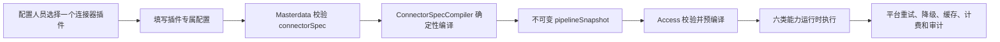

# 连接器粗粒度插件模型与配置简化优化设计

> 版本：V1.0
>
> 日期：2026-08-12
>
> 状态：**阶段 0—4、阶段 5 控制面与隔离 API/多服务/浏览器链路已完成验收；生产厂商迁移、生产容量/滚动观察、阶段 6 最终退役与生产发布未完成**
>
> 适用项目：`data-manager-hub`
>
> 前置基线：[外部请求连接器插件化升级设计](./2026-08-03-external-request-connector-plugin-upgrade-design.md)
>
> 当前操作说明：[接口连接器配置与后端解析指南](./CONNECTOR_CONFIGURATION_GUIDE.md)

## 1. 文档目标

本文档解决当前连接器“运行时能力完整，但配置模型直接暴露六阶段流水线，普通配置复杂且专用厂商兼容能力不足”的问题。

本设计固定以下结论，后续开发人员不需要再次决定产品抽象：

1. 保留现有六类能力及其运行时治理，不重写 Access 执行引擎。
2. 普通配置人员只选择**一个粗粒度厂商连接器插件**、一个固定版本，并填写一次插件配置。
3. Masterdata 将粗粒度 `connectorSpec` 在服务端确定性编译为现有 `pipelineSnapshot`。
4. `stageKey`、`capability`、`order`、`enabled`、`TRANSPORT` 数量、平台内置步骤和摘要全部退出普通编辑界面。
5. 开发人员通过一个厂商插件入口类实现请求构建、厂商协议处理和响应解析；平台继续统一掌握传输、密钥、超时、重试、降级、缓存、计费和审计。
6. 简单标准 HTTP 厂商使用新的内置 `generic-http:2.0.0`；非标准厂商使用专用插件，不继续向一个通用 HTTP 配置器堆积厂商分支。
7. 当前已发布流水线不重写、不丢失、不中断；旧高级流水线只作为历史兼容和只读执行计划保留。

本文保留原始设计、实施顺序和验收标准，并在第 17、20、23 节记录当前实现证据。代码和隔离环境
验证通过不代表生产数据库已迁移、生产厂商已切流或生产容量已经验收。

## 2. 当前问题与源码结论

### 2.1 当前运行时有价值

现有 `PipelineCompiler` 和 `ConnectorPipelineExecutor` 已经提供：

- 固定插件版本和制品摘要；
- 配置、Manifest、Schema 和快照完整性校验；
- 阶段顺序和单一 `TRANSPORT` 拓扑校验；
- 插件租约、在途请求固定版本和卸载生命周期；
- 阶段耗时、错误类别以及 `NOT_SENT/SENT/MAYBE_SENT` 交付状态；
- 插件调用与平台重试、降级、缓存和计费治理的边界。

这些能力是生产运行时能力，不能因为前端复杂而删除。

### 2.2 当前产品模型暴露了引擎内部结构

当前 `VendorConnectorWorkspace.vue` 直接允许配置人员：

- 新增和删除步骤；
- 手工填写 `stageKey`；
- 为每一步选择插件和插件版本；
- 选择 capability；
- 启停和调整顺序；
- 手工保证恰好一个 `TRANSPORT`。

上述字段属于编译后的执行计划，不属于厂商业务配置。

### 2.3 当前 Schema 粒度错误

一个插件版本只有一份 `configSchemaJson`，但前端和 Masterdata 会把它重复应用到该插件的每个阶段。
内置 `legacy-http` 的同一份 Schema 同时包含 URL、请求映射、认证、超时、安全步骤和响应映射，导致：

- 多个步骤重复展示同一批字段；
- 阶段看到与自己无关的字段；
- 配置人员必须理解运行时分层才能正确拆分配置；
- `vendor_config.timeout/retryCount` 与请求步骤中的超时、幂等字段出现职责重叠。

### 2.4 流水线不会自动增加厂商兼容性

流水线只定义“能力如何编排”，不能自动实现厂商特有的：

- Token 获取、刷新与多次请求；
- 特殊签名串和加密协议；
- 异步提交、轮询和结果合并；
- 非标准 JSON/XML/二进制响应；
- 业务码、收费证据和缓存资格判断；
- 厂商字段的复杂转换。

这些能力仍然必须由插件实现类完成。继续给 `legacy-http` 增加配置字段，只会把 Java 分支转移成难维护的 JSON 分支。

### 2.5 与 Bumblebee 的关键差异

Bumblebee 的配置人员选择 `Fetcher` 或 `Parse` 插件并填写该插件自己的参数，具体协议差异由 `pluginImpl` 实现类完成。
当前项目已经具备 `entryClass`、`ConnectorPlugin`、签名制品和隔离加载，但把插件内部的六类能力继续暴露成了用户可编辑步骤。

应吸收 Bumblebee 的**粗粒度插件产品模型**，同时保留当前项目更严格的宿主管理 Transport、签名、密钥、版本和治理边界。

## 3. 优化目标与非目标

### 3.1 必须达到的目标

1. 普通厂商连接器只配置一次插件、一次版本和一份配置对象。
2. 专用厂商插件开发完成后，可被多个该厂商配置实例复用，不修改平台主流程。
3. 普通页面不再出现任何可编辑运行时步骤字段。
4. Masterdata 生成的隐藏执行计划仍使用当前 Access 六阶段运行时。
5. 新旧版本的测试、发布、回滚、插件激活和历史解释保持完整。
6. 标准 HTTP 厂商无需开发插件即可使用 `generic-http:2.0.0`。
7. Token 前置请求、业务请求、异步轮询等复杂厂商能够通过宿主管理的多 HTTP 会话实现。
8. 现有 OpenAPI、调用记录、计费、缓存、主备和错误策略契约不变。

### 3.2 明确非目标

- 不允许插件直接使用 OkHttp、Apache HttpClient、Socket 或任意网络库。
- 不允许脚本、Groovy、JavaScript、SpEL 或远程表达式。
- 不允许插件访问 Spring 容器、数据库、Redis、Kafka、Nacos、Feign 或领域 Service。
- 不允许配置人员通过普通页面重新开启任意阶段组合。
- 不重写现有已发布 `pipeline_snapshot`、`snapshot_hash`、调用记录或计费事实。
- 不在首期支持 FTP、SFTP、浏览器爬虫和未知第三方代码的进程内执行。
- 不把插件测试结果当作生产部署或生产容量验收。

## 4. 核心设计：产品规格与运行计划分离

目标数据流如下：



系统增加两个明确模型：

| 模型 | 面向对象 | 是否可编辑 | 事实所有者 |
|---|---|---:|---|
| `connectorSpec` | 配置人员、插件开发人员 | 草稿可编辑，发布后不可变 | Masterdata |
| `pipelineSnapshot` | Access 运行时、审计和诊断 | 永远由服务端生成，不允许普通用户编辑 | Masterdata 生成，Access 执行 |

### 4.1 普通配置模型

`connectorSpec` 固定采用以下结构：

```json
{
  "specVersion": "1",
  "plugin": {
    "pluginId": "qixinbao-connector",
    "pluginVersion": "2.0.0"
  },
  "config": {
    "endpoint": "https://api.qixin.example.com/company/query",
    "appKeyRef": "vendor.qixin.appKey",
    "secretRef": "vendor.qixin.secret"
  },
  "responseMapping": null
}
```

字段语义固定如下：

| 字段 | 规则 |
|---|---|
| `specVersion` | 首期固定为 `1` |
| `plugin.pluginId` | 选择一个 `SIMPLE_CONNECTOR` 插件 |
| `plugin.pluginVersion` | 保存草稿时固定版本，不允许浮动到 latest |
| `config` | 只保存该插件的业务配置和 SecretRef，不保存平台策略 |
| `responseMapping` | 仅 Manifest 声明 `HOST_MAPPING` 时允许；否则必须为 `null` |

以下内容不进入 `connectorSpec`：

- `stageKey/capability/order/enabled`；
- 插件制品、Manifest、Schema 和配置哈希；
- `timeout/retryCount/circuitThreshold/circuitTimeout`；
- API Key、限流、配额、缓存和计费策略；
- 明文密码、Token、证书和私钥；
- 平台内置 Transport 和安全步骤配置。

### 4.2 隐藏运行计划

Masterdata 根据固定插件版本的已签名 Manifest、当前厂商安全版本和平台内置插件版本生成执行计划。
普通单 HTTP 插件的典型计划为：


运行计划可以包含多个同类处理步骤，但仍必须：

- capability 顺序单调递增；
- 恰好一个 `TRANSPORT`；
- 所有步骤固定插件 ID、版本和配置摘要；
- 发布后不可修改；
- Access 再次按现有规则校验。

## 5. 三种连接器产品类型

### 5.1 `DEDICATED_VENDOR`：专用厂商插件，默认推荐

适用于签名、Token、响应和业务语义具有厂商差异的接口。

特点：

- 一个插件入口类代表一个厂商协议族；
- 配置只包含环境差异，例如 endpoint、账号 SecretRef、产品编码；
- 厂商字段拼装、签名、业务码、解析和标准化由代码实现；
- 同一插件版本可以绑定多个 `vendor_config`；
- 不把厂商逻辑加入平台通用类。

### 5.2 `GENERIC_HTTP`：标准 HTTP 免开发连接器

规划新增内置 `generic-http:2.0.0`，适用于一次同步 HTTP 调用即可完成的标准厂商。

它与现有 `legacy-http` 一样由宿主代码显式注册，使用 `builtin://generic-http/2.0.0`，
不从外部制品库下载，也不能通过导入 API 覆盖；目录记录必须与宿主 descriptor 和 Manifest 逐字段一致。

普通表单只显示：

- URL 和方法；
- 请求 Header 与 Content-Type；
- 请求字段映射；
- NONE/Bearer/Basic/API Key 认证；
- 可选版本化安全配置引用；
- 响应成功码/业务码规则；
- 响应字段映射。

不再显示：

- 六个重复阶段；
- 三份重复超时；
- `TRANSPORT` 数量；
- 手工幂等策略（由方法和插件实现声明）；
- `configHash` 等运行摘要。

`vendor_config.timeout/retryCount/circuit*` 继续作为平台唯一执行策略；Generic HTTP 不能提高平台上限。

### 5.3 `ADVANCED_LEGACY`：现有流水线兼容模式

所有现有 v1 Manifest 和已发布流水线在 V049 后标记为 `ADVANCED_LEGACY`。

规则：

- 已发布版本继续执行和回滚；
- 普通页面只读展示，不提供新增、删除、排序和 capability 编辑；
- 仅提供“转换为简化草稿”入口；
- 无法无损转换的流水线保持运行，不强制转换；
- 不再允许新厂商从空白创建高级流水线；
- 后续是否彻底删除高级写接口，必须等所有活动配置完成迁移后另行验收。

## 6. 插件开发模型

### 6.1 保持现有 SPI 二进制兼容

不修改 `ConnectorPlugin`、`ConnectorStage` 和 `ConnectorStageFactory` 的现有抽象方法。

规划在 `data-platform-plugin-spi` 新增便利基类和类型：

- `AbstractVendorConnectorPlugin`
- `VendorConnectorInvocation`
- `VendorParseResult`
- `ManagedTransportSession`
- `Deadline`
- `CancellationToken`
- `ConnectorAuthoringModel`
- `ConnectorTransportMode`
- `ConnectorOutputMode`

现有高级插件仍可以直接实现 `ConnectorPlugin`；新专用插件默认继承 `AbstractVendorConnectorPlugin`。

### 6.2 开发人员只实现一个入口类

规划契约如下：

```java
public abstract class AbstractVendorConnectorPlugin implements ConnectorPlugin {

    protected abstract ConnectorRequest buildRequest(
        VendorConnectorInvocation invocation) throws ConnectorException;

    protected ConnectorRequest processRequest(
        VendorConnectorInvocation invocation,
        ConnectorRequest request) throws ConnectorException {
        return request;
    }

    protected ConnectorRawResponse processResponse(
        VendorConnectorInvocation invocation,
        ConnectorRawResponse response) throws ConnectorException {
        return response;
    }

    protected abstract VendorParseResult parseResponse(
        VendorConnectorInvocation invocation,
        ConnectorRawResponse response) throws ConnectorException;

    protected Map<String, Object> normalizeResponse(
        VendorConnectorInvocation invocation,
        VendorParseResult parsed) throws ConnectorException {
        return parsed.data();
    }

    protected ConnectorRawResponse executeManagedTransport(
        VendorConnectorInvocation invocation,
        ManagedTransportSession session,
        ConnectorRequest request) throws ConnectorException {
        return session.execute(request);
    }

    @Override
    public final List<ConnectorStageFactory> stageFactories() {
        return VendorConnectorStageAdapters.create(this);
    }
}
```

`VendorConnectorStageAdapters` 由 SPI 模块提供；上述类名和方法签名是本方案固定的开发契约，
实际编码时应按阶段 1 的契约测试一次性落地，不能由各厂商插件自行复制适配逻辑。

约束：

- 必须实现 `buildRequest` 和 `parseResponse`；
- 只有 `PLUGIN_NORMALIZED` 才必须覆盖 `normalizeResponse`；
- 请求/响应处理方法按需覆盖；
- 普通单 HTTP 插件不实现 Transport，使用 `platform-core`；
- 多 HTTP 插件只通过 `ManagedTransportSession` 发起请求；
- 插件实例不得保存请求级可变状态；请求数据只存在于 invocation/exchange；
- safeMessage 不得包含完整请求、响应或秘密。

### 6.3 高层类型的固定语义

`VendorConnectorInvocation` 是每次执行创建的只读对象，至少包含：

- `requestId`：平台生成的追踪 ID；
- `vendorConfigId`：当前实际厂商配置；
- `standardInput`：通过接口请求契约校验后的标准参数，只读；
- `pluginConfig`：固定插件版本对应的完整配置，只读；
- `deadline` 和 `cancellationToken`：宿主总截止时间和取消状态；
- `attemptNo` 和 `idempotencyContext`：当前平台尝试及幂等事实；
- `secretResolver`：只允许解析当前 capability 的 SecretRef；
- `objectCodec`、`clock`、`logger`、`metricRecorder`：现有受控宿主能力。

它不包含 Caller 密钥、计费方案、缓存时效、备用厂商、Spring Context 或领域 Service。

首期接口签名固定为：

```java
public interface VendorConnectorInvocation {
    String requestId();
    long vendorConfigId();
    JsonNode standardInput();
    JsonNode pluginConfig();
    Deadline deadline();
    CancellationToken cancellationToken();
    int attemptNo();
    IdempotencyContext idempotencyContext();
    SecretResolver secretResolver();
    ObjectCodec objectCodec();
    Clock clock();
    PluginLogger logger();
    PluginMetricRecorder metricRecorder();
}

public interface Deadline {
    Instant expiresAt();
    Duration remaining();
    boolean isExpired();
}

public interface CancellationToken {
    boolean isCancelled();
    void throwIfCancelled() throws ConnectorException;
}
```

上述对象均由宿主实现；插件不得自行实现后传回平台，也不得持有到请求结束之后。

`VendorParseResult` 是不可变值对象，至少包含：

| 字段 | 语义 |
|---|---|
| `businessStatus` | `SUCCESS/REJECTED/UNKNOWN`，不得用 HTTP 状态替代 |
| `data` | 解析后的结构化数据；`HOST_MAPPING` 的输入或默认规范化结果 |
| `vendorBusinessCode` | 可选、已截断的厂商业务码，不含秘密 |
| `billingSignal` | 仅为 `ELIGIBLE/INELIGIBLE/UNKNOWN` 建议 |
| `cacheSignal` | 仅为 `CACHEABLE/NOT_CACHEABLE/UNKNOWN` 建议 |
| `safeMessage` | 可直接记录的脱敏说明，最长 512 字符 |

SPI 提供静态工厂 `success/rejected/unknown`，构造时即校验 data、状态和 signal 组合；
不暴露可变 setter，避免插件在后续阶段篡改已经判定的业务事实。

`ManagedTransportSession` 只提供：

```java
public interface ManagedTransportSession {
    ConnectorRawResponse execute(ConnectorRequest request) throws ConnectorException;
    Deadline deadline();
    CancellationToken cancellationToken();
    int remainingCalls();
}
```

Session 不允许插件修改重试上限、私网/域名策略、响应大小、实际 deliveryState 或子请求事实。
这些事实由宿主在每次 `execute` 时记录并在 Session 结束时聚合。

`VendorConnectorStageAdapters` 的映射固定如下：

| capability | 调用的高层方法 | 创建条件 |
|---|---|---|
| `REQUEST_BUILDER` | `buildRequest` | SIMPLE 插件必有 |
| `REQUEST_PROCESSOR` | `processRequest` | Manifest 声明时创建 |
| `TRANSPORT` | `executeManagedTransport` | 仅 `HOST_MANAGED_MULTI_HTTP` 创建 |
| `RESPONSE_PROCESSOR` | `processResponse` | Manifest 声明时创建 |
| `RESPONSE_PARSER` | `parseResponse` | SIMPLE 插件必有 |
| `RESPONSE_NORMALIZER` | `normalizeResponse` | 仅 `PLUGIN_NORMALIZED` 创建 |

适配器负责把高层返回值写入受控 `ConnectorExchange`，并统一转换空返回、非法状态、超时、
取消和未声明异常；厂商实现不得直接操作 Exchange。

### 6.4 单 HTTP 与多 HTTP

Manifest 的 `transportMode` 固定支持：

#### `HOST_SINGLE_HTTP`

- 插件构造一个 `ConnectorRequest`；
- `platform-core` 执行一次托管 HTTPS 请求；
- 平台精确控制超时、响应大小、域名白名单和交付状态；
- 适用于大多数同步厂商。

#### `HOST_MANAGED_MULTI_HTTP`

- 插件可以在一个 `TRANSPORT` 阶段中执行 Token 请求、业务请求或有限轮询；
- 每次请求都必须调用当前请求的 `ManagedTransportSession`；
- 默认最多 5 次网络调用，且不能突破总 deadline；
- Session 汇总所有子请求的 endpoint、耗时、字节数和交付状态；
- 任一先前请求已发送后，后续失败不得降级为 `NOT_SENT`；
- 非幂等业务请求发送后禁止平台重试或备用厂商回退；
- 不允许插件自行创建线程、调度器或无限轮询。

首期不支持通过配置调整 5 次上限；需要更高次数必须由平台安全评审后提升宿主上限。

### 6.5 开发模板

每个专用插件工程固定结构：

```text
vendor-qixinbao-connector/
├── pom.xml
├── src/main/java/com/example/qixin/QixinbaoConnectorPlugin.java
├── src/main/resources/META-INF/data-platform/plugin.json
└── src/test/java/com/example/qixin/QixinbaoConnectorContractTest.java
```

开发人员完成一个插件的固定步骤：

1. 继承 `AbstractVendorConnectorPlugin`。
2. 定义插件 descriptor 和线程安全初始化。
3. 实现请求构建和响应解析。
4. 按需实现签名、解密、业务状态和标准化。
5. 编写 Manifest v2 和单一配置 Schema。
6. 使用 TestKit 验证 Manifest、Schema、SecretRef、错误分类和交付状态。
7. CI 生成 JAR、SHA-256、签名和 SBOM。
8. 通过平台导入、预加载、受控测试和激活。

不需要修改 Masterdata、Access、`VendorProxyService` 或前端组件。

## 7. Manifest v2

### 7.1 示例

```json
{
  "manifestVersion": "2",
  "pluginId": "qixinbao-connector",
  "version": "2.0.0",
  "spiVersion": "1.1",
  "displayName": "启信宝企业信息连接器",
  "provider": "internal",
  "entryClass": "com.example.qixin.QixinbaoConnectorPlugin",
  "authoringModel": "SIMPLE_CONNECTOR",
  "connectorKind": "DEDICATED_VENDOR",
  "transportMode": "HOST_SINGLE_HTTP",
  "outputMode": "PLUGIN_NORMALIZED",
  "capabilities": [
    "REQUEST_BUILDER",
    "REQUEST_PROCESSOR",
    "RESPONSE_PARSER",
    "RESPONSE_NORMALIZER"
  ],
  "compatibility": {
    "vendorCodes": ["QIXINBAO"],
    "dataTypeCodes": ["COMPANY_PROFILE"]
  },
  "minHostVersion": "2.2.0",
  "configSchema": {
    "$schema": "https://json-schema.org/draft/2020-12/schema",
    "type": "object",
    "additionalProperties": false,
    "required": ["endpoint", "appKeyRef", "secretRef"],
    "properties": {
      "endpoint": {
        "type": "string",
        "format": "uri",
        "x-ui-group": "基础配置",
        "x-ui-order": 10
      },
      "appKeyRef": {
        "type": "string",
        "x-secret-ref": true,
        "x-stage-scope": ["REQUEST_PROCESSOR"],
        "x-ui-group": "认证配置",
        "x-ui-order": 20
      },
      "secretRef": {
        "type": "string",
        "x-secret-ref": true,
        "x-stage-scope": ["REQUEST_PROCESSOR"],
        "x-ui-group": "认证配置",
        "x-ui-order": 30
      }
    }
  },
  "permissions": {
    "networkProtocols": ["https"],
    "networkHosts": ["api.qixin.example.com"]
  }
}
```

### 7.2 新增字段语义

| 字段 | 可选值 | 规则 |
|---|---|---|
| `authoringModel` | `SIMPLE_CONNECTOR`、`ADVANCED_PIPELINE` | 新普通插件必须为 `SIMPLE_CONNECTOR` |
| `connectorKind` | `DEDICATED_VENDOR`、`GENERIC_HTTP` | 决定插件目录展示和推荐顺序 |
| `transportMode` | `HOST_SINGLE_HTTP`、`HOST_MANAGED_MULTI_HTTP` | 决定由平台还是插件托管会话适配器提供唯一 Transport |
| `outputMode` | `PLUGIN_NORMALIZED`、`HOST_MAPPING` | 决定最终 Normalizer 来源 |
| `compatibility.vendorCodes` | 厂商编码数组或 `*` | 服务端过滤和绑定校验 |
| `compatibility.dataTypeCodes` | 数据类型编码数组或 `*` | 服务端过滤和绑定校验 |

### 7.3 Manifest v1 兼容规则

- Manifest v1 解析和签名规范保持不变；
- v1 版本统一视为 `ADVANCED_PIPELINE`；
- v1 插件不出现在新建简化连接器目录；
- 现有活动 v1 插件可以继续加载、执行和回滚；
- 不允许通过修改原 Manifest 将已发布 v1 原地变成 v2，必须发布新插件版本。

### 7.4 Manifest v2 校验规则

`PluginManifestReader` 和 Masterdata 导入校验必须同时执行：

- SIMPLE 插件至少声明 `REQUEST_BUILDER` 和 `RESPONSE_PARSER`；
- `HOST_SINGLE_HTTP` 不允许插件声明 `TRANSPORT`；
- `HOST_MANAGED_MULTI_HTTP` 必须声明 `TRANSPORT`；
- `PLUGIN_NORMALIZED` 必须声明 `RESPONSE_NORMALIZER`；
- `HOST_MAPPING` 禁止插件声明最终 `RESPONSE_NORMALIZER`；
- compatibility 至少有 vendor 或 dataType 维度，通用插件显式使用 `*`；
- SecretRef 字段必须声明非空 `x-stage-scope`；
- `x-stage-scope` 只能引用插件声明的 capability；
- Schema 不允许远程 `$ref`、递归引用、脚本或秘密默认值；
- 签名覆盖完整 Manifest v2 和 JAR SHA-256。

## 8. 确定性执行计划编译

### 8.1 新增 `ConnectorSpecCompiler`

`ConnectorSpecCompiler` 规划属于 Masterdata Service，因为：

- `connectorSpec`、厂商、数据类型、安全版本和插件目录都属于 Masterdata；
- Access 只消费固定运行快照，不应理解管理端产品模型；
- `data-platform-common-runtime` 继续只负责技术运行时，不保存领域配置。

### 8.2 编译输入

编译必须在同一事务读视图中固定：

- `vendor_config` 和当前 CAS 版本；
- `vendor_info.vendor_code`；
- 数据类型编码；
- `connectorSpec`；
- 精确 `pluginId + pluginVersion` 目录记录；
- Manifest、Schema、Artifact 摘要；
- 当前 `securityVersion` 及其不可变配置快照；
- `platform-core` 固定版本；
- `compilerVersion`。

### 8.3 编译算法

顺序固定如下：

1. 校验 `specVersion`。
2. 拒绝客户端提交任何 `__platform` 或其他保留字段。
3. 精确解析插件版本，不使用 latest 浮动引用。
4. 校验插件状态和 Manifest v2。
5. 校验 vendor/dataType compatibility。
6. 使用插件级 Schema 对 `config` **只校验一次**。
7. 校验全部 SecretRef 存在且属于当前厂商。
8. 根据 Manifest capability 生成厂商步骤。
9. 根据 `securityVersion` 插入平台 REQUEST/RESPONSE 安全步骤。
10. 根据 `transportMode` 插入 `platform-core` Transport 或厂商 Managed Multi Transport。
11. 根据 `outputMode` 插入厂商 Normalizer 或 `platform-core` Mapping Normalizer。
12. 按 8.4 的固定顺序分配 stageKey 和 order。
13. 对同一插件配置只生成一个 canonical config 和 configHash；各厂商步骤引用同一份不可变配置值。
14. 固化每一步插件版本、配置哈希和制品摘要；平台步骤只固化宿主生成的最小配置。
15. 校验最终计划恰好一个 Transport 且 capability 顺序合法。
16. 计算 `specHash`、现有 `snapshotHash` 和 `compileHash`。

### 8.4 固定 stageKey

用户不能指定 stageKey。编译器按以下命名生成：

```text
connector.request-builder
connector.request-processor
platform.security.request.000
platform.transport
connector.transport
platform.security.response.000
connector.response-processor
connector.response-parser
platform.response-normalizer
connector.response-normalizer
```

上述列表中的互斥项不会同时出现：`platform.transport/connector.transport` 二选一，
`platform.response-normalizer/connector.response-normalizer` 二选一。处理顺序固定为：

1. 厂商先完成业务请求构建和厂商级请求处理；
2. 平台安全步骤最后包装线上请求；
3. Transport 执行；
4. 平台安全步骤先验签、解密或解码响应；
5. 厂商再做响应预处理、解析和最终归一化。

这种“请求向外包装、响应按相反顺序拆包”的顺序不可由 Manifest 或配置覆盖。
没有某一 capability 时直接省略对应步骤，不生成 `enabled=false` 占位步骤。

Masterdata 使用完整插件 Schema 对 `connectorSpec.config` 校验一次。Access 为防止快照篡改，
按唯一 `(pluginId, pluginVersion, configHash)` 再校验一次，而不是对同一配置的每个阶段重复校验；
随后仍调用每个 Factory 的 capability 级 `validate`。Manifest v1 继续走现有逐步骤兼容逻辑。

同一输入必须在不同 Masterdata 实例、不同时间和重复编译中产生完全相同的 canonical JSON 与哈希。

### 8.5 三类哈希

| 哈希 | 输入 | 用途 |
|---|---|---|
| `specHash` | canonical `connectorSpec` | 判断用户配置是否变化 |
| `snapshotHash` | 现有 canonical `pipelineSnapshot` | Access 运行时和调用事实继续使用 |
| `compileHash` | `specHash + snapshotHash + compilerVersion + securityVersion` | 证明产品配置与执行计划的对应关系 |

现有 `hashAlgorithm/integrityHash` 继续描述实际执行的 pipeline，不要求 Access、CallRecord 或 Billing 增加新字段。
调用事实通过 `vendorConfigId + pipelineVersion + snapshotHash` 关联回 Masterdata 的不可变版本，再读取 spec/compileHash。

### 8.6 SecretRef 阶段作用域

Manifest v2 的 `x-stage-scope` 用于最小化秘密暴露：

- Masterdata 校验 SecretRef 所有权；
- Access 从固定 Schema 和 capability 计算当前步骤允许的引用集合；
- `PipelineCompiler` 只将当前 capability 的 SecretRef 交给阶段 SecretResolver；
- 插件在其他阶段解析同一引用时失败关闭；
- v1 插件维持现有兼容行为，不能伪装成 v2 最小作用域。

## 9. 五域职责与模块落点

### 9.1 `data-platform-plugin-spi`

规划新增高层插件便利类型和 TestKit 所需基础契约，但不引入 Spring、数据库、Redis、Nacos、Feign 或领域 Service。

不修改现有 `ConnectorPlugin` 的抽象方法，避免破坏已构建插件二进制。

### 9.2 `data-platform-common-runtime`

规划负责：

- `platform-core` 内置插件；
- Manifest v1/v2 解析；
- `AbstractVendorConnectorPlugin` 的阶段适配支持；
- `ManagedTransportSession` 实现；
- v2 SecretRef capability scope；
- 现有 pipeline 编译、执行、租约和 ClassLoader 行为。

Common Runtime 不读取 Masterdata 数据库，不理解 vendor/dataType compatibility。

### 9.3 Masterdata

规划负责：

- Manifest v2 目录字段；
- 简化插件候选目录；
- `connectorSpec` 草稿和不可变版本；
- Spec Schema、compatibility 和 SecretRef 校验；
- `ConnectorSpecCompiler`；
- spec/plan diff、升级预检和旧流水线转换；
- 受控测试、发布、历史和回滚；
- 向 Access 继续提供完整 `pipelineSnapshot`。

### 9.4 Access

规划只做必要的运行时兼容：

- 解析 Manifest v2；
- v2 SecretRef stage scope；
- Managed Multi HTTP 会话；
- 继续执行现有 pipeline runtime snapshot。

Access 不读取 `connectorSpec`，不新增跨域数据库访问，不改变 OpenAPI 请求和响应。

### 9.5 Billing、Identity、Governance

- Billing 不改计费决策和事件契约；继续接收实际 pipeline 事实。
- Identity 仅在新增权限时维护角色和 Service JWT scope；本方案不需要新的跨域 scope。
- Governance 记录插件选择、版本升级、Spec 发布、转换和回滚审计事件。

### 9.6 跨域契约

Masterdata → Access 的受控测试和运行快照仍通过现有 `*-api` Internal Feign DTO 传递 pipeline。
不得把 Masterdata Entity、Mapper 或 `connectorSpec` 管理对象引入 Access Service。

## 10. 数据模型与迁移

### 10.1 迁移编号

本设计立项时的迁移基线为 V048；当前实现已按固定文件名新增并注册：

- `V049__add_connector_product_spec.sql`
- `U049__add_connector_product_spec.sql`
- `V050__seed_generic_http_connector_v2.sql`
- `U050__seed_generic_http_connector_v2.sql`

不得修改 V042—V048 已有 changeset。

### 10.2 `connector_plugin_version` 新增字段

V049 已增加：

| 字段 | 类型 | 说明 |
|---|---|---|
| `manifest_version` | `VARCHAR(16)` | v1/v2 快速过滤 |
| `authoring_model` | `VARCHAR(32)` | `SIMPLE_CONNECTOR/ADVANCED_PIPELINE` |
| `connector_kind` | `VARCHAR(32)` | `DEDICATED_VENDOR/GENERIC_HTTP`，v1 可空 |
| `transport_mode` | `VARCHAR(32)` | 两种宿主管理模式，v1 可空 |
| `output_mode` | `VARCHAR(32)` | 两种输出模式，v1 可空 |
| `compatibility_manifest` | `JSONB` | 厂商和数据类型兼容声明 |

这些字段是签名 Manifest 的索引投影，不是第二事实源。导入和 Access 校验时必须与 Manifest 内容一致。

### 10.3 `vendor_connector_version` 新增字段

V049 已增加：

| 字段 | 类型 | 说明 |
|---|---|---|
| `authoring_mode` | `VARCHAR(32) NOT NULL` | `SIMPLE_CONNECTOR/ADVANCED_LEGACY` |
| `connector_spec` | `JSONB` | 简化产品配置；Legacy 为空 |
| `spec_hash` | `CHAR(64)` | canonical spec SHA-256 |
| `compiler_version` | `VARCHAR(32)` | 首期固定 `1.0.0` |
| `compile_hash` | `CHAR(64)` | spec 与 pipeline 绑定摘要 |

保持现有草稿哈希约束：`status=DRAFT` 时数据库列 `snapshot_hash` 继续为 `NULL`；
保存和校验响应中的 `compiledSnapshotHash` 是对草稿 `pipeline_snapshot` 的即时计算值。
发布时才把该值写入新发布行的 `snapshot_hash`。这样不改变现有草稿/发布语义。

### 10.4 `vendor_connector_test_fact` 新增字段

V049 已增加：

| 字段 | 类型 | 说明 |
|---|---|---|
| `authoring_mode` | `VARCHAR(32) NOT NULL` | 旧事实回填 `ADVANCED_LEGACY` |
| `spec_hash` | `CHAR(64)` | SIMPLE 受控测试所用产品配置摘要 |
| `compile_hash` | `CHAR(64)` | SIMPLE 受控测试所用编译关系摘要 |

SIMPLE 发布门禁必须同时匹配
`vendorConfigId + draftVersion + specHash + compiledSnapshotHash + compileHash`；
任一字段变化都必须重新受控测试。Legacy 事实的两个新增摘要保持空值并沿用当前门禁。

### 10.5 数据约束

- 现有所有行先回填 `authoring_mode=ADVANCED_LEGACY`；
- 不修改任何现有 `pipeline_snapshot/snapshot_hash/hash_algorithm/integrity_hash`；
- SIMPLE 草稿必须有 spec、specHash、compilerVersion、compileHash 和非空 pipelineSnapshot，
  但持久化 `snapshot_hash` 按现有约束保持为空；
- SIMPLE 发布版本上述字段全部非空并冻结；
- ADVANCED_LEGACY 的 spec 相关字段必须为空；
- SIMPLE 测试事实的 specHash/compileHash 必须同时非空，Legacy 测试事实必须同时为空；
- `connector_spec` 最大 128 KiB；
- 发布版本的现有 V047 不可变触发器必须前向扩展，保护所有新字段；
- 插件版本 V047 冻结触发器也必须覆盖 Manifest v2 投影字段；
- 物理删除保护保持不变。

### 10.6 迁移执行顺序

V049 必须按以下顺序执行，并在同一事务中失败关闭：

1. 前置校验 V047/V048 已应用且连接器历史完整性矩阵无漂移；
2. 添加可空列，不放宽现有发布事实约束；
3. 将既有插件版本投影为 Manifest v1/ADVANCED_PIPELINE；
4. 将既有连接器版本和测试事实回填为 ADVANCED_LEGACY；
5. 添加 SIMPLE/Legacy 成对约束、大小约束和查询索引；
6. 以前向版本替换 V047 的不可变触发器，使新列也被冻结；
7. 注册到 Liquibase changelog 并执行 fresh、V048 upgrade 和 repeat-update 验证。

V050 只注册宿主内置 `generic-http:2.0.0`，坐标固定为 `builtin://generic-http/2.0.0`，
`artifact_sha256` 必须由构建时固定 Manifest/descriptor 生成并与 Access 内置实现一致，
`detached_signature/signing_key_id` 沿用受控的 `builtin` 标识。该坐标不能由外部导入 API 创建或覆盖；
任一双 Access 实例的内置 descriptor/摘要不一致时，版本不得 READY 或 ACTIVE。

当前隔离证据：`verify-v049-connector-product-spec.sh` 在 current changelog 应用后事务回滚 exact、未引用的
V050 seed，严格停在 V049 surface 执行回填与约束断言；它不会通过排除 Generic 行来弱化 v2 存量 HALT。
`verify-v050-generic-http.sh` 再验证 V001—V050 fresh、V049 upgrade、parent-only 补 version、漂移/HALT、
引用回滚门禁和 Java static/compiler/resolver 合成契约。两者退出时清理本轮严格命名的临时库。

### 10.7 回退边界

U049 只允许在不存在任何 `SIMPLE_CONNECTOR` 草稿、发布版本或 SIMPLE 测试事实时删除新增字段；否则明确 HALT。

U050 只允许 `generic-http:2.0.0` 没有任何草稿、发布、测试或激活引用时删除种子；否则明确 HALT。

生产回退优先采用：

1. 保留数据库新列；
2. 前端切回只读旧工作区；
3. 停止创建 SIMPLE 草稿；
4. 活动版本回滚到原 `ADVANCED_LEGACY` 发布版本。

不允许通过逆迁移破坏已经发布的 spec/pipeline 对应关系。

## 11. 管理 API（阶段 2—3 已实现）

### 11.1 简化插件目录

| 方法 | 路径 | 权限 | 用途 |
|---|---|---|---|
| GET | `/vendor/config/{configId}/connector-spec/catalog` | `connector-plugin:view` | 返回与当前 vendor/dataType 兼容的 SIMPLE 插件及推荐版本 |
| GET | `/vendor/config/{configId}/connector-spec/catalog/{pluginId}/versions` | `connector-plugin:view` | 查看兼容的活动/可测试版本 |
| POST | `/vendor/config/{configId}/connector-spec/upgrade-preview` | `connector-plugin:bind` | 预检目标版本 Schema 和配置差异 |

目录 API 由 Masterdata 完成兼容过滤，前端不得自行解析 raw Manifest 决定可绑定性。

### 11.2 Spec 生命周期

| 方法 | 路径 | 权限 | 用途 |
|---|---|---|---|
| GET | `/vendor/config/{configId}/connector-spec/draft` | `connector-plugin:view` | 获取简化草稿 |
| PUT | `/vendor/config/{configId}/connector-spec/draft` | `connector-plugin:bind` | CAS 保存并编译草稿 |
| POST | `/vendor/config/{configId}/connector-spec/validate` | `connector-plugin:bind` | 校验 Spec 和编译计划 |
| POST | `/vendor/config/{configId}/connector-spec/test` | `connector-plugin:test` | 使用编译后的计划执行受控测试 |
| POST | `/vendor/config/{configId}/connector-spec/publish` | `connector-plugin:publish` | 发布不可变 spec + pipeline |
| GET | `/vendor/config/{configId}/connector-spec/versions` | `connector-plugin:view` | 查询简化和历史 Legacy 版本 |
| POST | `/vendor/config/{configId}/connector-spec/rollback/{version}` | `connector-plugin:rollback` | 创建新的回滚发布版本 |
| GET | `/vendor/config/{configId}/connector-spec/execution-plan` | `connector-plugin:view` | 只读查看草稿/活动/历史执行计划 |

### 11.3 保存请求

```json
{
  "expectedDraftVersion": 3,
  "connectorSpec": {
    "specVersion": "1",
    "plugin": {
      "pluginId": "qixinbao-connector",
      "pluginVersion": "2.0.0"
    },
    "config": {
      "endpoint": "https://api.qixin.example.com/company/query",
      "appKeyRef": "vendor.qixin.appKey",
      "secretRef": "vendor.qixin.secret"
    },
    "responseMapping": null
  }
}
```

### 11.4 草稿响应

```json
{
  "id": 501,
  "vendorConfigId": 101,
  "draftVersion": 4,
  "authoringMode": "SIMPLE_CONNECTOR",
  "securityVersion": 3,
  "connectorSpec": {},
  "specHash": "...",
  "compilerVersion": "1.0.0",
  "compileHash": "...",
  "compiledSnapshotHash": "..."
}
```

普通草稿响应不返回完整 pipeline 和步骤配置。`compiledSnapshotHash` 是即时计算值，
不是草稿表中持久化的 `snapshot_hash`；测试事实和发布门禁使用该值。

### 11.5 只读执行计划响应

执行计划只返回：

- stageKey；
- capability；
- pluginId/pluginVersion；
- order；
- configHash；
- 来源：`CONNECTOR/PLATFORM_SECURITY/PLATFORM_TRANSPORT/PLATFORM_NORMALIZER`。

不返回完整配置、SecretRef 解析值或原始响应。

### 11.6 Legacy 转换 API

| 方法 | 路径 | 用途 |
|---|---|---|
| POST | `/vendor/config/{configId}/connector-spec/convert-preview` | 判断当前 Legacy 草稿能否无损转换并返回字段差异 |
| POST | `/vendor/config/{configId}/connector-spec/convert` | 使用 `expectedDraftVersion` 创建 SIMPLE 草稿 |

无法转换返回 `LEGACY_PIPELINE_NOT_CONVERTIBLE` 和安全原因列表，不修改任何数据。

### 11.7 旧 API 兼容

现有 `/vendor/config/{id}/connector/**`：

- 第一阶段保持可读和现有运行行为；
- 前端完成切换后，写接口对 SIMPLE 草稿返回 409；
- Legacy 写接口增加 Deprecation 响应头并限制平台管理员；
- 全部活动配置迁移并完成回滚窗口前不得删除；
- 删除必须单独立项，不能混入本次简化首发。

## 12. 前端交互设计

### 12.1 普通工作区

目标页面只保留五个区域：

1. **连接器插件**：插件卡片和兼容说明。
2. **固定版本**：只读展示当前版本；通过显式“升级版本”动作改变。
3. **插件配置**：一份 Schema 动态表单。
4. **受控测试**：标准参数、结果摘要和可展开阶段耗时。
5. **发布历史**：Spec 差异、测试事实、发布和回滚。

页面不得出现：

- 添加/删除/上移/下移步骤；
- `stageKey` 输入框；
- capability 和 enabled；
- `TRANSPORT 0/1`；
- 每一步重复的插件和版本下拉框；
- 可编辑哈希。

### 12.2 插件选择

候选插件按以下顺序展示：

1. vendorCode 精确匹配的 `DEDICATED_VENDOR`；
2. dataTypeCode 精确匹配的专用插件；
3. `GENERIC_HTTP`；
4. 不展示不兼容插件。

首次选择插件时自动固定服务端返回的 recommended ACTIVE 版本。
版本不能自动漂移；升级必须经过预检、重新保存、测试和发布。

### 12.3 动态表单扩展

在现有 Schema 扩展基础上规划增加：

- `x-ui-group`：表单分组；
- `x-ui-advanced`：折叠到“高级选项”；
- `x-ui-visible-if`：仅允许声明式字段条件，不执行代码；
- `x-stage-scope`：仅供后端 SecretRef 作用域，不直接展示；
- `x-platform-managed`：平台字段，只读或隐藏。

前端只实现固定白名单条件运算符：`equals/notEquals/in/present`。

### 12.4 版本差异

发布前差异按产品字段展示：

- 插件 ID/版本变化；
- 配置字段新增、删除和修改；
- SecretRef 只显示引用名，不显示秘密；
- responseMapping 变化；
- securityVersion 变化；
- 编译计划变化数量。

默认不以六阶段 JSON diff 作为主要视图。

### 12.5 高级执行计划

“查看执行计划”是只读抽屉，仅供排障：

- 展示编译出的步骤和来源；
- 展示测试阶段耗时；
- 展示插件版本和摘要前 12 位；
- 不允许拖拽或编辑；
- 普通用户不需要理解它也能完成配置。

## 13. Generic HTTP 2.0 详细配置

`generic-http:2.0.0` 使用一份表单，不使用六张阶段卡片。

### 13.1 基础配置

| 字段 | 必填 | 说明 |
|---|---:|---|
| endpoint | 是 | HTTPS 厂商地址 |
| method | 是 | GET/POST/PUT/PATCH/DELETE/HEAD |
| contentType | 否 | 默认 JSON |
| headers | 否 | 固定 Header；禁止 Host/Content-Length 等受限 Header |
| requestMapping | 否 | 标准参数到厂商字段 |

### 13.2 认证配置

| 字段 | 条件 | 规则 |
|---|---|---|
| auth.type | 始终 | NONE/BEARER/BASIC/API_KEY |
| auth.tokenRef | BEARER | 必须是当前厂商 SecretRef |
| auth.usernameRef/passwordRef | BASIC | 必须是 SecretRef |
| auth.keyName/keyRef/location | API_KEY | 值使用 SecretRef，位置只允许 header/query |

### 13.3 响应配置

| 字段 | 说明 |
|---|---|
| successHttpStatuses | 默认 2xx |
| businessCodePath | 可选业务码路径 |
| successBusinessCodes | 可选成功码集合 |
| dataPath | 可选数据根路径 |
| responseMapping | 标准字段映射 |

### 13.4 平台策略去重

Generic HTTP 不再配置 connect/read/total timeout、retryCount、circuit 参数和最终缓存时效。

- 总 deadline 来自 `vendor_config.timeout`；
- 建连和读取超时由 Managed Transport 在总 deadline 内按平台上限分配；
- 重试次数来自 `vendor_config.retryCount`；
- GET/HEAD/OPTIONS 默认幂等；
- 非安全方法只有插件生成幂等键且平台允许时才能重试；
- 响应大小使用平台默认上限；如需例外，修改平台受审策略，不写进普通插件表单。

### 13.5 何时禁止继续使用 Generic HTTP

出现以下任一情况必须开发专用插件：

- 需要前置 Token 请求或异步轮询；
- 签名规则无法由现有安全能力表达；
- 需要条件分支、多次请求或响应合并；
- 业务码决定复杂计费/缓存信号；
- 响应不是受支持的 JSON/XML；
- 配置表单开始出现厂商名称专属字段。

## 14. 错误、重试、降级、缓存和计费

### 14.1 保持现有平台治理

本优化不改变 `ConnectorErrorPolicy`、`VendorProxyService` 和 Billing 的职责。

插件仍只能产生：

- transport/business 状态；
- errorCategory/errorCode/safeMessage；
- deliveryState；
- billingSignal/cacheSignal；
- normalizedData。

平台继续决定：

- 是否重试；
- 是否调用备用厂商；
- 是否收费和金额；
- 是否缓存和时效；
- 对外标准错误码。

### 14.2 Multi HTTP 交付状态

Managed Session 聚合规则固定为：

| 子请求事实 | 总体 deliveryState |
|---|---|
| 所有尝试均在发送前失败 | `NOT_SENT` |
| 至少一次可能发送但无明确响应 | `MAYBE_SENT` |
| 至少一次收到厂商响应或明确发送成功 | `SENT` |

总体状态只能从低风险向高风险提升，不能由插件回退。

### 14.3 业务结果

`VendorParseResult` 必须分别表达：

- 厂商业务成功；
- 厂商业务拒绝；
- 无法判断；
- 收费证据和缓存建议。

插件不得把 HTTP 200 等同业务成功，也不得把业务失败伪装为 Transport 失败以触发备用厂商。

## 15. 安全设计

### 15.1 保留的现有边界

- SHA-256 和受信脱离签名；
- HTTPS 制品仓库白名单；
- 隔离 ClassLoader 和插件版本租约；
- 双 Access 预加载与 readiness；
- 危险字节码扫描；
- SecretRef 所有权和按需解析；
- 网络协议/域名/私网限制；
- 日志脱敏、截断和 safeMessage；
- 插件测试不计费、不缓存、不写生产调用记录。

### 15.2 新增边界

- SIMPLE 插件不能声明任意阶段模板；执行计划由编译器生成；
- 客户端不能提交平台保留字段；
- Manifest v2 SecretRef 必须声明 capability scope；
- compatibility 在服务端强制，不信任前端过滤；
- Managed Multi HTTP 有调用次数、deadline 和取消限制；
- 插件版本升级不执行插件提供的迁移脚本；
- 配置迁移只做声明式 Schema 校验和人工确认；
- 高级流水线写入口默认关闭。

## 16. 兼容与迁移方案

### 16.1 不修改历史发布版本

V049 只增加元数据列并将现有记录标记为 `ADVANCED_LEGACY`。

现有：

- 活动版本继续运行；
- 在途请求继续使用原租约；
- 调用记录和 BillingEvent 继续指向原 pipeline；
- 历史 rollback 继续可用；
- 原哈希不重新计算。

### 16.2 Legacy HTTP 无损转换

新增 `LegacyHttpSpecConverter`，只转换满足全部条件的草稿：

- 所有步骤均为 `legacy-http:1.0.0`；
- capability 顺序合法；
- 恰好一个 Transport；
- 每个 capability 最多一个启用步骤；
- 不存在未知配置字段或自定义插件步骤；
- 请求、认证、安全和响应字段可以按当前代码读取规则完整归并。

转换映射固定为：

| Legacy 来源 | Generic HTTP 2.0 目标 |
|---|---|
| REQUEST_BUILDER config | endpoint/method/headers/requestMapping |
| REQUEST_PROCESSOR config | auth 和请求安全引用 |
| RESPONSE_PROCESSOR config | 响应安全引用 |
| RESPONSE_PARSER | Generic 内置解析规则 |
| RESPONSE_NORMALIZER config | responseMapping |
| vendor_config policy | 保持原 timeout/retry/circuit，不写入 spec |

转换执行后：

- 创建或更新 SIMPLE 草稿；
- 不修改当前活动版本；
- draftVersion 通过 CAS 增加；
- 转换后必须重新校验、受控测试和发布；
- 发布后才能切换活动版本。

### 16.3 无法转换的流水线

混合插件、自定义顺序、多 Parser 或非标准配置视为不可自动转换。

处理方式：

1. 保持当前活动版本运行；
2. 开发一个专用厂商插件；
3. 创建新的 SIMPLE 草稿；
4. 完成对等测试后发布；
5. 保留 Legacy 历史用于回滚窗口。

不得通过删除未知步骤来“尽量转换”。

## 17. 实施阶段与任务拆分

当前阶段状态如下；“已实现”仅指仓库代码和隔离自动化证据，不表示生产发布：

| 阶段 | 当前状态 | 证据边界 |
|---|---|---|
| 0 | 已实现并通过隔离自动化验收 | 高级 API/UI 基线、只读 converter、三类 fixture、分页 inventory；未对生产库执行清点 |
| 1 | 已实现并通过模块测试 | Manifest v1/v2、高层 SDK、Managed Session、platform-core、TestKit |
| 2 | 已实现并通过模块与 V049 隔离数据库验收 | Spec 控制面、确定性 compiler、测试/发布/历史/回滚/升级预检、V049/U049 |
| 3 | 已实现并通过模块与 V050 隔离数据库验收 | generic-http:2.0.0、V050/U050、转换预检/CAS、Legacy inventory 与离线对等 fixture |
| 4 | 已实现并通过 lint/typecheck/Vitest/build 与管理员登录态浏览器验收 | 单表单、版本预检、响应映射、只读计划、Legacy 转换；隔离浏览器已完成保存、校验、受控测试、发布、历史和回滚 |
| 5 | 控制面、单厂商隔离链路和容量基线已验证，生产验收未完成 | 已验证签名单 HTTP fixture 的双 Access/API/缓存/计费/主备摘要链路及 8 并发/32 请求基线；逐厂商真实对等、生产发布、生产容量/滚动升级、观察窗口仍是前置工作 |
| 6 | 已实现可切换退役门禁，生产最终切换未实施 | 已禁止从空白创建新的 `ADVANCED_LEGACY` 草稿并阻止 SIMPLE 覆盖；`CONNECTOR_LEGACY_WRITE_RETIRED=true` 且活动 Legacy 绑定、Legacy 草稿、未结束迁移均为 0 时，raw 写/测试/发布/回滚返回 410，否则 409 或保留兼容；历史读取与 Access 六阶段运行时继续保留 |

### 17.1 阶段 0：基线与可转换性清点

状态：**已实现并通过隔离自动化验收；生产 inventory 尚未执行。**

任务：

- 固化当前高级流水线页面和 API 行为测试；
- 导出现有草稿/活动版本的插件、能力和配置形态统计；
- 实现只读 `LegacyHttpSpecConverter` 预检器；
- 分类为可无损转换、需专用插件、必须继续 Legacy；
- 为单 HTTP、Token+业务请求、异步轮询各建立一个 fixture。

完成条件：

- 每个活动 `vendor_config` 有迁移分类；
- 不修改任何生产运行数据；
- 当前 OpenAPI、缓存、计费和主备基线测试全绿。

回滚点：无生产行为变化，直接撤销新增测试和预检代码。

### 17.2 阶段 1：Manifest v2 与插件开发 SDK

状态：**已实现并通过 SPI/common-runtime/TestKit 契约测试。**

任务：

- Manifest reader 支持 v1/v2；
- 新增高层插件便利基类和类型；
- 新增 `platform-core` 内置插件；
- 新增 Managed Transport Session；
- 新增 capability SecretRef scope；
- 提供插件 TestKit 和示例专用插件。

完成条件：

- v1 插件测试完全不变；
- 一个示例插件只用一个入口类完成单 HTTP；
- 一个示例插件通过托管 Session 完成 Token+业务请求；
- 原始网络库和跨阶段 SecretRef 负向测试通过。

回滚点：新能力未被任何发布配置引用，可以删除 v2 支持并继续 v1。

### 17.3 阶段 2：Masterdata Spec 控制面与 V049

状态：**已实现并通过模块测试及 `verify-v049-connector-product-spec.sh` 隔离矩阵。**

任务：

- 实施 V049/U049；
- 增加 Spec DTO、Entity 字段和 Mapper；
- 实现 `ConnectorSpecCompiler`；
- 实现目录、草稿、校验、计划预览和版本升级预检；
- 保留现有 raw pipeline 服务；
- 扩展 V047 冻结触发器的前向版本。

完成条件：

- SIMPLE 草稿能够确定性生成现有 pipeline DTO；
- 重复编译哈希一致；
- Existing Legacy 行和原哈希字节级不变；
- fresh、V048→V049、重复执行、HALT 原子性和恢复边界通过。

回滚点：没有 SIMPLE 记录时可执行 U049；已有记录时使用前端开关和应用回滚，不逆迁移数据。

### 17.4 阶段 3：Generic HTTP 2.0 与转换

状态：**已实现并通过模块测试及 `verify-v050-generic-http.sh` 隔离矩阵。**

任务：

- 实施 V050/U050；
- 完成 Generic HTTP 单表单插件；
- 完成 Legacy 转换预览和 CAS 转换；
- 建立 current vs Generic 请求/响应对等测试；
- 明确不能转换的安全错误原因。

完成条件：

- 标准 GET/POST、认证、安全、映射和业务码不需要手工阶段；
- timeout/retry/circuit 只有平台一份配置；
- 可转换 Legacy 的 compiled pipeline 行为对等；
- 不可转换情况零数据修改。

回滚点：活动版本仍是 Legacy；删除未发布 SIMPLE 草稿即可回到原流程。

### 17.5 阶段 4：前端简化工作区

状态：**已实现并通过 Node 24 lint/typecheck/Vitest/build，以及隔离环境管理员登录态浏览器 E2E。**

任务：

- 将 `VendorConnectorWorkspace.vue` 改为插件选择 + 单表单；
- 增加插件兼容目录、版本升级预检和 Spec diff；
- 高级计划改为只读抽屉；
- 增加 Legacy 转换入口；
- 删除普通用户的步骤编辑交互；
- 更新 `CONNECTOR_CONFIGURATION_GUIDE.md`。

完成条件：

- 普通流程中不出现 stageKey/capability/order/enabled/Transport 数量；
- SecretRef、动态字段、校验、测试、发布和回滚均可通过浏览器完成；
- 未授权按钮和接口都返回正确 403；
- 前端 lint、类型检查、Vitest 和 build 通过。

回滚点：功能开关恢复旧只读工作区；后端 Spec 和数据库事实保留。

### 17.6 阶段 5：受控发布与逐厂商迁移

状态：**控制面、一个签名单 HTTP fixture 的隔离 API/多服务链路、管理员浏览器链路和 8 并发/32 请求容量基线已验证；生产厂商迁移、生产容量/滚动升级和观察未完成。不得以 fixture、Mock 或隔离迁移结果替代生产厂商对等和发布观察。**

任务：

- 通过受保护的迁移控制面记录单厂商源快照，按 CAS 推进准备、观察、完成或回滚；
- 先迁移 Generic 可转换厂商；
- 再为非标准厂商开发专用插件；
- 每个厂商执行请求、响应、错误、缓存、计费和主备对等验证；
- 按厂商发布新的 SIMPLE 连接器版本；
- 保留 Legacy 回滚窗口；
- 观察真实错误率、P95 和 Billing 覆盖率。

隔离运行证据（2026-08-28）已覆盖 Identity 登录、Gateway、Masterdata、Access 双实例、Billing、
Redis/Kafka/Nacos、签名制品库和厂商 HTTPS fixture；完成了 Manifest v2 导入/激活、Legacy 转换、
Spec 保存/校验/受控测试/发布、单条/批量调用、缓存命中、HTTP/解析错误、CallRecord/BillingEvent
落库和主备版本摘要对等；管理员浏览器已完成登录、主备厂商查看、简化表单保存/校验/受控测试/发布、版本
历史、Simple 回滚和 Legacy 回滚，两个 Access 实例均显示 READY。该证据仍不替代目标环境的生产 inventory、
真实厂商请求对等、观察窗口、容量/滚动升级和回滚演练。

完成条件：

- inventory 与迁移动作只返回版本/哈希/聚合事实，不保存请求、响应或密钥；
- 开始观察前两个 Access 实例均为 READY，观察同时读取 Access CallRecord 和 BillingEvent；
- 所有新建厂商默认 SIMPLE；
- 目标存量厂商完成新版本发布；
- 异常时只通过版本 rollback 回退，不双发生产请求；
- 历史调用仍能解释原 Advanced 版本。

回滚点：回滚到原不可变 Legacy 版本。

### 17.7 阶段 6：旧高级写入口收口

状态：**已实现可切换退役门禁，生产最终切换未实施。当前阻止 raw 变更/测试/发布/回滚覆盖 SIMPLE，并阻止 raw PUT 从空白创建新的 `ADVANCED_LEGACY` 草稿；当退役开关开启且数据库事实满足门禁时，既有 raw 写/测试/发布/回滚返回 410；raw validate 是无数据写入的只读例外。**

前置条件必须全部满足：

- 无活动配置需要编辑 ADVANCED_LEGACY；
- 回滚窗口结束；
- SIMPLE 通过完整容量和滚动升级测试；
- 插件管理员确认无合法高级写场景；
- API 和浏览器真实验收完成。

然后：

- raw pipeline PUT/POST 写接口返回 410 或删除；
- 删除前端步骤编辑代码；
- 保留历史只读计划和 Access 六阶段运行时；
- 更新 API、部署、Wiki 和迁移文档。

当前实现将上述删除前置条件编码为运行时门禁：`CONNECTOR_LEGACY_WRITE_RETIRED=true` 时，先读取活动
Legacy 绑定、Legacy 草稿和未结束迁移数量；三者均为 0 才返回 `410 CONNECTOR_LEGACY_WRITE_RETIRED`，
否则返回 `409 CONNECTOR_LEGACY_WRITE_RETIREMENT_GATE_NOT_PASSED`。事实查询失败会失败关闭；只读历史、
运行时和 `validate` 不受影响。该开关尚未在生产打开。

## 18. 实现拆分记录

本轮工作按以下可独立审阅的功能边界组织；最终提交仍需由仓库负责人按实际 diff 分批完成：

1. `test(connector): freeze advanced pipeline and conversion baselines`
2. `feat(plugin-spi): add coarse vendor connector authoring support`
3. `feat(connector-runtime): support manifest v2 and managed transport sessions`
4. `feat(masterdata): add connector product spec persistence and compiler`
5. `feat(masterdata-api): expose connector spec management contracts`
6. `feat(connector): add generic-http v2 and legacy conversion`
7. `feat(web): replace editable stages with connector product form`
8. `test(connector): add signed plugin multi-instance runtime acceptance`
9. `docs(connector): publish simplified configuration and rollout guide`

每个提交前都必须按仓库规则对实际修改符号执行 GitNexus impact；每个提交前执行 `detect_changes(compare master)`。

已知实施风险基线：

| 当前符号 | GitNexus 风险 | 当前图谱摘要 | 实施要求 |
|---|---|---|---|
| `PluginManifestReader` | HIGH | 9 个直接、29 个总影响，3 个模块 | v1/v2 完整策略矩阵和双端校验 |
| `PipelineCompiler` | HIGH | 19 个直接、32 个总影响，2 个模块 | 增加 v2 配置分组校验和 SecretRef scope，不改变 v1 热路径 |
| `ConnectorPlugin` | HIGH、lower-bound | 24 个直接、47 个总影响 | 不修改现有抽象方法，新增便利基类 |
| `VendorConnectorWorkspace.vue` | LOW | 1 个直接、2 个总影响 | 完整前端和浏览器回归 |

上述结果是 2026-08-12 当前索引的规划基线；实际编码前必须重新分析，不能直接复用为修改授权。

## 19. 测试矩阵

### 19.1 Manifest 和 SPI

- v1 Manifest 继续加载；
- v2 缺 authoring/transport/output 字段拒绝；
- capability 与 transport/output 冲突拒绝；
- compatibility 匹配和不匹配；
- SecretRef 缺 `x-stage-scope` 拒绝；
- 插件只实现一个入口类且生成正确工厂；
- 共享/请求级生命周期和 close 异常；
- raw Socket/HTTP Client/线程/native 代码拒绝。

### 19.2 Spec Compiler

- 同输入重复编译字节一致；
- 单 HTTP 恰好一个 platform Transport；
- Multi HTTP 恰好一个 connector Transport；
- securityVersion 变化使旧测试事实失效；
- HOST_MAPPING 与 PLUGIN_NORMALIZED 计划正确；
- 平台步骤版本和摘要固化；
- 客户端伪造 stage/hash/保留字段拒绝；
- config、spec、snapshot 和 compile hash 正确。

### 19.3 数据库

- V001—V050 fresh；
- V048→V049→V050 upgrade；
- 重复 update；
- 现有发布行 pipeline/hash 不变；
- SIMPLE 约束正常/非法矩阵；
- 发布版本和插件 v2 投影字段不可修改；
- U049/U050 有引用时 HALT 且无半成品；
- 备份、恢复和应用启动。

### 19.4 API

- 目录只返回兼容插件；
- 草稿 CAS 409；
- plugin/version 不兼容 400；
- SecretRef 跨厂商 400；
- validate/test/publish 的 specHash、compiledSnapshotHash 和 compileHash 一致；
- 修改草稿后旧测试事实不能发布；
- upgrade-preview 不写数据；
- Legacy 转换成功与不可转换零写入；
- raw 写 API 对 SIMPLE 拒绝；
- 权限 401/403。

### 19.5 Generic HTTP

- GET Query、POST JSON、Header 和编码；
- Bearer/Basic/API Key SecretRef；
- 请求和响应映射；
- HTTP 失败与业务失败分离；
- 非 JSON、空响应、大响应和业务码；
- timeout/retry 只使用平台策略；
- 非幂等请求不安全重试拒绝。

### 19.6 专用插件

- 单 HTTP 厂商；
- Token 请求 + 业务请求；
- 提交 + 有限轮询；
- 请求签名和响应解密；
- 厂商业务拒绝；
- 标准化输出；
- Billing/Cache signal 只作为建议。

### 19.7 运行时治理

- `NOT_SENT` 可按策略回退；
- `SENT/MAYBE_SENT` 禁止备用厂商；
- Multi HTTP 前序已发送后失败不会降级为 NOT_SENT；
- 缓存命中不调用插件；
- Billing 幂等且失败不收费；
- 调用记录保存实际 vendor/plugin/pipeline/hash；
- 双 Access 全 READY 才激活；
- 切换时在途请求固定旧版本；
- 离线制品缓存和空缓存 readiness；
- ClassLoader 引用归零并卸载。

### 19.8 前端与浏览器

- 插件目录推荐顺序；
- 单一 Schema 各类型和条件渲染；
- SecretRef 不显示明文；
- 不存在可编辑运行阶段控件；
- 版本升级预检和差异；
- 转换预览和不可转换提示；
- 受控测试和只读执行计划；
- 发布、历史和回滚；
- 真实浏览器管理员成功、低权限 403；
- lint、typecheck、Vitest、build、npm audit。

## 20. 真实运行验收

功能完成不能只以单元测试或 Mock 为准，必须按 `runtime-e2e-acceptance` 启动隔离环境并通过真实浏览器操作。

当前证据状态：

| 验收层 | 状态 | 当前证据/缺口 |
|---|---|---|
| 代码与契约 | 已完成 | SPI、runtime、Masterdata、Access、迁移和前端自动化测试覆盖阶段 0—4 |
| 隔离 PostgreSQL 迁移 | 已完成 | V049/V050 fresh、upgrade、重复、漂移/HALT、条件 rollback/reapply，V051 错误码扩容和 V052 CallRecord 接口身份列已在真实隔离库应用并复核；临时库退出清理 |
| 前端静态与组件验收 | 已完成 | Node 24 lint、typecheck、Vitest、production build |
| 新工作区登录态浏览器 E2E | 已完成（隔离环境） | 管理员真实登录后完成接口管理、主备厂商、插件固定版本、单表单保存/校验/受控测试/发布、历史、Simple/Legacy 回滚；未出现 stageKey/capability/order/enabled/TRANSPORT 编辑控件；生产厂商交互仍未执行 |
| 本节核心多服务 API E2E | 已完成（隔离环境） | `run-api-e2e.sh` 已联跑 PostgreSQL、Redis、Nacos、Identity、Masterdata、Access×2、Billing、Gateway 与签名单插件 fixture，Web 由上方浏览器 E2E 覆盖；覆盖 Legacy inventory 分类（3 个配置、目标分类 `LOSSLESS_CONVERTIBLE`）、单 HTTP、Token+业务请求、有限轮询、错误/缓存/计费/主备实际厂商事实；22/22 条 CallRecord 具备接口身份、插件版本、流水线版本和快照摘要，6/6 条 BillingEvent 具备接口身份，总额 1.25000000、缓存命中 1 次，迁移状态通过 `PREPARED → OBSERVING → READY → STABLE`；fixture 计数器还证明缓存命中不增加主厂商请求、4 个错误不回退、熔断只增加 1 次备用请求，最终 `vendor=24/echo=22/fallback=2/token=2/business=2/asyncSubmit=2/asyncPoll=4`；`observe-capacity.sh` 的 8/32 基线已通过（32/32 CallRecord 事实完整，客户端 p95 183.2ms）。受保护的 `ConnectorProductFlowTest` 已在同一隔离环境以完整 Secret 向量通过 `2/2`；生产厂商对等和滚动升级仍未完成 |
| 生产发布/容量 | 未完成 | 未迁移生产数据库、未切生产厂商、未执行生产容量、滚动升级或生产观察窗口 |

至少启动：

- PostgreSQL、Redis、Nacos；
- Identity、Masterdata、Access×2、Billing、Gateway；
- Web；
- HTTPS 制品仓库；
- 单 HTTP、Token+业务请求和轮询三个厂商 fixture。

必须形成 HTTP、数据库、指标和浏览器证据：

1. 导入并激活签名 Manifest v2 插件；
2. 页面选择一个插件并只填写一次配置；
3. 保存、CAS 冲突、校验、测试、发布；
4. Gateway 单条和批量真实成功；
5. CallRecord/BillingEvent 的实际版本和摘要一致；
6. 缓存第二次命中且厂商 fixture 不增加请求；
7. 已验证 HTTP 错误为 SENT 不回退、熔断打开为 NOT_SENT 的备用路由门禁，并补充备用配置真实成功和实际厂商 CallRecord 样本；
8. Token+业务请求的 Session 子调用和总体交付状态正确；
9. 双 Access 激活、滚动切换、离线缓存和 readiness；
10. 浏览器无 stageKey/capability/order/Transport 编辑控件；
11. Legacy 转换和回滚真实可用；
12. 清理隔离数据库、进程、缓存和一次性密钥，残留为 0。

隔离 E2E 通过后仍只能声明“代码与隔离环境验收通过”，不能声明生产已上线。

## 21. 性能和容量目标

- Spec 编译只发生在保存、校验、测试、发布和激活，不进入请求热路径；
- 已加载 pipeline 的运行时 P95 额外编排开销继续不超过 5ms；
- 单 HTTP 连接器不因便利基类增加远程查询；
- Multi HTTP 每个子请求共享总 deadline，不创建独立无界预算；
- 单个 connectorSpec 最大 128 KiB；
- 单次配置表单默认可见字段不超过 20 个，其他字段必须放入明确分组或高级区域；
- 普通页面首屏不加载完整历史 pipeline 配置；执行计划按需加载；
- 插件目录查询不读取或加载 JAR。

## 22. 指标与审计

保留现有插件指标，并已新增：

- `connector_spec_compile_total`
- `connector_spec_compile_failures_total`
- `connector_spec_conversion_total`
- `connector_spec_conversion_failures_total`
- `connector_managed_transport_subrequests_total`
- `connector_managed_transport_sessions_total`

低基数标签只允许：

- pluginId/pluginVersion；
- connectorKind；
- transportMode；
- errorCategory；
- conversionResult。

审计事件增加：

- 选择或更换连接器插件；
- 固定/升级插件版本；
- Legacy 转换预览和执行；
- Spec 保存、测试、发布和回滚；
- 查看高级执行计划不记录配置内容，只记录访问事实。

## 23. 验收标准

以下条件全部满足才能将本方案标记为“全部实施并满足生产发布门禁”：

当前分层判定：**阶段 0—4 的仓库实现和隔离自动化验收已完成，阶段 5 控制面与隔离 API/多服务/浏览器验收已完成**。
阶段 5 生产迁移/观察/容量/滚动升级、阶段 6 最终退役和生产发布门禁仍未完成，因此不能宣称本方案已在
生产上线，也不能关闭本节剩余生产条目。

| 条目组 | 当前状态 |
|---|---|
| 单插件单表单、隐藏计划、SDK/Generic、确定性编译、Manifest v2、V049/V050、模块/前端/架构检查 | 已完成代码与隔离自动化验收 |
| v1/Legacy 历史零改写与条件回滚 | 已由迁移矩阵和单元/契约测试覆盖；生产回滚演练未执行 |
| 双 Access、真实 Gateway、调用/计费/缓存副作用、登录态浏览器的本方案完整 E2E | 已完成单厂商隔离 API/浏览器验收；生产厂商链路未执行 |
| 逐厂商生产迁移、生产容量/滚动升级、观察窗口、旧 raw 入口最终退役 | 未完成 |

- 普通连接器页面只选择一个插件和一份配置；
- 用户不能编辑任何运行步骤字段；
- 专用插件只需要一个入口实现类，不修改平台主流程；
- Generic HTTP 覆盖标准一次 HTTP 厂商，平台策略无重复配置；
- Managed Multi HTTP 覆盖 Token+业务请求和有限轮询；
- Spec 编译结果确定且通过现有 Access runtime；
- v1/Legacy 活动版本零中断、历史零改写、可回滚；
- Manifest v2、SecretRef scope、签名和字节码边界全绿；
- V049/V050 完成 fresh、upgrade、重复执行、HALT、恢复验证；
- 后端全量、前端全量、架构扫描和 Git diff 检查通过；
- 双 Access、真实 Gateway、数据库副作用和浏览器验收通过；
- API、部署、配置指南、Wiki、任务清单与真实实现同步；
- 不把隔离验收描述成生产部署。

## 24. 固定实施假设

- 首期只优化 HTTP/HTTPS 连接器产品模型；非 HTTP 协议另立 Worker/Transport 方案。
- 普通用户只有 SIMPLE 模式，Advanced 只读。
- 插件版本始终固定，不使用动态 latest。
- Masterdata 是 Spec 和编译计划事实源；Access 不读取 Spec。
- Access 六阶段 runtime、错误治理、计费和缓存契约继续使用。
- `legacy-http:1.0.0` 永久保留历史执行能力，不再用于新建简化配置。
- `generic-http:2.0.0` 是新的标准 HTTP 入口。
- 当前安全版本继续由 Masterdata 管理，并在 Spec 编译时固化。
- 未知第三方插件仍必须进入独立 Worker/容器，不能因配置简化而放宽。
