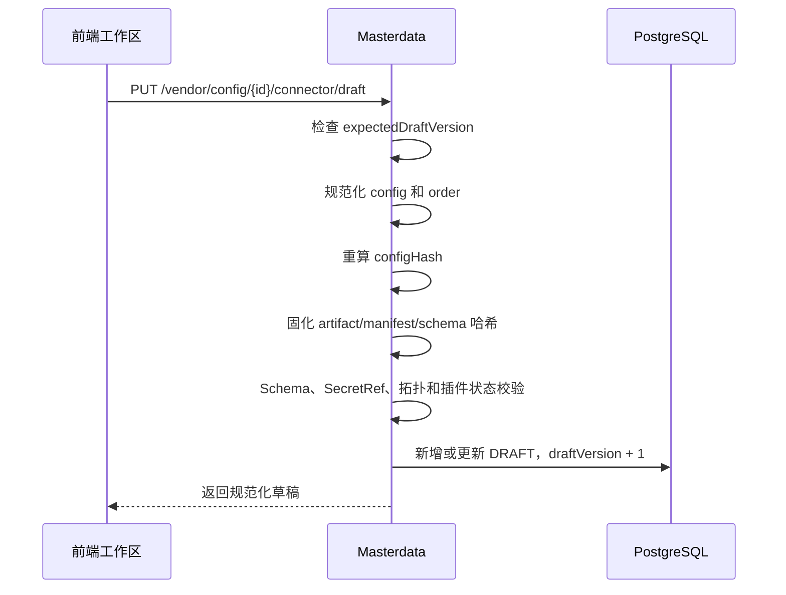

# 接口连接器配置与后端解析指南

> 适用范围：当前 `data-manager-hub` 的“外部请求连接器”配置，重点说明内置
> `legacy-http:1.0.0`。本文按当前代码行为编写；架构和供应链设计见
> [外部请求连接器插件化升级设计](./2026-08-03-external-request-connector-plugin-upgrade-design.md)，
> HTTP 接口清单见 [API 文档](./API.md#33-连接器插件与版本化厂商流水线)。

## 1. 先理解三个不同层次的配置

页面上容易混淆的内容实际上分为三层，必须按顺序完成：

1. **接口身份**：创建接口时只维护 `apiCode`、名称、数据类型、排序和描述。
2. **厂商路由**：将接口绑定到一个或多个厂商配置，并显式指定一个主配置和可选备用配置。
3. **连接器流水线**：描述如何把标准参数变成厂商 HTTP 请求、如何认证、如何发送、如何解析并转换厂商响应。

外部调用者始终使用固定入口 `POST /openapi/v1/query`，通过请求中的 `apiCode` 识别业务接口；调用者不选择厂商。

一个可以正式启用的厂商接口配置，至少需要：

- 一条厂商接口配置，即 `vendor_config`；
- 一个已发布的不可变连接器版本；
- 已发布版本中恰好一个启用的 `TRANSPORT` 步骤；
- 配置引用的插件版本在平台中处于可用状态；
- Access 服务允许访问厂商域名。

连接器的完整生命周期是：


注意：**绑定厂商、配置主备、保存草稿、发布连接器、启用厂商配置和启用接口是不同动作**。保存草稿不会影响生产；发布后生产运行时才有活动快照；主配置和连接器/必要配置就绪后，接口才允许启用。

旧的 `path`、`api_interface.vendor_id` 和 `vendor_config.fallback_vendor_id` 仅作为兼容字段保留，新流程不依赖它们。

## 2. 配置前准备

### 2.1 权限

当前连接器相关页面和接口使用以下权限：

| 操作 | 权限 |
|---|---|
| 查看接口和路由状态 | `interface:view` |
| 创建、编辑、启用接口和保存主备路由 | `interface:edit` |
| 查看厂商、绑定列表和厂商配置 | `vendor:view` |
| 绑定、编辑、启用或删除厂商配置 | `vendor:edit` |
| 查看插件、草稿、活动版本和历史 | `connector-plugin:view` |
| 保存草稿、校验 | `connector-plugin:bind` |
| 受控测试 | `connector-plugin:test` |
| 发布 | `connector-plugin:publish` |
| 回滚 | `connector-plugin:rollback` |
| 导入、验证、预加载、激活或禁用插件 | 对应 `connector-plugin:import/verify/activate/disable` |

缺少权限时，前端可能隐藏按钮或接口返回 HTTP 403。权限问题与连接器配置内容无关，应先由管理员给当前角色授权。

### 2.2 插件版本

普通 HTTP 厂商接口优先使用内置插件：

- 插件 ID：`legacy-http`
- 版本：`1.0.0`
- 能力：六个标准阶段全部支持
- 制品：平台内置，不需要上传 JAR

外部插件必须先经过“导入 → 验证 → Access 全实例预加载 → 激活”。草稿可以引用 `ACTIVE` 版本；受控测试要求插件版本至少为 `STAGING` 或 `ACTIVE`；正式发布要求 `ACTIVE`。

### 2.3 Access 网络白名单

连接器不会因为填写了 `apiUrl` 就自动获得网络访问权限。Access 服务还需要配置：

```yaml
connector.runtime:
  network-allowed-protocols: [https]
  network-allowed-hosts: [api.vendor.example.com]
  allow-private-networks: false
  max-connect-timeout-ms: 5000
  max-read-timeout-ms: 30000
  max-total-timeout-ms: 60000
  test-timeout-ms: 30000
  max-response-bytes: 10485760
```

默认只允许 HTTPS，禁止重定向，禁止访问私网地址。`apiUrl` 的主机不在白名单时，草稿静态校验可能通过，但受控测试或运行会失败。

### 2.4 密钥引用

密码、Token、私钥、证书、API Key 不得作为明文写入连接器草稿。先在当前厂商下维护扩展配置，再在连接器中引用配置键：

- `vendor.secretKey`：引用厂商主记录的 `secret_key`；
- 其他字符串，例如 `vendor.apiToken`：引用当前厂商同名扩展配置。

提交格式为：

```json
{
  "secretRef": "vendor.apiToken"
}
```

后端会拒绝不存在、属于其他厂商或以明文提交的敏感字段。测试和生产执行时，只会解析当前阶段实际声明的 SecretRef。

## 3. 前端完整配置步骤

### 3.1 创建接口

进入“接口管理”点击“新增接口”。当前页面只维护接口身份和契约入口，不再选择厂商、填写业务接口路径或手工选择状态。

| 页面选项 | 是否必填 | 当前含义 |
|---|---:|---|
| 接口编码 `apiCode` | 是 | 对外请求中的稳定业务标识，创建后用于 `POST /openapi/v1/query` 的路由 |
| 接口名称 | 是 | 管理页面展示名称和返回信息中的接口名称 |
| 数据类型 | 是 | 接口对应的标准数据类型；绑定厂商时由服务端从接口推导，前端不可在绑定时另选 |
| 排序 | 否 | 管理页面展示顺序 |
| 描述 | 否 | 接口用途说明 |

页面醒目展示固定入口：`POST /openapi/v1/query`。请求体通过 `apiCode` 区分业务接口，不能把厂商 URL 或旧 `path` 当成调用入口。
新接口默认 `inactive`；保存后先完成厂商绑定、路由和连接器配置，再启用接口。

### 3.2 绑定厂商并配置主备

在接口详情进入“**厂商连接器**”，点击“**绑定厂商**”。绑定下拉框只展示当前接口尚未绑定的厂商；编辑既有配置时保留当前厂商。数据类型从接口详情只读展示，创建请求的事实源是 `interfaceId + vendorId`，不是前端提交的 `dataTypeCode`。

| 页面选项 | 是否必填 | 当前含义 |
|---|---:|---|
| 厂商 | 是 | 选择一个尚未绑定到当前接口的真实厂商；同一接口重复绑定返回 HTTP 409 |
| 数据类型 | 只读 | 由接口的 `dataTypeId/dataTypeName` 推导，不允许另选 |
| 超时时间 | 是 | 单次业务调用的总预算，单位毫秒；通常 10000～30000 |
| 重试次数 | 是 | 失败后最多再试次数；总尝试次数最多为 `1 + retryCount` |
| 熔断阈值/时间 | 是 | 保存到厂商配置的执行策略；当前运行时仍以错误策略和交付状态决定是否回退 |

新建厂商配置固定为 `runtimeMode=PLUGIN`、`connectorVersion=0`、未发布活动连接器和停用状态。第一次有效绑定通过首绑定 CAS 自动成为接口主配置。每个接口最多一个 `PRIMARY` 和一个 `FALLBACK`；备用可以为空，且不能与主配置相同。

路由区使用接口已绑定的配置选择主、备用，并调用：

```http
PUT /interface/{interfaceId}/vendor-routing
Content-Type: application/json

{"primaryVendorConfigId":101,"fallbackVendorConfigId":102}
```

`fallbackVendorConfigId` 可以为 `null`。服务端会校验配置属于当前接口且未删除；不能跨接口、不能主备相同。卡片上的 `PRIMARY`、`FALLBACK`、`UNASSIGNED` 是当前显式路由事实。

厂商卡片显示真实的 `vendorName`、接口推导的 `dataTypeName`、连接器版本、`routingRole` 和就绪状态；不会把 ID 拼成“厂商 #78”。后端暂时返回空名称时，页面显示“厂商名称未加载”，这表示详情数据缺失，不表示可以把厂商 ID 当名称继续配置。

### 3.3 打开连接器配置工作区

每条厂商配置提供以下入口：

- **连接器配置**：编辑版本化流水线；
- **受控测试**：对当前草稿执行测试；
- **发布连接器**：生成不可变活动版本；
- **状态开关**：发布活动连接器版本且必要配置就绪后才允许启用；
- **删除**：被主/备用路由引用的配置不能删除，服务端返回业务错误。

连接器工作区顶部会显示：

- 当前运行模式 `PLUGIN`；
- 当前配置版本；
- 活动连接器版本；
- 草稿版本；
- 启用的 `TRANSPORT` 数量。

### 3.4 添加六阶段流水线

推荐为普通 HTTP 接口创建以下六个步骤，并保持顺序：

| 顺序 | `stageKey` 示例 | `capability` | 作用 | 主要输入 | 主要输出 |
|---:|---|---|---|---|---|
| 0 | `build-request` | `REQUEST_BUILDER` | 参数映射并构造 URL、方法、Header、Query、Body 和超时 | 标准请求参数 | `ConnectorRequest` |
| 1 | `process-request` | `REQUEST_PROCESSOR` | 请求签名、加密、认证和 Header/Query 注入 | 请求、SecretRef | 处理后的请求 |
| 2 | `transport` | `TRANSPORT` | 通过平台托管 HTTP 客户端发送请求 | 处理后的请求 | 原始响应 |
| 3 | `process-response` | `RESPONSE_PROCESSOR` | 解密、验签或解码响应 | 原始响应、SecretRef | 处理后的响应体 |
| 4 | `parse-response` | `RESPONSE_PARSER` | 将响应体解析为 JSON 对象 | 响应字节 | JSON 对象 |
| 5 | `normalize-response` | `RESPONSE_NORMALIZER` | 把厂商字段映射为平台标准字段 | JSON 对象 | `normalizedData` |

流水线的能力顺序不能倒置；可以省略不需要的处理阶段，但通常保留六阶段最容易理解。所有启用步骤中必须**恰好一个** `TRANSPORT`。

每个步骤的通用选项：

| 选项 | 含义 | 后端处理 |
|---|---|---|
| 步骤标识 `stageKey` | 当前流水线内的稳定唯一标识 | 非空、不能重复；建议只用小写字母、数字和连字符 |
| 插件 `pluginId` | 该步骤由哪个插件实现 | 必须存在于插件目录 |
| 插件版本 `pluginVersion` | 固定执行版本 | 发布后固化，不自动漂移到新版本 |
| 能力 `capability` | 本步骤处于六阶段中的哪一段 | 插件 Manifest 必须声明支持该能力 |
| 启用 `enabled` | 是否参与编译和运行 | 停用步骤保留在快照中但不执行 |
| 顺序 `order` | 执行顺序 | 前端保存时按当前列表位置重排为 0、1、2……；后端要求非负且唯一 |
| 配置 `config` | 插件 Schema 生成的动态表单 | 后端规范化为 JSON 对象并按 Schema、插件规则校验 |

以下值由服务端维护，前端不需要填写：

- `configHash`：配置规范化后的 SHA-256；
- `artifactSha256`：插件制品哈希；
- `manifestHash`：插件 Manifest 哈希；
- `schemaHash`：配置 Schema 哈希。

### 3.5 保存、校验、测试和发布

按以下顺序操作：

1. 点击“保存草稿”。首次保存时草稿版本从 0 变为 1；后续每次保存加 1。
2. 点击“校验”。确认拓扑、插件状态、Schema、SecretRef、哈希和 `TRANSPORT` 数量通过。
3. 在“测试参数”中填写一个 JSON 对象，例如 `{"companyName":"示例公司"}`。
4. 点击“受控测试”。该操作可能真实请求厂商，但不计费、不缓存、不写生产调用记录。
5. 检查 `success`、安全错误信息、`normalizedData` 和各阶段耗时。
6. 点击“发布”。发布要求当前草稿已经有一次与 `draftVersion + snapshotHash` 精确匹配的成功测试。
7. 回到厂商配置列表，发布并启用需要参与路由的厂商配置；确认主配置和必要配置就绪后，在接口管理中启用接口。

草稿在成功测试后只要发生任何修改，就必须重新保存、校验和测试。发布版本不可编辑；要修改生产配置，应继续编辑草稿并发布新版本。

### 3.6 固定入口请求与响应示例

外部调用者使用 API Key 和固定入口，不在请求中传厂商 ID：

```http
POST /openapi/v1/query
X-Api-Key: <api-key>
Content-Type: application/json

{"requestId":"req-1001","apiCode":"company-query","apiVersion":"v1","productCode":"RISK","sceneCode":"DEFAULT","useCache":false,"params":{"companyName":"示例公司"}}
```

成功响应中的业务数据来自主配置或安全回退后的备用配置；调用记录、计费事实和实际厂商字段也以实际执行配置为准：

```json
{
  "code": 200,
  "message": "success",
  "data": {
    "companyName": "示例公司",
    "requestId": "vendor-request-1"
  }
}
```

未授权返回 401/403；接口未启用、主路由未就绪或主配置不可用时失败关闭。`FALLBACK_NOT_READY` 是备用未就绪警告：主配置仍可执行，但本次不会尝试备用；只有备用有效且主调用交付状态为 `NOT_SENT` 时才回退一次，`SENT` 或 `MAYBE_SENT` 均不会回退。请求契约错误、插件/配置未就绪和不安全的网络请求不会被“换一个厂商”掩盖。

## 4. `legacy-http` 每个配置项的实际作用

`legacy-http` 当前对六种能力公开同一份 Schema，因此每个步骤页面上可能看到所有字段。**不是每个阶段都使用所有字段**。后端只读取下表标明的字段，其他字段即使存在也会被忽略。

| 配置项 | 实际使用阶段 | 类型、默认值 | 后端解析和作用 |
|---|---|---|---|
| `apiUrl` | `REQUEST_BUILDER` | URI 字符串，无默认值 | 必填；创建请求 URI。插件校验 scheme 和 host；网络层再检查协议、主机和私网策略 |
| `method` | `REQUEST_BUILDER` | 枚举，默认 `POST` | 可选 `GET/POST/PUT/PATCH/DELETE/HEAD`；GET 参数进入 Query，GET/HEAD 不带 Body，其他方法将映射结果序列化为 JSON Body |
| `requestMapping` | `REQUEST_BUILDER` | JSON 对象、数组或 JSON 字符串 | 把平台标准入参映射成厂商字段，语法见第 5 节 |
| `headers` | `REQUEST_BUILDER` | 对象，默认空 | 生成初始请求 Header；`Host/Content-Length/Connection/Upgrade` 等受限 Header 会被托管传输层拒绝 |
| `contentType` | `REQUEST_BUILDER` | 字符串，默认 `application/json; charset=utf-8` | 写入请求内容类型 |
| `connectTimeoutMs` | `REQUEST_BUILDER` | 正整数，默认 5000 | 建连超时；还会受到平台 `max-connect-timeout-ms` 和剩余总预算限制 |
| `readTimeoutMs` | `REQUEST_BUILDER` | 正整数，默认 30000 | 读取响应超时；还会受到平台最大值和剩余总预算限制 |
| `totalTimeoutMs` | `REQUEST_BUILDER` | 正整数，默认 30000 | 当前 HTTP 请求的总超时；不能突破厂商配置顶层 `timeout` 和平台最大值 |
| `idempotencyPolicy` | `REQUEST_BUILDER` | 枚举，默认 `IDEMPOTENT` | `IDEMPOTENT` 可重试；`IDEMPOTENT_WITH_KEY` 需要非空 key；`NON_IDEMPOTENT` 禁止非安全请求重试 |
| `idempotencyKey` | `REQUEST_BUILDER` | 字符串，可空 | POST/PUT/PATCH/DELETE 要进行安全重试时使用；当前插件不会自动把它写入 Header，只作为运行时重试判断事实 |
| `maxResponseBytes` | `REQUEST_BUILDER` | 正整数，默认 10485760 | 单次响应体上限；实际值取步骤配置与平台上限的较小值 |
| `authType` | `REQUEST_PROCESSOR` | `NONE/BEARER/BASIC/API_KEY`，默认 `NONE` | 选择认证方式，详见第 6 节 |
| `authConfig` | `REQUEST_PROCESSOR` | 对象 | 对应认证方式的参数；敏感值必须使用 SecretRef |
| `secretRefs` | 请求或响应处理阶段 | `alias -> secretRef` 对象 | 预解析安全流水线使用的密钥别名；实际值只存在于当前请求内存中 |
| `legacySecretAlias` | `REQUEST_PROCESSOR` | 字符串，可空 | 将别名对应的秘密替换到 Header 值中的 `{secretKey}` 占位符；仅用于旧配置兼容 |
| `securitySteps` | 请求或响应处理阶段 | 安全步骤数组 | 请求阶段执行 `REQUEST` 步骤，响应阶段执行 `RESPONSE` 步骤，详见第 7 节 |
| `responseMapping` | `RESPONSE_NORMALIZER` | JSON 对象、数组或 JSON 字符串 | 把厂商响应映射为平台标准结果，语法见第 5 节 |

### 4.1 超时的最终取值

最终超时不是简单使用某一个字段，而是由多个上限共同约束：

```text
业务总预算 = vendor_config.timeout（界面 100～60000 ms）
单请求总超时 = min(totalTimeoutMs, 业务剩余预算, 平台 max-total-timeout-ms)
建连超时 = min(connectTimeoutMs, 单请求剩余预算, 平台 max-connect-timeout-ms)
读取超时 = min(readTimeoutMs, 单请求剩余预算, 平台 max-read-timeout-ms)
受控测试总超时 = min(业务总预算, connector.runtime.test-timeout-ms)
```

### 4.2 重试的最终行为

`retryCount` 表示“失败后最多再试几次”，不是总请求次数。只有同时满足以下条件才会重试：

- 错误类别被平台策略判定为可重试；
- 请求交付状态允许再次发送；
- 总超时尚未耗尽；
- GET/HEAD/OPTIONS，或非安全方法具备允许重试的幂等策略和非空 `idempotencyKey`。

例如 `retryCount=2` 最多发送 3 次。业务拒绝、参数错误、认证错误和明确的非幂等请求通常不会重试。

## 5. 请求和响应映射

### 5.1 请求简单映射

最简单的写法是“平台字段 → 厂商字段”：

```json
{
  "companyName": "keyword",
  "creditCode": "uscc"
}
```

输入：

```json
{
  "companyName": "示例公司",
  "creditCode": "91310000XXXX",
  "pageNo": 1
}
```

映射后：

```json
{
  "keyword": "示例公司",
  "uscc": "91310000XXXX",
  "pageNo": 1
}
```

简单请求映射会保留未配置映射的字段。

### 5.2 请求高级映射

数组写法只输出声明过的字段：

```json
[
  {
    "targetField": "keyword",
    "sourceVar": "companyName",
    "required": true,
    "transformType": "trim"
  },
  {
    "targetField": "page",
    "sourceVar": "pageNo",
    "required": false,
    "defaultValue": "1",
    "transformType": "none"
  }
]
```

也可以使用包裹格式：

```json
{
  "requestMapping": [
    {
      "targetField": "keyword",
      "sourceVar": "companyName",
      "required": true,
      "transformType": "trim"
    }
  ]
}
```

请求映射项：

| 字段 | 含义 |
|---|---|
| `targetField` | 厂商请求字段名 |
| `sourceVar` | 平台标准入参字段名，只支持当前参数对象的直接键 |
| `defaultValue` | 找不到源字段时使用的默认字符串 |
| `required` | 默认 `true`；必填且无默认值时直接报错 |
| `transformType` | `none/uppercase/lowercase/trim` |

### 5.3 响应简单映射

简单写法是“厂商字段路径 → 平台标准字段”：

```json
{
  "data.company_name": "companyName",
  "data.credit_code": "creditCode",
  "request_id": "requestId"
}
```

点号路径支持读取嵌套对象。只输出能够读取到的映射字段。

### 5.4 响应高级映射

```json
[
  {
    "targetField": "companyName",
    "sourcePath": "data.company_name",
    "sourceType": "field",
    "defaultValue": "",
    "transformType": "toString"
  },
  {
    "targetField": "firstTag",
    "sourcePath": "$.data.tags[0]",
    "sourceType": "jsonPath",
    "defaultValue": null,
    "transformType": "none"
  }
]
```

响应映射项：

| 字段 | 含义 |
|---|---|
| `targetField` | 平台标准输出字段名 |
| `sourcePath` | 厂商响应字段路径或 JsonPath |
| `sourceType` | `field` 使用点号路径；`jsonPath` 使用 JsonPath 表达式 |
| `defaultValue` | 取不到值时写入的默认值 |
| `transformType` | `none/toString/toNumber` |

映射 JSON 解析失败时，当前兼容实现会记录告警并回退到原始参数或原始响应，而不是让校验立即失败。因此必须在受控测试中核对 `normalizedData`，不能只看“测试请求成功”。

## 6. 认证配置

认证配置放在 `REQUEST_PROCESSOR` 步骤。

### 6.1 无认证

```json
{
  "authType": "NONE",
  "authConfig": {}
}
```

### 6.2 Bearer Token

```json
{
  "authType": "BEARER",
  "authConfig": {
    "token": {"secretRef": "vendor.apiToken"}
  }
}
```

后端解析后写入：

```text
Authorization: Bearer <secret value>
```

### 6.3 Basic Auth

```json
{
  "authType": "BASIC",
  "authConfig": {
    "username": {"secretRef": "vendor.basicUsername"},
    "password": {"secretRef": "vendor.basicPassword"}
  }
}
```

用户名和密码会组合为 `username:password`，再进行 Base64 编码并写入 `Authorization: Basic ...`。

### 6.4 API Key

写入 Header：

```json
{
  "authType": "API_KEY",
  "authConfig": {
    "apiKeyName": "X-API-Key",
    "apiKeyValue": {"secretRef": "vendor.apiKey"},
    "apiKeyLocation": "header"
  }
}
```

写入 Query：

```json
{
  "authType": "API_KEY",
  "authConfig": {
    "apiKeyName": "access_token",
    "apiKeyValue": {"secretRef": "vendor.apiKey"},
    "apiKeyLocation": "query"
  }
}
```

`apiKeyLocation` 不填时默认为 `header`。

## 7. 安全流水线配置

需要签名、摘要、加解密或验签时，在 `REQUEST_PROCESSOR` 或 `RESPONSE_PROCESSOR` 的 `securitySteps` 中配置。

每个步骤的公共结构：

```json
{
  "id": "canonical-text",
  "direction": "REQUEST",
  "stepType": "CANONICALIZE",
  "stepName": "生成待签名串",
  "sortNo": 10,
  "enabled": true,
  "config": {
    "inputFrom": "MAPPED_PARAMS"
  }
}
```

| 公共字段 | 说明 |
|---|---|
| `id` | 可选；配置后可被后续步骤以 `RESULT.<id>` 引用，同一安全流水线内不可重复 |
| `direction` | `REQUEST` 或 `RESPONSE`；必须与所在处理阶段一致 |
| `stepType` | 安全处理类型，见下表 |
| `stepName` | 展示名称，不参与算法 |
| `sortNo` | 执行顺序，默认 100；同一方向不可重复 |
| `enabled` | 默认 `true`；`false` 时跳过 |
| `config.inputFrom` | 输入来源；空或 `LAST` 表示上一步结果，没有上一步时表示参数对象 |

常用 `inputFrom`：

- `PARAMS`、`MAPPED_PARAMS`、`RESPONSE`：整个参数/响应对象；
- `PARAMS.field`、`RESPONSE.field`：对象中的一个字段；
- `BODY`、`RESPONSE_BODY`：当前 Body；
- `HEADERS`、`HEADERS.name`：全部 Header 或单个 Header；
- `QUERY`、`QUERY.name`：全部 Query 或单个 Query；
- `RESULT.stepId`：前面某个安全步骤的结果；
- `LAST`：上一个步骤的结果。

支持的步骤类型和主要 `config` 选项：

| `stepType` | 方向限制 | 主要配置 |
|---|---|---|
| `FIELD_SELECT` | 请求/响应 | `fields` 必填；`replaceParams` 默认 false |
| `GENERATE` | 仅请求 | `fieldName`；`generator=TIMESTAMP_SECONDS/TIMESTAMP_MILLIS/UUID/NONCE/CONSTANT`；`location=PARAM/HEADER/QUERY`；NONCE 可设 `length`；CONSTANT 必须有 `value` |
| `CANONICALIZE` | 请求/响应 | `fieldOrder=KEY_ASC/KEY_DESC/EXPLICIT/NONE`；显式排序用 `fields`；`nullPolicy=IGNORE/KEEP`；`pairSeparator` 默认 `&`；`keyValueSeparator` 默认 `=`；`includeKey` 默认 true；可设 `prefix/suffix` |
| `DIGEST` | 请求/响应 | `algorithm=MD5/SHA1/SHA256/SHA512/SM3`；`outputEncoding=HEX_LOWER/HEX_UPPER/BASE64/BASE64_URL`；可用 `secretRef` 和 `secretPlacement=PREFIX/SUFFIX` |
| `HMAC` | 请求/响应 | `secretRef` 必填；`algorithm=HMAC_SHA1/HMAC_SHA256/HMAC_SHA512`；`keyEncoding`；`outputEncoding` |
| `SIGN` | 仅请求 | `secretRef` 指向 PKCS#8 RSA 私钥；当前只支持 `RSA_SHA256`；`outputEncoding` 默认 BASE64 |
| `ENCRYPT` | 仅请求 | `secretRef`；`algorithm=AES_GCM/AES_CBC/RSA_OAEP/SM4_CBC`；`keyEncoding`；`outputEncoding`；对称算法可设 `prependIv/iv/ivEncoding` |
| `DECRYPT` | 仅响应 | 与 ENCRYPT 对应；使用 `inputEncoding`；RSA 使用私钥，对称算法处理 IV |
| `VERIFY` | 仅响应 | `secretRef`、`signatureFrom` 必填；支持 RSA_SHA256 或 HMAC；`signatureEncoding`、`keyEncoding`；`failOnInvalid` 默认 true |
| `ENCODE` | 请求/响应 | `encoding=HEX_LOWER/HEX_UPPER/BASE64/BASE64_URL` |
| `DECODE` | 仅响应 | 与 ENCODE 对应 |
| `INJECT` | 请求/响应 | `location=PARAM/PARAMS/BODY_FIELD/HEADER/QUERY/BODY`；除 BODY 外必须有 `fieldName`；把输入写入目标位置 |
| `REMOVE_FIELD` | 请求/响应 | `fieldName` 必填；`location=PARAM/PARAMS/BODY_FIELD/HEADER/QUERY` |

安全流水线最多 100 步，单步骤配置最大 64 KiB，整条安全流水线最大 256 KiB。`GENERATE/SIGN/ENCRYPT` 不能放在响应方向；`DECRYPT/VERIFY/DECODE` 不能放在请求方向。

### 7.1 HMAC 签名示例

下面的请求安全步骤先按字段名升序生成签名原文，再做 HMAC-SHA256，最后把结果写入 `X-Signature`：

```json
{
  "secretRefs": {
    "signing-key": "vendor.signingKey"
  },
  "securitySteps": [
    {
      "id": "canonical",
      "direction": "REQUEST",
      "stepType": "CANONICALIZE",
      "stepName": "规范化参数",
      "sortNo": 10,
      "enabled": true,
      "config": {
        "inputFrom": "MAPPED_PARAMS",
        "fieldOrder": "KEY_ASC",
        "pairSeparator": "&",
        "keyValueSeparator": "=",
        "includeKey": true
      }
    },
    {
      "id": "signature",
      "direction": "REQUEST",
      "stepType": "HMAC",
      "stepName": "计算签名",
      "sortNo": 20,
      "enabled": true,
      "config": {
        "inputFrom": "RESULT.canonical",
        "secretRef": "signing-key",
        "algorithm": "HMAC_SHA256",
        "keyEncoding": "UTF8",
        "outputEncoding": "HEX_LOWER"
      }
    },
    {
      "id": "inject-signature",
      "direction": "REQUEST",
      "stepType": "INJECT",
      "stepName": "写入签名请求头",
      "sortNo": 30,
      "enabled": true,
      "config": {
        "inputFrom": "RESULT.signature",
        "location": "HEADER",
        "fieldName": "X-Signature"
      }
    }
  ]
}
```

这里安全步骤中的 `secretRef` 使用的是 `secretRefs` 里的别名 `signing-key`，而 `secretRefs` 再把该别名映射到厂商扩展配置 `vendor.signingKey`。

## 8. 可直接理解的完整六阶段示例

下面是一个无认证 GET 查询接口的草稿请求。`configHash` 和插件材料哈希不提交，由服务端重算和固化。

```json
{
  "expectedDraftVersion": 0,
  "pipelineSnapshot": [
    {
      "stageKey": "build-request",
      "pluginId": "legacy-http",
      "pluginVersion": "1.0.0",
      "capability": "REQUEST_BUILDER",
      "order": 0,
      "enabled": true,
      "config": {
        "apiUrl": "https://api.vendor.example.com/company/search",
        "method": "GET",
        "requestMapping": {
          "companyName": "keyword",
          "creditCode": "uscc"
        },
        "headers": {
          "Accept": "application/json"
        },
        "contentType": "application/json; charset=utf-8",
        "connectTimeoutMs": 3000,
        "readTimeoutMs": 10000,
        "totalTimeoutMs": 15000,
        "idempotencyPolicy": "IDEMPOTENT",
        "maxResponseBytes": 1048576
      }
    },
    {
      "stageKey": "process-request",
      "pluginId": "legacy-http",
      "pluginVersion": "1.0.0",
      "capability": "REQUEST_PROCESSOR",
      "order": 1,
      "enabled": true,
      "config": {
        "authType": "NONE",
        "authConfig": {},
        "secretRefs": {},
        "securitySteps": []
      }
    },
    {
      "stageKey": "transport",
      "pluginId": "legacy-http",
      "pluginVersion": "1.0.0",
      "capability": "TRANSPORT",
      "order": 2,
      "enabled": true,
      "config": {}
    },
    {
      "stageKey": "process-response",
      "pluginId": "legacy-http",
      "pluginVersion": "1.0.0",
      "capability": "RESPONSE_PROCESSOR",
      "order": 3,
      "enabled": true,
      "config": {
        "secretRefs": {},
        "securitySteps": []
      }
    },
    {
      "stageKey": "parse-response",
      "pluginId": "legacy-http",
      "pluginVersion": "1.0.0",
      "capability": "RESPONSE_PARSER",
      "order": 4,
      "enabled": true,
      "config": {}
    },
    {
      "stageKey": "normalize-response",
      "pluginId": "legacy-http",
      "pluginVersion": "1.0.0",
      "capability": "RESPONSE_NORMALIZER",
      "order": 5,
      "enabled": true,
      "config": {
        "responseMapping": {
          "data.company_name": "companyName",
          "data.credit_code": "creditCode",
          "request_id": "requestId"
        }
      }
    }
  ]
}
```

对应受控测试参数：

```json
{
  "params": {
    "companyName": "示例公司",
    "creditCode": "91310000XXXX"
  }
}
```

## 9. 后端如何保存、校验和解析

### 9.1 草稿保存



第一次保存必须使用 `expectedDraftVersion=0`。后续保存必须使用页面刚读取到的版本；多人同时编辑时，较晚提交的一方会收到 HTTP 409，应刷新后重新合并。

### 9.2 校验规则

发布前至少会检查：

- 流水线非空且不超过 50 步；
- `stageKey`、`order` 各自唯一；
- `order >= 0`；
- 启用步骤恰好一个 `TRANSPORT`；
- 能力顺序为构建请求 → 处理请求 → 传输 → 处理响应 → 解析响应 → 标准化；
- 插件及固定版本存在，且声明支持所选能力；
- 插件状态满足草稿、测试、发布或回滚阶段的要求；
- 每阶段配置不超过 64 KiB；
- 配置符合插件签名 Schema；
- 不允许脚本、表达式、远程 `$ref`、动态 `$ref` 或递归 `$ref`；
- 敏感字段只使用当前厂商拥有的 SecretRef；
- 配置哈希、制品哈希、Manifest 哈希和 Schema 哈希与目录一致。

### 9.3 受控测试

Masterdata 将规范化后的草稿和测试参数发给 Access。Access 在隔离的测试执行路径中：

- 不使用降级厂商；
- 不计费；
- 不读写业务缓存；
- 不写生产调用记录；
- 受独立线程池和 `test-timeout-ms` 限制；
- 仍可能向真实厂商地址发送请求。

测试结果只返回安全错误信息、标准化数据和阶段耗时，不返回原始厂商报文或秘密。Masterdata 只保存不可变测试事实，不保存测试参数、原始响应和标准化数据。

### 9.4 发布和回滚

发布会创建新的不可变 `ACTIVE` 版本，将旧活动版本标记为 `SUPERSEDED`，更新厂商配置的活动版本指针，并把运行模式设置为 `PLUGIN`。

回滚不是把数据库行改回旧状态，而是复制指定历史快照，创建一个新的活动版本。因此历史事实始终保留，版本号继续递增。

### 9.5 生产执行

生产请求进入 Access 后的核心流程：


已发布快照固定插件版本和所有哈希。运行时不会因为插件目录出现新版本而自动改变行为。

接口路由在上述流水线之前已经被确定，解析链路是：

```text
apiCode
  → ApiInterfaceDTO
  → primaryVendorConfigId / fallbackVendorConfigId
  → 精确读取 VendorConfigDTO
  → vendor / active connector version / pipeline snapshot
  → 当前厂商的配置、扩展配置和 credential/SecretRef
```

Access 不按列表顺序、创建时间或灰度规则猜测厂商。`UNBOUND`、`PRIMARY_NOT_READY`、主配置不存在、不是 `active`、名称或数据类型无法解析时，路由失败关闭。`FALLBACK_NOT_READY` 仍精确执行主配置，但调用上下文不携带备用；`READY` 时若已选择备用但备用非 `active`、厂商无效或数据类型不一致，只禁用本次备用，不阻断主调用。备用调用只在主调用的 `ConnectorErrorPolicy` 判定错误可安全回退且交付状态为 `NOT_SENT` 时发生一次；`SENT` 和 `MAYBE_SENT` 均不得回退。备用配置本身的 `fallbackVendorId` 不会触发第二次链式回退。

成功或失败事实中的 `actualVendorId`、`actualVendorCode`、`fallbackFrom`、插件追踪和计费事实，均来自实际执行的主配置或备用配置，而不是接口上的旧厂商字段。

### 9.6 插件控制面表与启动顺序

`connector_plugin_activation` 由迁移 `V042__create_connector_plugin_control_plane.sql` 创建；当前连接器迁移链已到 V048，必须按 V042—V048 顺序执行。Access 启动同步器、待处理激活调度和心跳在访问 Mapper 前先检查该表；表不存在时 readiness 保持未就绪，并记录稳定安全错误码 `CONNECTOR_SCHEMA_NOT_READY`，不会把缺表误报成普通业务失败，也不会吞掉其他 SQL 错误。迁移完成、表恢复后，后续调度会自动继续同步。

部署顺序应为：先完成数据库迁移并确认迁移历史，再启动或放行 Access 的连接器运行时；若在升级窗口中先启动 Access，必须保持 readiness/流量门禁关闭，直到该表可见。

## 10. 常见错误与排查

| 现象 | 典型原因 | 处理方式 |
|---|---|---|
| 页面提示“无连接器权限”或接口 403 | 当前角色缺少 `connector-plugin:*` 权限 | 给角色补齐第 2.1 节权限并重新登录 |
| 保存草稿返回 409 | `expectedDraftVersion` 已过期 | 刷新草稿，合并后重新保存 |
| 发布返回 409，提示需要成功测试 | 草稿保存后未测试，或测试后又改了草稿 | 对当前草稿重新执行受控测试 |
| 校验提示 TRANSPORT 数量错误 | 没有启用传输步骤，或启用了多个 | 只保留一个启用的 `TRANSPORT` |
| 校验提示能力顺序错误 | 步骤拖动后顺序违反六阶段拓扑 | 按第 3.4 节重新排序 |
| 校验提示插件状态不可发布 | 插件版本不是 `ACTIVE` | 在插件管理完成预加载和激活 |
| 校验提示 SecretRef 不存在或越权 | 引用键未创建，或属于其他厂商 | 在当前厂商下创建扩展配置并选择正确引用 |
| 受控测试提示 URL 或网络错误 | `apiUrl` 非法、非 HTTPS、主机不在白名单、命中私网限制 | 检查 URL 和 Access 的 `network-allowed-*` 配置 |
| 受控测试响应不是 JSON 对象 | `legacy-http` 解析器只接受非空 JSON Object | 让厂商返回对象，或使用支持该响应格式的插件 |
| 测试成功但字段不对 | 映射 JSON 写错后兼容实现回退到原始数据 | 检查 `normalizedData`，修正第 5 节映射 |
| POST 等请求没有重试 | 非幂等策略或缺少 `idempotencyKey` | 明确厂商幂等语义后再配置策略和 key |
| 降级没有发生 | 错误或交付状态不允许安全降级 | 降级默认只在平台判断未发送等安全状态下执行 |
| 启用开关失败 | 尚未发布活动连接器 | 完成保存、校验、测试和发布 |
| 绑定厂商返回 409 | 当前接口已经绑定该厂商 | 在“绑定厂商”下拉框选择尚未绑定的厂商；同一接口不能重复绑定 |
| 配置主备返回 409 | 配置不属于当前接口、主备相同或目标配置已删除 | 只从当前接口的绑定卡片中选择；备用可以留空 |
| 接口启用返回 409 | 主路由未配置，或主配置/连接器/必要配置未就绪 | 检查 `routingReadiness`，完成主配置的发布和启用后再启用接口 |
| 页面显示“厂商名称未加载” | 后端返回的厂商名称缺失或详情加载失败 | 检查 Masterdata 查询权限和数据；不要用厂商 ID 代替名称 |
| Access readiness 为 DOWN，错误码 `CONNECTOR_SCHEMA_NOT_READY` | `connector_plugin_activation` 尚未由迁移创建或当前不可见 | 先按迁移顺序执行 V042—V048，确认表存在后等待同步器恢复 |

## 11. 当前实现限制

以下是当前代码的真实限制，配置人员需要特别注意：

### 11.1 复杂对象目前不能完整通过动态表单编辑

`legacy-http` Schema 将 `headers`、`authConfig`、`secretRefs` 定义为没有子属性声明的通用对象，将 `securitySteps` 定义为通用对象数组。当前前端 Schema 表单只能很好地编辑有明确 `properties/items.properties` 的对象，因此：

- 基础无认证 HTTP 连接器可以通过界面完成；
- 新建 Header、认证、SecretRef 和安全步骤时，界面目前不能完整录入其内部字段；
- `requestMapping/responseMapping` 在界面中可能以文本输入形式出现，可填写 JSON 文本；
- 已存在的复杂 JSON 能随草稿加载和保存，但通用对象内部不便可视化编辑；
- `legacySecretAlias` 因字段名包含 `secret`，前端会按敏感字段渲染成 SecretRef 选择器，而兼容插件实际需要普通别名字符串，因此当前界面无法正确新增该字段。

需要复杂认证或安全处理时，现阶段应通过草稿 API 提交完整 JSON，或先完善插件的分阶段 Schema 和前端对象编辑器。不要把 Token 或密码临时写成明文绕过界面限制，后端会拒绝或造成安全问题。

### 11.2 熔断阈值和熔断时间尚未接入运行时

界面的 `circuitThreshold` 和 `circuitTimeout` 会保存到 `vendor_config`，但当前 `CircuitBreakerManager` 使用固定配置：

- 失败率阈值 50%；
- 滑动窗口 10 次；
- 至少 10 次调用后计算；
- 熔断 30 秒；
- 半开状态允许 5 次探测。

因此修改界面上的两个熔断字段目前不会改变实际熔断行为。这是实现缺口，不是配置方式问题。

### 11.3 URL 的完整校验发生在受控测试编译阶段

通用 JSON Schema 校验器当前主要校验类型、枚举、长度、范围、正则和本地 `$ref`，不会单独执行 `format=uri`。`legacy-http` 插件会在 Access 编译/测试时检查 URL 的 scheme 和 host，托管传输层再执行网络策略检查。因此必须完成受控测试，不能只依赖“校验”按钮判断 URL 可用。

## 12. 后端源码定位

| 关注点 | 主要实现 |
|---|---|
| 前端厂商执行策略 | `data-platform-web/src/views/interface/components/VendorInterfaceConfig.vue` |
| 前端连接器工作区 | `data-platform-web/src/views/interface/components/config/VendorConnectorWorkspace.vue` |
| JSON Schema 动态表单 | `data-platform-web/src/components/connector/JsonSchemaField.vue` |
| 前端 Schema 默认值和 SecretRef | `data-platform-web/src/utils/connector.ts` |
| Masterdata HTTP 接口 | `VendorConnectorController` |
| 草稿、校验、测试、发布、回滚 | `VendorConnectorServiceImpl` |
| JSON Schema 校验 | `ConnectorJsonSchemaValidator` |
| SecretRef 所有权检查和解析 | `ConnectorSecretReferenceService`、`ScopedConnectorSecretResolver` |
| Access 草稿测试和生产执行 | `DefaultConnectorVendorExecutor` |
| 流水线拓扑和插件编译 | `PipelineCompiler` |
| 六阶段执行 | `ConnectorPipelineExecutor` |
| 内置 HTTP 插件 | `LegacyHttpConnectorPlugin` |
| 请求/响应映射 | `AbstractVendorAdapter`、`RequestMappingProcessor`、`ResponseMappingProcessor` |
| 安全步骤 | `SecurityPipelineExecutor`、`DefaultSecurityStepHandlers` |
| 托管 HTTP 网络策略 | `OkHttpManagedTransport`、`ConnectorRuntimeProperties` |
| 重试、熔断和降级 | `DefaultConnectorVendorExecutor`、`CircuitBreakerManager`、`VendorProxyService` |
